# 01 – Obecné principy zajišťování bezpečnosti a dostupnosti digitálních aktiv

**Zdroj:** `01_Obecne_principy_zajistovani_bezpecnosti_a_dostupnosti_digitalnich_aktiv.pdf`  
**Autor:** Prof. Ing. Cyril Klimeš, CSc.  
**Poslední aktualizace:** 2026-05-15

---

## 1. Základní pojmy

### 1.1 Kyberprostor

Kyberprostor má **3 vrstvy**:
1. **Fyzická** – umístění síťových prvků a komponent (servery, routery, kabely, datová centra)
2. **Logická** – logické propojení mezi síťovými uzly (IP adresy, směrování, komunikační kanály)
3. **Sociální** – osoby na síti (e-mailové adresy, IP adresa, číslo telefonu, uživatelé)

> **KYBERPROSTOR = INTERNET = WEBOVÉ SLUŽBY**

### 1.2 Kybernetická bezpečnost

Kybernetická bezpečnost je možné vymezit jako:
- **Souhrn právních, organizačních, technických a vzdělávacích prostředků**, které směřují k zajištění ochrany počítačových systémů a dalších prvků ICT, aplikací, dat a uživatelů
- **Schopnost počítačových systémů a využívaných služeb reagovat na kybernetické hrozby či útoky a jejich následky**, jakož i plánování obnovy funkčnosti počítačových systémů a služeb s nimi spojených

**Smyslem** kybernetické bezpečnosti je zajistit jak **bezpečnost ICT** jako takových, tak i zejména **dat a informací**, které jsou těmito prvky přenášeny, zpracovávány a uchovávány.

---

## 2. Bezpečnost informací – klíčové pojmy

### 2.1 Aktivum
- Cokoliv, co má pro organizaci hodnotu
- Část hodnoceného systému či jeho dat, která mají pro společnost hodnotu
- **Informace představují majetek (aktivum) s určitou hodnotou (assets)**

Informace musí být chráněna:
- Před neoprávněným přístupem
- Před zcizením, zfalšováním a zneužitím
- Před vyzrazením
- Před zablokováním přístupu oprávněným subjektům

Informace je chráněna v souladu s **informační bezpečnostní politikou (BP)** organizace, jejímž je majetkem.

### 2.2 Hrozba
- Potenciální příčina nechtěného incidentu, jehož výsledkem může být poškození systému nebo organizace
- Jakákoliv aktivita využívající **úmyslně či neúmyslně zranitelnosti** s negativním dopadem na důvěrnost, dostupnost a integritu aktiv
- Vyjádřena **pravděpodobností výskytu hrozby**

**Příklady hrozeb:**
- Porušení bezpečnostní politiky, provedení neoprávněných činností, zneužití oprávnění ze strany uživatelů a administrátorů
- Škodlivý kód (viry, spyware, trojské koně)
- Narušení fyzické bezpečnosti
- Přerušení poskytování služeb elektronických komunikací nebo dodávek elektrické energie
- Pochybení ze strany zaměstnanců
- Nedostatek zaměstnanců s potřebnou odbornou úrovní
- Cílený kybernetický útok pomocí sociálního inženýrství, použití špionážních technik
- Napadení elektronické komunikace (odposlech, modifikace)

### 2.3 Zranitelnost
- Slabé místo aktiva nebo slabé místo bezpečnostního opatření, které může být zneužito jednou nebo více hrozbami
- Vyjádření slabého místa aktiva nebo skupiny aktiv, které za určitého předpokladu bude využito hrozbou s následkem poškození nebo ztráty aktiv

**Příklady zranitelností:**
- Zastaralost informačního a komunikačního systému
- Nedostatečné bezpečnostní povědomí uživatelů a administrátorů
- Nedostatečné monitorování činnosti uživatelů a administrátorů a neschopnost odhalit jejich nevhodné nebo závadné způsoby chování
- Nedostatečná ochrana aktiv
- Nevhodná bezpečnostní architektura
- Nedostatečná míra nezávislé kontroly

### 2.4 Riziko

> **Riziko = Dopad na aktivum (A) × Hrozba (T) × Zranitelnost (V)**
> neboli **R = T × A × V**

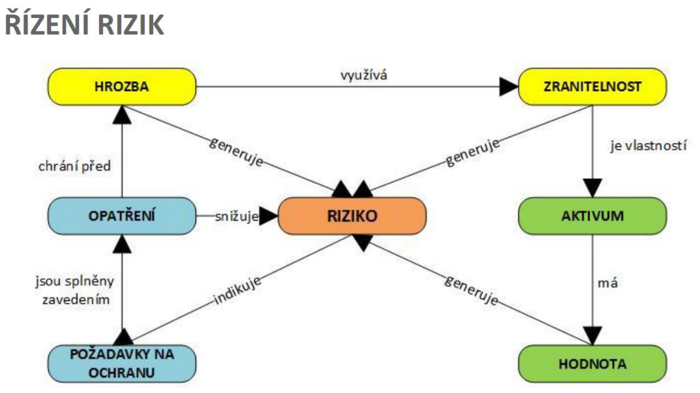

```
HROZBA ──využívá──► ZRANITELNOST
  │                      │ je vlastností
  │ generuje         ▼
  │              AKTIVUM
  ▼                  │ má
RIZIKO ◄─generuje─  HODNOTA
  │
  └─indikuje─► POŽADAVKY NA OCHRANU ──zavedením──► OPATŘENÍ ──snižuje──► RIZIKO
                                                                chrání před HROZBOU
```

---

## 3. Typy aktiv

### 3.1 Primární aktiva
Informace nebo služba, kterou zpracovává nebo poskytuje informační systém kritické informační infrastruktury, komunikační systém kritické informační infrastruktury nebo významný informační systém.

| Typ | Popis |
|-----|-------|
| **Informační aktiva** | Informace uložené v IS a dokumentech společnosti. Bez těchto dat by společnost nebyla schopna účinného rozhodování a nebyla by schopna naplňovat své cíle. |
| **Služby IT** | Informační a komunikační služby, které podporují hlavní činnosti organizace. Jsou ve vrcholové úrovni sepsány do **Katalogu služeb**. |
| **Znalosti** | Vědomosti, bez kterých by organizace nemohla úspěšně fungovat. V dnešní době je přenos a zachování znalostí (kontinua znalostí) ve firmě zásadní. |

### 3.2 Podpůrná aktiva
Technická aktiva, zaměstnanci a dodavatelé podílející se na provozu, rozvoji, správě nebo bezpečnosti IS.

| Typ | Popis | Příklady |
|-----|-------|---------|
| **Objekty** | Prostředky pro zajištění fyzické bezpečnosti | trezory, zámky, elektronické zóny, bezpečnostní dveře |
| **Technologie** | Softwarové a hardwarové vybavení (neobsahující data) | servery, SW, síťové prvky |
| **Procesy IT** | Pravidla, principy, postupy a činnosti podporující provoz IT | bezpečnostní politiky, postupy |
| **Osoby** | Pracovníci starající se o fungování primárních aktiv | administrátor, programátor, operátor helpdesku |
| **Dodavatelé** | Pracovníci zajišťující funkcionalitu a funkčnost služeb IT, kteří nejsou zaměstnanci společnosti | externí IT firmy |

### 3.3 Atributy aktiva
Každé aktivum má tyto atributy:
- **Název** (např. server Dell PowerEdge, program GINIS, vedoucí IT)
- **Kategorie** (primární nebo podpůrné)
- **Typ** (např. server, účetní systém, vedoucí pracovníci)
- **Garant** (např. vedoucí IT, vedoucí účtárny)
- **Lokalizace** (např. Praha, Brno)
- **Hodnocení** (Integrita, Dostupnost, Důvěrnost)
- **Nadřazená / Podřízená aktiva**

---

## 4. CIA Triáda – metriky aktiv

Při uplatňování kybernetické bezpečnosti dochází k implementaci principů nazývaných **triády kybernetické bezpečnosti**:
1. **CIA** [C – Confidentiality (důvěrnost); I – Integrity (celistvost); A – Availability (dostupnost)]
2. **Prvky KB** (Lidé, Technologie, Procesy)
3. **Životní cyklus KB** (Prevence, Detekce, Reakce)

### 4.1 Důvěrnost (Confidentiality – C)

> „S aktivem může pracovat pouze entita, která k tomu je autorizovaná."

Schopnost systému zajistit, aby pouze správný autorizovaný uživatel/systém/zdroj mohl prohlížet, přistupovat, měnit nebo jinak používat data.

**Zajištění:**
- Řízení a zaznamenávání přístupu
- Přenosy informací v komunikační síti chránit pomocí kryptografických prostředků

#### Hodnocení úrovně důvěrnosti

| Úroveň | Popis | Ochrana |
|--------|-------|---------|
| **Nízká** | Aktiva jsou veřejně přístupná nebo určena ke zveřejnění. Narušení neohrožuje oprávněné zájmy. | Není vyžadována žádná ochrana. Likvidace/mazání aktiva na úrovni Nízká. |
| **Střední** | Aktiva nejsou veřejně přístupná a tvoří know-how; ochrana není vyžadována žádným právním předpisem. | Pro ochranu jsou využívány prostředky pro řízení přístupu. Likvidace/mazání na úrovni Střední. |
| **Vysoká** | Aktiva nejsou veřejně přístupná a jejich ochrana je vyžadována právními předpisy (obchodní tajemství, osobní údaje). | Řízení a zaznamenávání přístupu + kryptografická ochrana přenosů + likvidace na úrovni Vysoká. |
| **Kritická** | Aktiva vyžadují nadstandardní míru ochrany (strategické obchodní tajemství, zvláštní kategorie osobních údajů). | Vše jako Vysoká + metody ochrany zabraňující zneužití ze strany administrátorů. |

### 4.2 Integrita (Integrity – I)

> „Aktivum nesmí být změněno, vytvořeno a odstraněno bez autorizovaného přístupu."

- **Integrita dat** – „jistota, že data nebyla změněna. Přeneseně označuje i platnost, konzistenci a přesnost dat, např. databází nebo systémů souborů. Bývá zajišťována kontrolními součty, hašovacími funkcemi, samoopravnými kódy, redundancí, žurnálováním atd."
- **Integrita systému** – „vlastnost, že systém vykonává svou zamýšlenou funkci nenarušeným způsobem, bez záměrné nebo náhodné neautomatizované manipulace se systémem."
- Integrita představuje **nemožnost zásahu do informací, dat, počítačových systémů, jejich nastavení atp.** jinou osobou, než tou, která je k takovému úkonu oprávněna.

**Zajištění:**
- Prostředky dovolující sledovat historii provedených změn a zaznamenat identitu osoby provádějící změnu
- Ochrana integrity informací přenášených komunikačními sítěmi je zajištěna pomocí kryptografických prostředků

#### Hodnocení úrovně integrity

| Úroveň | Popis | Ochrana |
|--------|-------|---------|
| **Nízká** | Narušení integrity aktiva neohrožuje oprávněné zájmy povinné osoby. | Není vyžadována žádná ochrana. |
| **Střední** | Narušení může vést k poškození oprávněných zájmů s méně závažnými dopady na primární aktiva. | Standardní nástroje (např. omezení přístupových práv pro zápis). |
| **Vysoká** | Narušení integrity vede k poškození oprávněných zájmů s podstatnými dopady na primární aktiva. | Speciální prostředky pro sledování historie změn + kryptografická ochrana přenosů. |
| **Kritická** | Narušení integrity vede k velmi vážnému poškození s přímými a velmi vážnými dopady na primární aktiva. | Speciální prostředky jednoznačné identifikace osoby provádějící změnu (např. digitální podpis). |

### 4.3 Dostupnost (Availability – A)

> „Vlastnost přístupnosti a použitelnosti na žádost oprávněné entity."

- Garance možnosti přístupu k informaci, datům, nebo počítačovému systému v okamžiku potřeby
- „O zničení (destruction) určitých informací se v informační bezpečnosti hovoří jako o narušení jejich dostupnosti (availability)."

**Zajištění:**
- Zálohování a obnova
- Využívání záložních systémů; obnova poskytování služeb je krátkodobá a automatizovaná

#### Hodnocení úrovně dostupnosti

| Úroveň | Popis | Ochrana |
|--------|-------|---------|
| **Nízká** | Narušení dostupnosti není důležité, tolerováno delší časové období pro nápravu (cca do 1 týdne). | Postačující pravidelné zálohování. |
| **Střední** | Narušení by nemělo překročit dobu pracovního dne, delší výpadek vede k možnému ohrožení zájmů. | Běžné metody zálohování a obnovy. |
| **Vysoká** | Narušení by nemělo překročit dobu několika hodin. Jakýkoli výpadek nutné řešit neprodleně (přímé ohrožení zájmů). | Záložní systémy, obnova může být podmíněna zásahy obsluhy nebo výměnou technických aktiv. |
| **Kritická** | Narušení dostupnosti není přípustné; krátkodobá nedostupnost (minuty) vede k vážnému ohrožení. Aktiva jsou kritická. | Záložní systémy, obnova je krátkodobá a **automatizovaná**. |

---

## 5. Klasifikace informací

### 5.1 Státní klasifikace (zákon 412/2005 Sb., o ochraně utajovaných informací a o bezpečnostní způsobilosti)

| Stupeň | Anglický ekvivalent | Dopad |
|--------|--------------------|----|
| **Přísně tajné** | Top secret | Neoprávněné nakládání by mohlo způsobit **mimořádně vážnou újmu** zájmům České republiky |
| **Tajné** | Secret | Neoprávněné nakládání by mohlo způsobit **vážnou újmu** zájmům České republiky |
| **Důvěrné** | Confidential | Neoprávněné nakládání by mohlo způsobit **prostou újmu** zájmům České republiky |
| **Vyhrazené** | Restricted | Neoprávněné nakládání by mohlo být **nevýhodné** pro zájmy České republiky |

### 5.2 Komerční klasifikace

| Stupeň | Dopad | Příklady |
|--------|-------|---------|
| **Chráněné** | Závažné poškození či zničení organizace | Únik strategických informací, zdrojových kódů, schémat zabezpečení, hesel |
| **Interní** | Poškození organizace | Únik osobních údajů, smluv |
| **Citlivé** | Negativní dopad na společnost | Dosud nezveřejněné informace o projektech, plánovaných akcích |
| **Veřejné** | Bez dopadu | Veřejně dostupné kontakty, prezentace projektů |

### 5.3 Traffic Light Protocol (TLP) – pro zrychlení výměny informací

| Barva | Kdy použít | Jak sdílet |
|-------|-----------|-----------|
| **Červená** – Neurčeno k zveřejnění, pouze pro účastníky | Informace neumožňuje účinnou reakci dalších subjektů a mohly by vést k dopadům na soukromí, pověst nebo operace, pokud by byly zneužity. | Informace by měly být vyměňovány **pouze verbálně nebo osobně** |
| **Žlutá** – Omezené zveřejnění (v rámci organizací účastníků) | Informace vyžadují účinnou reakci dalších subjektů a přináší riziko pro soukromí/pověst/operace, pokud jsou sdíleny mimo zúčastněné organizace | Subjekty mohou volně **stanovovat další pravidla sdílení**, tato musí být dodržována |
| **Zelená** – Omezené zveřejnění, omezené na komunitu | Informace jsou užitečné pro zvýšení informovanosti všech zúčastněných organizací; lze je sdílet s dalšími subjekty v rámci širší komunity nebo sektoru | Informace **nesmí být uvolněna mimo komunitu** |
| **Bílá** – Zveřejnění není nijak omezeno | Informace obsahují minimální nebo žádné předvídatelné riziko zneužití | Informace mohou být **distribuovány bez omezení** |

---

## 6. Prvky kybernetické bezpečnosti

Bezpečnost se skládá ze tří vzájemně propojených prvků:

### 6.1 Lidé

Lidé vystupují v bezpečnosti v rolích:
- **Strůjce (tvůrce) bezpečnosti** – osoby, které se snaží prosadit a implementovat jednotlivé prvky kybernetické bezpečnosti (vůči sobě i vůči organizaci)
- **Příjemce pravidel kybernetické bezpečnosti** – osoby, které se rozhodly či jsou nuceny implementovat již existující pravidla
- **Subjekty, které je třeba chránit** před kybernetickými útoky
- **Subjekty, které je třeba informovat a proškolit** o pravidlech a principech kybernetické bezpečnosti
- **Riziko či hrozba** v rámci vytváření a udržování kybernetické bezpečnosti

### 6.2 Technologie

**Pro uživatele:** prostředek, který mu umožní připojit se k Internetu, sociálním sítím a dalším aplikacím (PC, tablet, mobilní telefon). Uživatel zpravidla vnímá jen koncové technologie.

**Pro organizace:** celá škála zařízení:
- Technologie určené pro uživatele (desktop, mobilní zařízení)
- Kompletní infrastruktura sítě (LAN, aktivní prvky, Wi-Fi)
- Servery a aplikace
- Prvky pro zajištění zabezpečení na perimetru (firewall, IDS/IPS, honeypot) i v rámci infrastruktury (autentizace, autorizace, monitoring, analýza)

> Je třeba udržovat technologie v takovém stavu, aby byly schopny reagovat na změny, které se k vývoji ICT pojí. Zejména by měly být technologie (HW i SW) udržovány **aktualizované a zabezpečené**.

### 6.3 Procesy

Procesy představují **činnost**, kterou je třeba vynaložit, aby bylo možné technologie a s nimi spojené služby používat lidmi.

Zahrnují:
- Řízení aktiv a rizik (definování a kategorizace aktiv, analýza a kategorizace rizik)
- Implementace ICT a aplikací
- Správa uživatelů a rolí
- Autorizace a autentizace
- Údržby (aktualizace) systémů a služeb
- Testování zabezpečení jednotlivých počítačových systémů a služeb
- Analýza a realizace nápravných opatření
- Audit kybernetické bezpečnosti
- Detekce anomálií či kybernetických útoků
- Reakce na kybernetické útoky či jiné incidenty
- Procesy k zajištění kontinuity
- Školení a cvičení

---

## 7. Životní cyklus kybernetické bezpečnosti

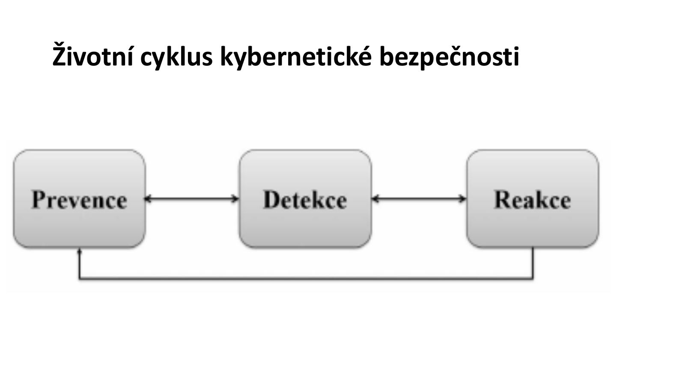

- **Prevence** – zamezení incidentům (bezpečnostní politika, opatření, školení)
- **Detekce** – zjišťování incidentů (monitoring, IDS, logy)
- **Reakce** – řešení incidentů (nápravná opatření, obnova, analýza příčin)

---

## 8. Bezpečnostní politika

### 8.1 Hierarchie dokumentů

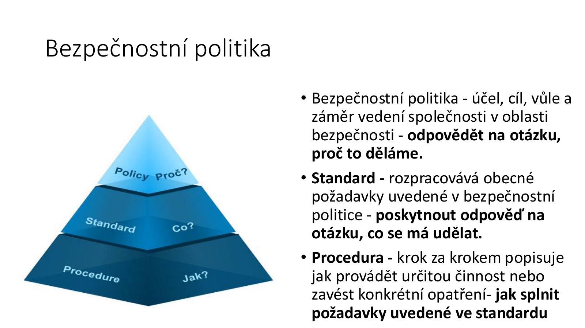


- **Bezpečnostní politika** – účel, cíl, vůle a záměr vedení společnosti v oblasti bezpečnosti → odpovídá na otázku **„proč to děláme"**
- **Standard** – rozpracovává obecné požadavky uvedené v bezpečnostní politice → odpovídá na otázku **„co se má udělat"**
- **Procedura** – krok za krokem popisuje jak provádět určitou činnost nebo zavést konkrétní opatření → odpovídá na otázku **„jak splnit požadavky uvedené ve standardu"**

### 8.2 Další dokumenty

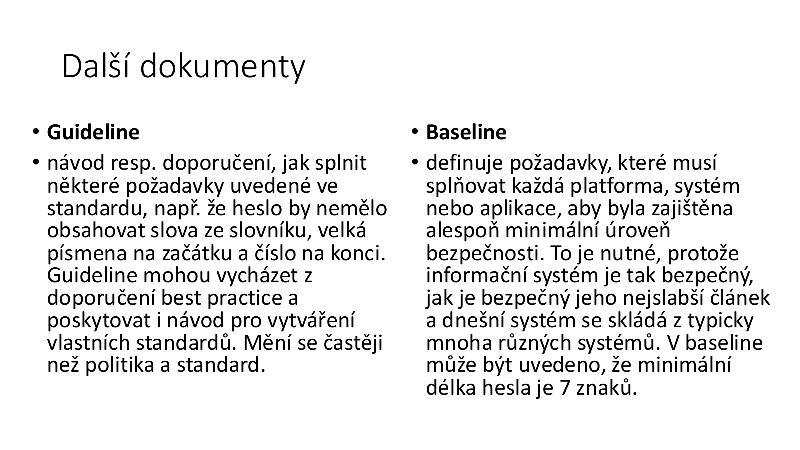

| Dokument | Popis |
|----------|-------|
| **Guideline** | Návod resp. doporučení, jak splnit některé požadavky uvedené ve standardu (např. heslo by nemělo obsahovat slova ze slovníku). Mění se častěji než politika a standard. |
| **Baseline** | Definuje požadavky, které musí splňovat každá platforma, systém nebo aplikace, aby byla zajištěna alespoň minimální úroveň bezpečnosti (IS je tak bezpečný, jak je bezpečný jeho nejslabší článek). |

### 8.3 Typický obsah dokumentu politiky bezpečnosti informací

- Důvody, cíle a způsoby zabezpečení informací
- Organizační zajištění bezpečnosti (směrnice)
- Politika mobilních zařízení a práce na dálku
- Personální bezpečnost
- Klasifikace a řízení informačních aktiv
- Fyzické zajištění bezpečnosti (mříže, ostraha) a bezpečnosti prostředí (klimatizace serverovny)
- Vyjasnění práv přístupu k IT systémům
- Minimální požadavky na vývoj a údržbu systémů
- Potřeby a způsoby šifrování
- Způsob zajištění kontinuity činností (Business Continuity Process – BCP)
- Způsob zajištění souladu s legislativou (ISO 27000, GDPR, kybernetický zákon)

### 8.4 Postup tvorby bezpečnostní politiky

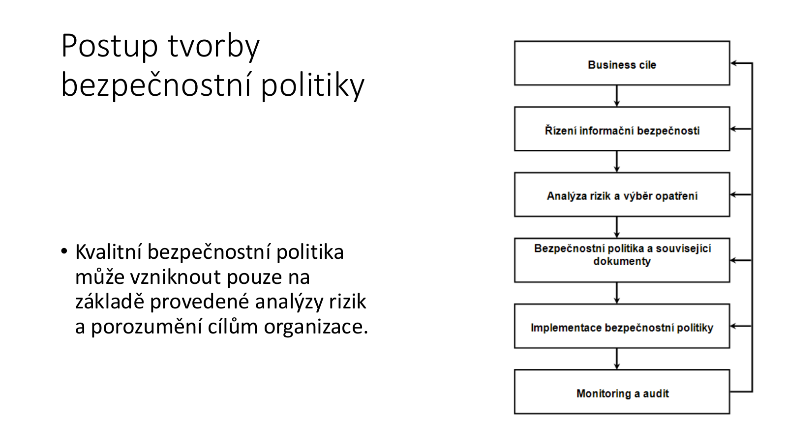


> Kvalitní bezpečnostní politika může vzniknout pouze na základě provedené analýzy rizik a porozumění cílům organizace.

---

## 9. Systém řízení ochrany (SŘO) – PDCA cyklus

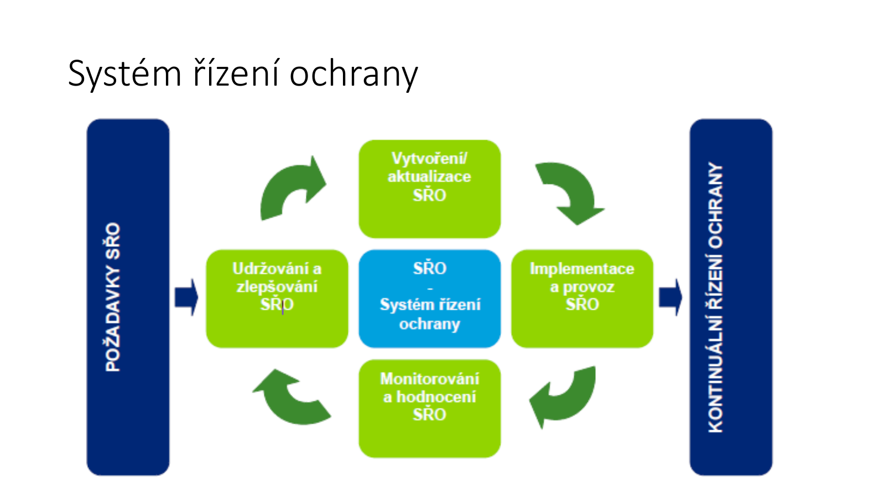


Čtyři fáze (PDCA):
1. **Plánuj (Plan) – Vytvoření:** Bezpečnostní manažer ve spolupráci s odpovědnými zaměstnanci provádí pravidelné plánování ochranných opatření, implementace, interní i nezávislé kontroly. Vytváří se harmonogram a alokují se kapacity.
2. **Udělej (Do) – Implementace a provoz:** Ve spolupráci s administrátory systémů, zaměstnanci fyzické ochrany, správci procesů aj. jsou realizována a provozována opatření bezpečnosti.
3. **Zkontroluj (Check) – Monitorování a hodnocení:** Kontrola opatření probíhá v úrovni vyhodnocování bezpečnostních událostí v daných oblastech a přímo kontrolou nastavení jednotlivých opatření a projekce jejich úspěšnosti.
4. **Jednej (Act) – Udržování a zlepšování:** Na základě zjištění získaných pravidelným monitorováním a hodnocením stavu řízení ochrany jsou připraveny aktuální požadavky k úpravě/aktualizaci opatření.

### 9.1 Standardní kroky řešení bezpečnosti

1. Studie informační bezpečnosti – aktuální stav
2. Riziková analýza
3. Tvorba bezpečnostní politiky – vytýčení cílů
4. Bezpečnostní standardy – pro naplnění cílů bezpečnostní politiky
5. Bezpečnostní projekt – technická opatření
6. Implementace bezpečnosti – nasazení výše uvedeného
7. Monitoring a audit – prověřování, zda vytvořené bezpečnostní mechanismy odpovídají dané situaci

### 9.2 Postup tvorby SŘO

1. Klasifikace a ohodnocení aktiv kritické infrastruktury
2. Definice katalogu hrozeb a rizik kritické infrastruktury
3. Stanovení katalogu bezpečnostních opatření, včetně jejich kategorizace a parametrů
4. Stanovení požadavků a návrh systému řízení ochrany kritické infrastruktury
5. Pilotní provoz a ověření funkčnosti SŘO na vybrané části
6. Vyhodnocení pilotního provozu a úprava metodických postupů
7. Tvorba dokumentace pro systém řízení ochrany kritické infrastruktury

---

## 10. Identita a autentizace

| Pojem | Definice |
|-------|----------|
| **Identita** | Sada vlastností, které jednoznačně určují konkrétní objekt (věc, osobu, událost) |
| **Identifikace** | Akt nebo proces, během kterého entita předloží nějaký identifikátor, na jehož základě systém může rozeznat entitu a odlišit ji od jiných entit |
| **Autentizace** | Proces ověření identity subjektu (autentizace entity, dat, klíče, zprávy …) |
| **Autorizace** | Udělení práv subjektu pro vykonání určených aktivit v IS |

---

## 11. Řízení rizik

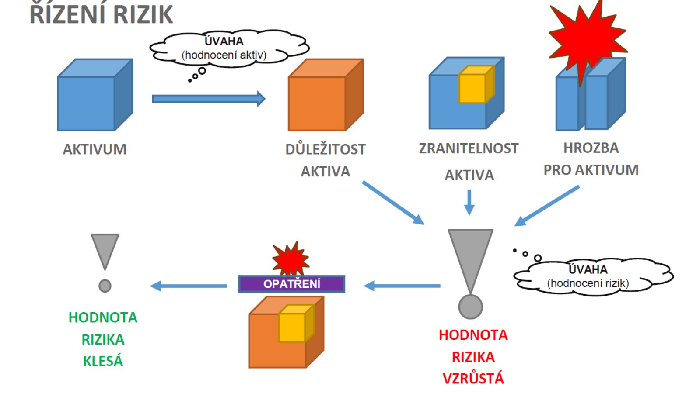

### 11.1 Postup při provádění analýzy rizik

1. **Identifikace a ohodnocení aktiv** – A
2. **Nalezení zranitelných míst** – kritických oblastí; identifikace hrozeb a jejich pravděpodobností – T
3. **Určení zranitelnosti aktiv** – V (matice zranitelnosti aktiva hrozbou)
4. **Určení míry rizika** – R = T × A × V
5. **Stanovení nepřijatelných a přijatelných rizik**
6. **Stanovení opatření a hodnocení dopadu** – identifikace použitelných bezpečnostních opatření ke snížení rizik na přijatelnou míru
7. **Odhad ročních úspor** po zavedení bezpečnostních opatření (ve vazbě na náklady na opatření – ekonomika)

### 11.2 Hodnocení pravděpodobnosti hrozby

| Kategorie | Hodnota | Pravděpodobnost |
|-----------|---------|----------------|
| Nízká pravděpodobnost (NP) | < 33 % | pod 33 % |
| Střední pravděpodobnost (SP) | 33–66 % | interval 33–66 % |
| Vysoká pravděpodobnost (VP) | > 66 % | nad 66 % |

### 11.3 Hodnocení dopadu

| Kategorie | Dopad | Popis |
|-----------|-------|-------|
| Malý nepříznivý dopad (MD) | do 0,5 % hodnoty projektu | Dopady vyžadují určité zásahy do plánu projektu |
| Střední nepříznivý dopad (SD) | 0,51–19,5 % hodnoty projektu | Ohrožení nákladů, termínu, zdrojů; vyžaduje mimořádné zásahy |
| Velký nepříznivý dopad (VD) | nad 20 % hodnoty projektu | Ohrožení cíle projektu, koncového termínu, možnost překročení celkového rozpočtu |

### 11.4 Hodnocení rizika

| Kategorie | Popis |
|-----------|-------|
| **Nízká hodnota rizika (NHR)** | Závažnost a pravděpodobnost neohrožuje projekt; riziko může nastat kdykoliv a bude zmírněno nebo odstraněno navrhnutým opatřením |
| **Střední hodnota rizika (SHR)** | Závažnost a pravděpodobnost ohrožuje zpoždění některé z části projektu; nikoliv projekt jako takový; bude zmírněno, nikoliv odstraněno s dopadem na navýšení zdrojů/nákladů |
| **Vysoká hodnota rizika (VHR)** | Závažnost a pravděpodobnost ohrožuje celý projekt; opatření dokáží riziko zmírnit, nikoliv odstranit; navyšuje zdroje, náklady a odhadovanou pracnost; řešení celého projektu je ve zpoždění |

### 11.5 Příklad – případová studie WEB-SHOP

Fiktivní firma WEB-SHOP se zabývá internetovým prodejem. Firma má kancelář (2 PC + server) a sklad (1 PC) na jiné lokalitě.

**Kontext provozu:**
- V kanceláři pracuje majitel firmy a sekretářka; kancelář má dvě PC.
- V kanceláři je umístěn server pro provoz www stránek internetového obchodu.
- Server používá **Microsoft Windows 2000** a databázi **Microsoft Access**.
- Sklad je přijímacím bodem pro dodavatele a používá jedno PC pro evidenci položek, jejich umístění, vyznačení objednávek k odeslání a záznam již odeslaných objednávek.
- Aplikace skladu používá také **Microsoft Access**.
- Záznamy o zásobách a objednávkách se synchronizují se serverem **dvakrát denně od pondělí do pátku**.
- Synchronizace je spouštěna z počítače ve skladu.
- Ve skladu pracují dva pracovníci a každý z nich může provádět všechny potřebné skladové operace.

**Identifikovaná aktiva a jejich hodnoty:**

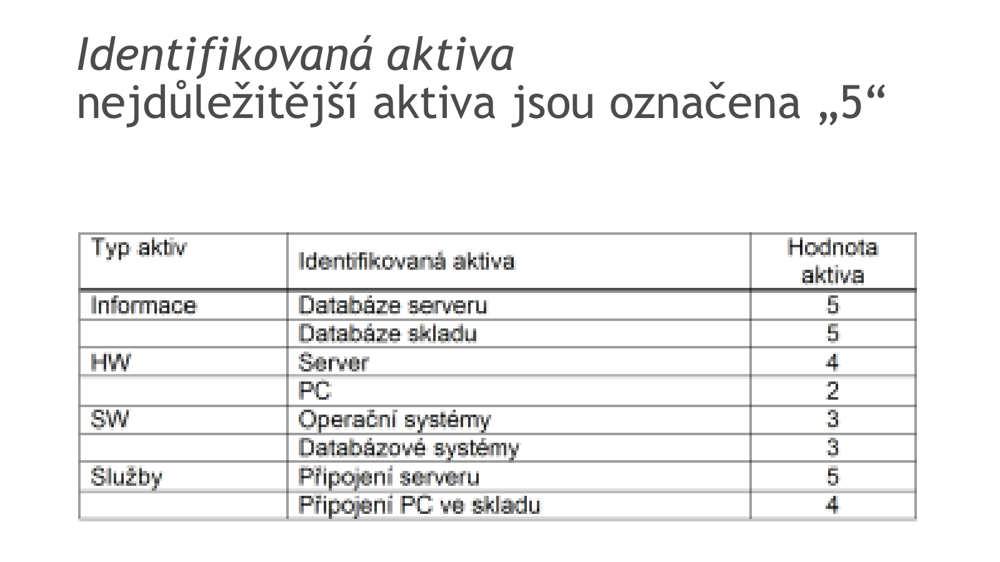

**Identifikované hrozby:**

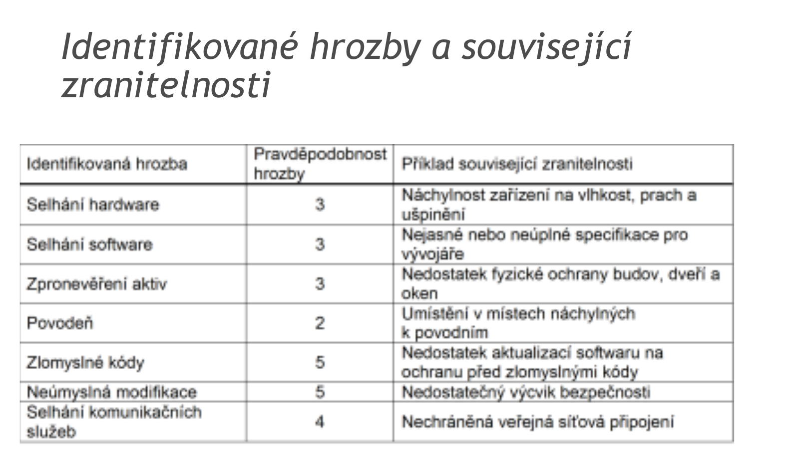

**Matice zranitelností:**

Matice zranitelností určuje, pro které kombinace hrozba–aktivum existuje relevantní slabé místo a jak silná tato zranitelnost je. Nevyplněná pole typicky znamenají, že hrozba se na dané aktivum v modelu neuvažuje nebo není významná.

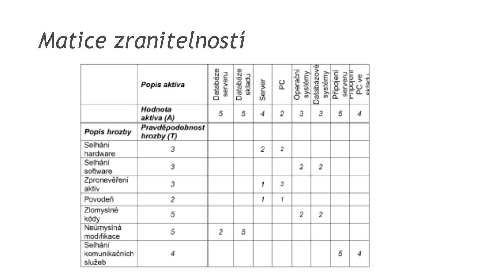

**Výpočet rizika R = T × A × V** – příklady z matice rizik:
- Neúmyslná modifikace databáze serveru: R = 5 × 5 × 2 = **50**
- Neúmyslná modifikace databáze skladu: R = 5 × 5 × 5 = **125** (nejvyšší riziko)
- Selhání komunikačních služeb – připojení serveru: R = 4 × 5 × 5 = **100**

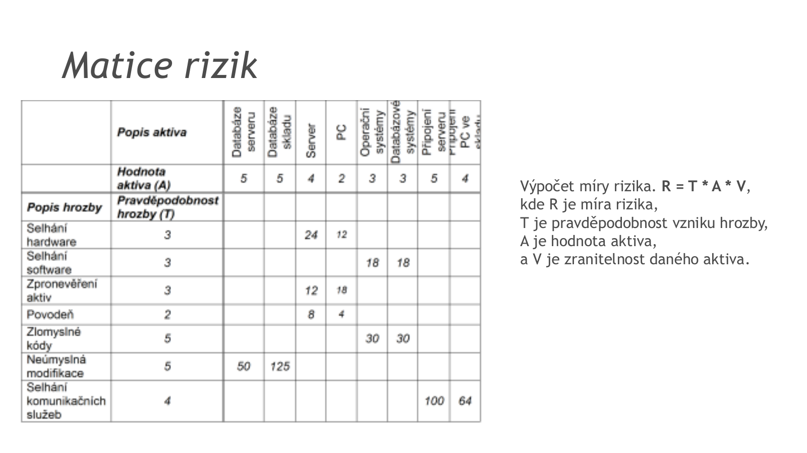

**Interpretace příkladu:**
- Riziko **125** u neúmyslné modifikace databáze skladu je kritické hlavně proto, že se násobí vysoká pravděpodobnost hrozby, vysoká hodnota aktiva a vysoká zranitelnost.
- Riziko **100** u selhání komunikačních služeb pro připojení serveru ukazuje, že dostupnost služby může být stejně důležitá jako samotná ochrana dat.
- Opatření se navrhují pro snížení zranitelnosti nebo dopadu, nikoliv pro úplné odstranění všech rizik. Příklad v materiálu uvádí např. pravidelné zálohování, omezení fyzického přístupu k serveru a umístění serveru mimo rizikové prostory.

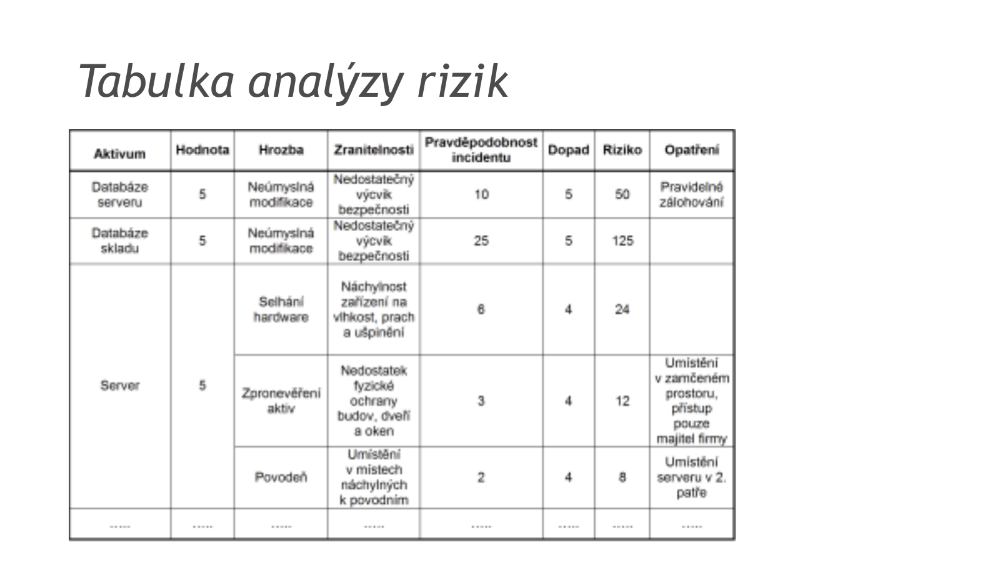

---

## 12. Fyzická, technická a organizační ochrana infrastruktury

### 12.1 Dělení infrastruktury

- **Nenahraditelnost** – při narušení je nutné subjekt opravit, rekonstruovat nebo znovu vystavět
- **Nahraditelnost** – při narušení nebo zničení jsou nutné opravy, rekonstrukce nebo znovuvýstavba

### 12.2 Fyzická opatření

- **Systémy technické ochrany:**
  - Poplachový zabezpečovací a tísňový systém
  - Kamerový systém
  - Systém kontroly vstupu
  - Mechanické zábranné prostředky
- **Fyzická ostraha**
- **Režimová opatření**
- Kritické prvky komunikační infrastruktury a služeb mají dostatečný výkon a redundanci zajišťující bezproblémový chod

### 12.3 Technická opatření

- Osobní údaje jsou uchovávány v bezpečném prostředí, přístupném pouze určeným zaměstnancům
- Při zpracování osobních údajů (přístupu nebo přenášení) je používáno **šifrování a šifrované protokoly**
- Před přístupem ke svým osobním údajům musí uživatel ověřit svou totožnost zadáním osobních přihlašovacích údajů
- Nastavena přísná pravidla pro **zálohování** osobních údajů uživatelů tak, aby byla zajištěna jejich dostupnost, důvěrnost a integrita
- Provoz je pečlivě a systematicky **monitorován** z důvodu včasného a efektivního řešení provozních a bezpečnostních problémů
- Provozované systémy jsou průběžně **testovány na výskyt zranitelností** a jiných slabin v jejich ochraně

### 12.4 Organizační opatření

- Jsou aplikovány principy **minimalizace** v oblasti přidělování privilegovaných přístupových oprávnění
- Jsou aplikována přísná opatření v oblasti **správy uživatelských identit** a v oblasti autentizace a autorizace
- Všichni zaměstnanci jsou vázáni **principy mlčenlivosti** a principy bezpečného nakládání s daty
- Jsou pořádány **školení** zaměřené na bezpečnost (dostupná a některá i povinná pro všechny zaměstnance)
- Je jmenován **pověřenec pro ochranu osobních údajů** (DPO), který působí i jako poradce v záležitostech ochrany soukromí
- Jsou zavedeny postupy pro vedení záznamů o zpracovatelských činnostech a hodnocení rizik
- Jsou uzavřeny **dohody o zpracování dat se subdodavateli**, kteří zpracovávají data z pověření organizace

---

## Otázky k opakování

1. Jaké jsou 3 vrstvy kybernetického prostoru a co každá z nich obsahuje?
2. Jak je definována kybernetická bezpečnost – jaké prostředky zahrnuje a jaká je její schopnostní složka?
3. Co je aktivum, hrozba, zranitelnost a riziko? Jak se riziko matematicky vypočítá?
4. Jaký je rozdíl mezi primárními a podpůrnými aktivy? Uveďte příklady každého typu.
5. Vyjmenujte atributy aktiva, které je třeba evidovat.
6. Vysvětlete CIA triádu – co znamenají pojmy důvěrnost, integrita a dostupnost (včetně přesných definic)?
7. Jak se hodnotí úrovně důvěrnosti (Nízká/Střední/Vysoká/Kritická) a jaká opatření každá úroveň vyžaduje?
8. Jaký je rozdíl mezi integritou dat a integritou systému?
9. Jak se hodnotí úrovně dostupnosti a co je přípustná doba výpadku pro každou z nich?
10. Popište státní klasifikaci informací dle zákona 412/2005 Sb. (4 stupně) a srovnejte s komerční klasifikací.
11. Co je Traffic Light Protocol a jaký je rozdíl mezi červenou, žlutou, zelenou a bílou kategorií?
12. Kdo jsou „lidé" v kontextu prvků kybernetické bezpečnosti? Vyjmenujte jejich 5 rolí.
13. Vyjmenujte alespoň 8 konkrétních procesů kybernetické bezpečnosti.
14. Popište životní cyklus kybernetické bezpečnosti (Prevence–Detekce–Reakce) a vztahy mezi fázemi.
15. Co je bezpečnostní politika a jaký je rozdíl mezi Policy, Standard, Procedure, Guideline a Baseline?
16. Popište PDCA cyklus (SŘO) – co se děje v každé z fází Plánuj/Udělej/Zkontroluj/Jednej?
17. Vyjmenujte 7 standardních kroků řešení bezpečnosti v organizaci.
18. Popište 7 kroků postupu při provádění analýzy rizik.
19. Jak funguje vzorec R = T × A × V? Vysvětlete na příkladu z případové studie WEB-SHOP.
20. Jaký je rozdíl mezi fyzickými, technickými a organizačními bezpečnostními opatřeními? Uveďte příklady každé kategorie.
