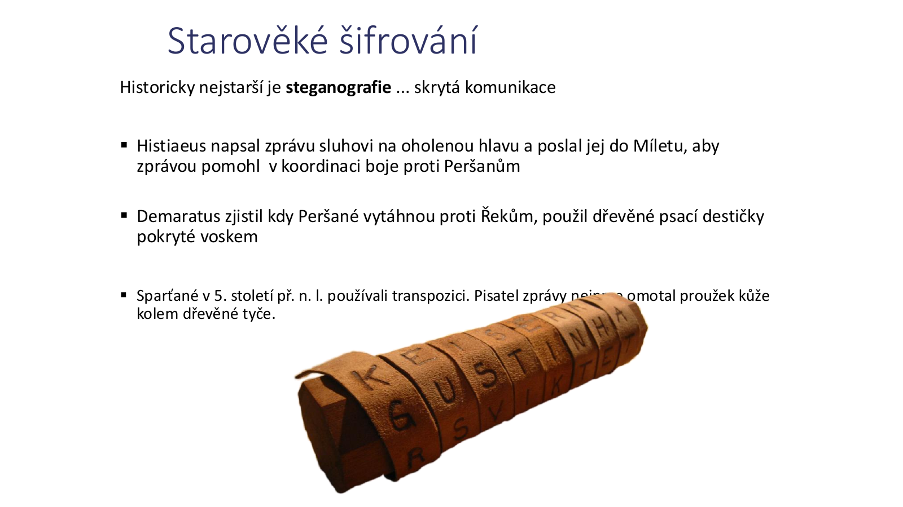
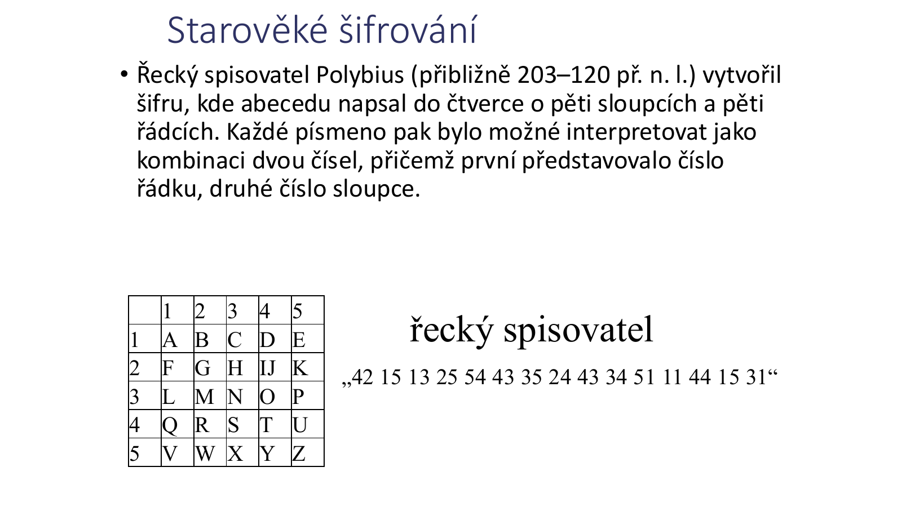
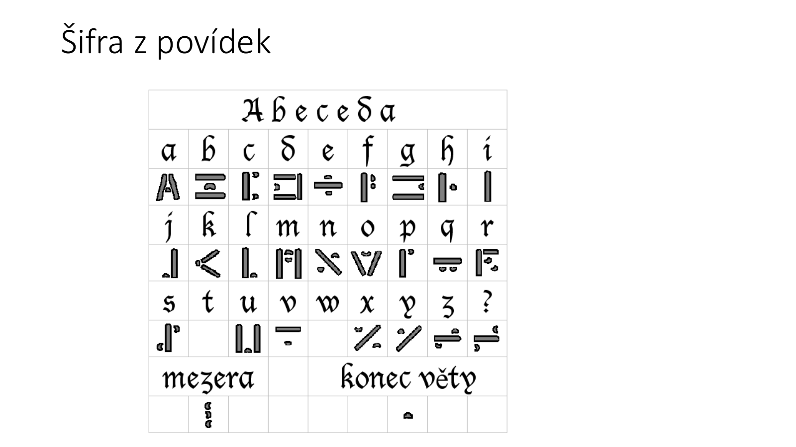
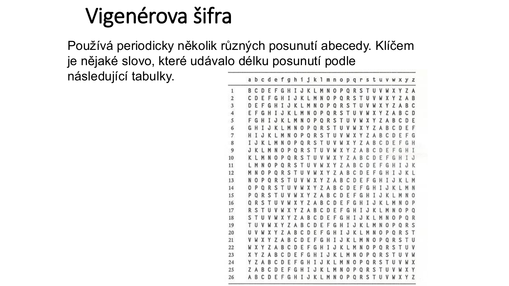
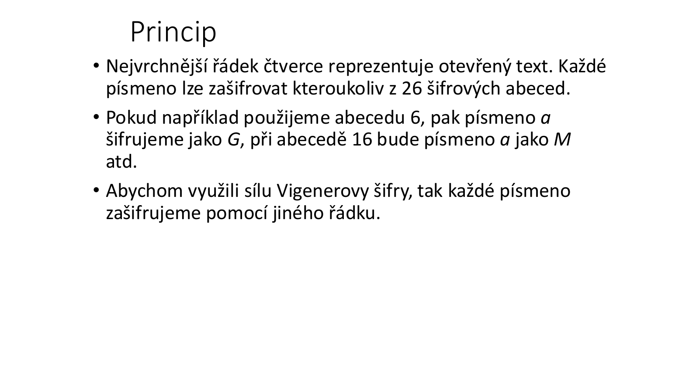
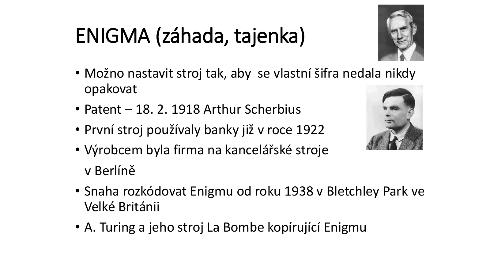
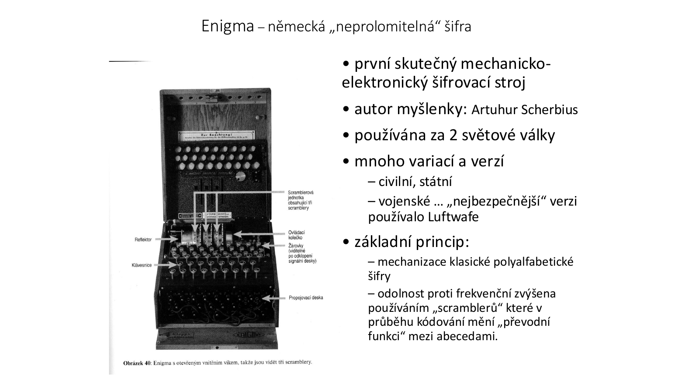
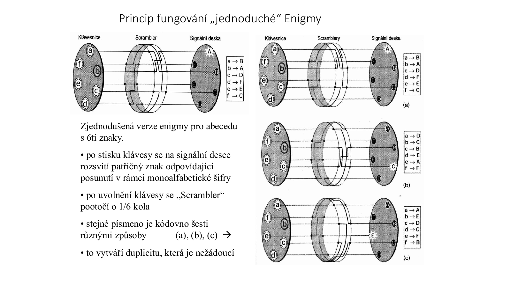
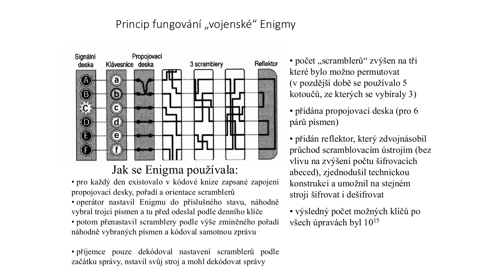

# 03 - Kryptografie (matematické základy + moderní metody + základní šifry)

**Zdroje:**
- `03a_crypto.html`
- `03c_Moderni_kryptografie.pdf`
- `03d_Principy_zakladnich_sifer.pdf`

**Autoři zdrojů:** Cyril Klimeš, Tomáš Pitner, Tomáš Sochor  
**Poslední aktualizace:** 2026-05-15

---

## 1. Matematické základy kryptografie

Moderní kryptografie stojí hlavně na **modulární aritmetice**, práci s prvočísly, hledání inverzí a efektivním umocňování. Tyto pojmy jsou klíčové hlavně pro asymetrickou kryptografii.

### 1.1 Modulární aritmetika

Pro celá čísla `x` a `n` je hodnota `x mod n` **zbytek po dělení** čísla `x` číslem `n`.

| Zápis | Význam |
|-------|--------|
| `x mod n = r` | `r` je zbytek po dělení `x` číslem `n` |
| `x ≡ r (mod n)` | `x` a `r` dávají při dělení `n` stejný zbytek |
| `a ≡ b (mod n)` | `n` beze zbytku dělí `(a - b)` |

**Modulární redukce:** v aritmetice `mod n` musí výsledek ležet v intervalu `[0, n-1]`. Pokud je mimo, přičítáme nebo odčítáme `n`, dokud se do intervalu nedostane.

**Příklad:**
- `2865 / 13 = 220.3846...`
- desetinná část `0.3846... × 13 = 5`
- tedy `2865 mod 13 = 5`

### 1.2 Kongruence

Kongruence je binární relace nad celými čísly. Čísla `a`, `b` jsou **kongruentní modulo `n`**, když:

```text
a ≡ b (mod n) ⇔ n dělí (a - b)
```

Základní vlastnosti:
- **Reflexivita:** `a ≡ a (mod n)`
- **Symetrie:** pokud `a ≡ b (mod n)`, pak `b ≡ a (mod n)`
- **Tranzitivita:** pokud `a ≡ b (mod n)` a `b ≡ c (mod n)`, pak `a ≡ c (mod n)`
- Kongruence je kompatibilní se sčítáním a násobením.

### 1.3 Inverze v modulární aritmetice

| Typ inverze | Definice | Příklad |
|-------------|----------|---------|
| **Aditivní inverze** | číslo, které po sečtení s `x` dá `0 mod n` | v `mod 6` je inverzí čísla `4` číslo `2`, protože `4 + 2 ≡ 0` |
| **Multiplikativní inverze** | číslo `x⁻¹`, pro které `x · x⁻¹ ≡ 1 (mod n)` | `3⁻¹ (mod 7) = 5`, protože `3 · 5 = 15 ≡ 1` |

Multiplikativní inverze `a⁻¹ (mod b)` existuje **jen tehdy, když jsou `a` a `b` nesoudělná čísla**, tedy `gcd(a, b) = 1`.

**Modulární dělení** se definuje jako násobení multiplikativní inverzí:

```text
a : b (mod n) = a · b⁻¹ (mod n)
```

Příklad `3 : 5 (mod 7)`:
- `5⁻¹ (mod 7) = 3`, protože `5 · 3 ≡ 1 (mod 7)`
- `3 : 5 ≡ 3 · 3 ≡ 9 ≡ 2 (mod 7)`

### 1.4 Prvočísla, faktorizace a Fermatova věta

- **Prvočíslo** je přirozené číslo větší než 1, které je dělitelné pouze `1` a samo sebou.
- Číslo `1` není prvočíslo.
- Čísla větší než 1, která nejsou prvočísla, jsou **složená**.
- Každé složené číslo lze jednoznačně rozložit na součin prvočísel. Tento proces se nazývá **faktorizace**.

**Malá Fermatova věta:**

Pokud `p` je prvočíslo a `gcd(a, p) = 1`, potom:

```text
a^(p-1) ≡ 1 (mod p)
a^p ≡ a (mod p)
a^(p-2) ≡ a⁻¹ (mod p)
```

To je užitečné pro výpočet inverzí modulo prvočíslo.

### 1.5 GCD a Eukleidův algoritmus

`gcd(a, b)` je největší společný dělitel čísel `a` a `b`.

**Eukleidův algoritmus:**
1. Opakovaně dělíme se zbytkem: `a = q · b + r`
2. Dvojici `(a, b)` nahradíme dvojicí `(b, r)`
3. Končíme, když `r = 0`
4. Poslední nenulový zbytek je `gcd(a, b)`

**Rozšířený Eukleidův algoritmus** hledá celá čísla `x`, `y` tak, aby:

```text
x · a + y · b = gcd(a, b)
```

Pokud `gcd(a, b) = 1`, lze z výsledku odvodit multiplikativní inverzi.

Příklad:

```text
7 = 3 · 2 + 1
1 = 7 - 3 · 2
=> 5 · 3 ≡ 1 (mod 7)
=> 3⁻¹ (mod 7) = 5
```

### 1.6 Efektivní umocňování a XOR

Naivní výpočet `x^n` používá opakované násobení. V kryptografii je potřeba efektivnější postup, typicky **square-and-multiply**, založený na opakovaném umocňování a redukci modulo `n`.

**XOR (`⊕`)** je výlučné NEBO, tj. sčítání modulo 2:

| A | B | A XOR B |
|---|---|---------|
| 0 | 0 | 0 |
| 0 | 1 | 1 |
| 1 | 0 | 1 |
| 1 | 1 | 0 |

Jednoduchá XOR šifra:

```text
Šifrování:   C = M ⊕ K
Dešifrování: M = C ⊕ K
```

Symetrie XOR je důvod, proč se tato operace používá v proudových šifrách a jednorázovém hesle.

---

## 2. Bezpečnost a kryptografie

### 2.1 Vývoj požadavků na bezpečnost

Požadavky na bezpečnost se výrazně mění:
- **Tradičně:** ochrana zamezením přístupu, uzamykáním a administrativně.
- **S výpočetní technikou:** potřeba automatizované ochrany souborů a informací.
- **S komunikačními sítěmi:** potřeba chránit data během přenosu.

### 2.2 Typy bezpečnosti

| Typ | Popis |
|-----|-------|
| **Počítačová bezpečnost** | Soubor prostředků pro ochranu dat a maření úsilí útočníků. |
| **Síťová bezpečnost** | Opatření k ochraně dat během přenosu. |
| **Bezpečnost Internetu** | Ochrana dat během přenosu přes propojené sítě; prevence, detekce a korekce hrozeb. |

### 2.3 Bezpečnostní služby, mechanizmy a útoky

| Pojem | Význam |
|-------|--------|
| **Bezpečnostní služba** | Zvyšuje bezpečnost přenosu a zpracování dat. |
| **Bezpečnostní mechanizmus** | Slouží k detekci, prevenci a obnově po bezpečnostním útoku; často používá šifrovací techniky. |
| **Bezpečnostní útok** | Jakákoliv akce narušující bezpečnost informací. |

Ochrana výpočetních systémů se skládá hlavně z:
1. **Ochrany zdrojů** - ochrana proti neoprávněnému použití prostředků v OS.
2. **Bezpečné komunikace** - ochrana přenášené informace.
3. **Ověřování uživatelů** - jistota, že zprávy přicházejí od ověřeného zdroje a nebyly modifikovány.

---

## 3. Napadení a obrana systémů

### 3.1 Pasivní útoky

Pasivní útok nemění data ani komunikaci, ale získává informace.

- **Odposlech** - neoprávněné poslouchání komunikace.
- **Analýza přenosu** - zjišťování metadat: odkud, kam, kolik, jak často.

**Cíl obrany:** prevence pasivního útoku, typicky šifrováním.

### 3.2 Aktivní útoky

Aktivní útok mění komunikaci nebo provoz systému.

- Modifikace zpráv
- Zadržování zpráv
- Podstrkávání falešných zpráv
- Opakování zpráv
- Změna pořadí zpráv
- Rušení
- Syntéza zpráv
- Změna adresy nebo dat
- Odepření služby (**DoS**)

**Cíl obrany:** detekce aktivního útoku, případně obnova po útoku.

---

## 4. Bezpečnostní architektura a mechanizmy

### 4.1 Bezpečnostní služby

| Služba | Význam |
|--------|--------|
| **Zajištění soukromí** | Ochrana před neoprávněným čtením. |
| **Ověřování pravosti** | Jistota, že entita je tím, za koho se vydává. |
| **Zajištění integrity** | Jistota, že data nebyla změněna. |

### 4.2 Bezpečnostní architektura

| Prvek | Popis |
|-------|-------|
| **Authentication** | Ověření pravosti entity. |
| **Access Control** | Zamezení neautorizovanému využívání zdrojů. |
| **Data Confidentiality** | Ochrana dat před neautorizovaným přístupem. |
| **Data Integrity** | Ujištění, že přijatá data byla odeslána ověřenou entitou a nebyla změněna. |
| **Non-repudiation** | Ochrana proti popření jednou z komunikujících entit. |

### 4.3 Bezpečnostní mechanizmy

- Šifrování
- Digitální podpisy
- Řízení přístupu
- Integrita dat
- Ověřování výměny dat
- Vyplňování přenosu
- Řízené směrování
- Ověřování třetí stranou

---

## 5. Terminologie šifrování

| Pojem | Definice |
|-------|----------|
| **Otevřený text (plaintext)** | Původní zpráva. |
| **Šifrovaný text (ciphertext)** | Zašifrovaná zpráva. |
| **Šifra** | Algoritmus pro transformaci otevřeného textu na šifrovaný. |
| **Klíč** | Parametr šifrování. |
| **Šifrování** | Převod otevřeného textu na šifrovaný text. |
| **Dešifrování** | Převod šifrovaného textu na otevřený text. |
| **Kryptografie** | Studium šifrovacích principů a metod; návrh šifrovacích systémů. |
| **Kryptoanalýza** | Studium metod pro dešifrování bez znalosti klíče; hledání slabin šifer. |
| **Kryptologie** | Kryptografie + kryptoanalýza. |

```text
KRYPTOLOGIE
├── KRYPTOGRAFIE  (návrh šifer)
└── KRYPTOANALÝZA (útok na šifry)
```

---

## 6. Kryptografická pravidla

### 6.1 Maxims

1. Při posuzování bezpečnosti je nutné předpokládat, že protivník zná šifrovací systém.
2. Bezpečnost systému může posoudit hlavně kryptoanalytik.
3. Algoritmus by měl být průhledný; umělé komplikace nemusí zvyšovat bezpečnost.
4. Nikdy nepodceňovat protivníka a nepřeceňovat vlastní schopnosti.
5. Je nutné brát v úvahu chyby a porušení pravidel ze strany uživatelů.

### 6.2 Kerckhoffsův princip

> Bezpečnost šifrovacího systému nesmí záviset na utajení algoritmu, ale pouze na utajení klíče.

### 6.3 Možná porušení pravidel

- Odvysílání otevřeného i odpovídajícího šifrového textu.
- Odvysílání dvou šifrových textů vzniklých šifrováním stejného otevřeného textu dvěma klíči.
- Odvysílání dvou různých otevřených textů šifrovaných stejným klíčem.
- Stereotypní začátky zpráv, běžná slova nebo fráze.
- Krátké nebo snadno uhodnutelné klíče.
- Zanedbání přípravy otevřeného textu před šifrováním.
- Nedostatečná kontrola šifrantů.

> Chyba kryptografa je často jedinou nadějí kryptoanalytika.

---

## 7. Základní operace šifrování

| Operace | Princip |
|---------|---------|
| **Substituce** | Náhrada znaku nebo skupiny znaků jiným znakem/skupinou. |
| **Transpozice** | Přesun znaků nebo bitů na jiné místo v kódu. |

| Typ šifry | Popis |
|-----------|-------|
| **Bloková** | Šifruje po blocích pevné délky. |
| **Proudová** | Šifruje po bitech nebo slabikách; délka bloku není předem pevně dána. |

---

## 8. Klasické šifry

### 8.1 Steganografie a starověké šifrování

Historicky nejstarší formou utajení je **steganografie** - skrytá komunikace, tedy ukrytí samotné existence zprávy.



Příklady z materiálu:
- Histiaeus nechal napsat zprávu na oholenou hlavu sluhy a po dorostení vlasů jej poslal do Míletu.
- Demaratus použil dřevěné psací destičky pokryté voskem.
- Sparťané používali **skytalé** - proužek kůže omotaný kolem tyče, tedy ranou transpoziční šifru.

### 8.2 Polybiův čtverec

Polybius vytvořil šifru, kde je abeceda zapsána do čtverce `5 × 5`. Každé písmeno se zapíše jako dvojice čísel: řádek a sloupec. V latince se často slučuje `I/J`.



### 8.3 Transpoziční šifry

Transpozice mění **pořadí znaků**, nikoliv samotné znaky.

| Metoda | Princip |
|--------|---------|
| **Psaní pozpátku** | Text se zapíše od konce. |
| **Zepředu/zezadu** | Vypisuje se střídavě znak zepředu a zezadu. |
| **Prolnutí** | Text se rozdělí na dvě poloviny; první se zapisuje na liché pozice, druhá na sudé. |
| **Podle plotu** | Text se rozdělí na lichá a sudá písmena, šifrový text vznikne jejich spojením. |
| **Tabulky** | Text se zapíše do tabulky jedním způsobem a čte jiným způsobem. |
| **Transpozice dle klíče** | Sloupce tabulky se seřadí podle abecedního pořadí písmen klíčového slova. |

### 8.4 Substituční šifry

Substituce nahrazuje znak zprávy jiným znakem nebo symbolem podle šifrové abecedy.

| Typ substituce | Princip |
|----------------|---------|
| **Monoalfabetická** | Celý text se šifruje jednou šifrovou abecedou; stejné písmeno se vždy nahrazuje stejně. |
| **Homofonní** | Častá písmena mohou mít více možných šifrových znaků. |
| **Polyalfabetická** | Každé písmeno se šifruje jinou šifrovou abecedou podle klíče. |
| **Bigramová / trigramová / polygramová** | Skupina písmen se nahrazuje jinou skupinou znaků. |
| **Digrafická** | Každé písmeno se nahradí dvojicí znaků. |

### 8.5 Caesarova šifra

Caesarova šifra je posunová monoalfabetická substituce.

```text
f(x) = x + k mod A
```

`x` je pořadí písmene, `k` je posun a `A` je velikost abecedy. Pro `k = 3` platí `A -> D`, `B -> E`, ..., `Z -> C`.

Vlastnosti:
- jednoduchá na použití,
- malý prostor klíčů,
- snadno prolomitelná hrubou silou nebo frekvenční analýzou.

### 8.6 Posun s pomocným slovem, převrácená a numerická abeceda

**Posun s pomocným slovem:**
- Do šifrové abecedy se nejprve zapíše klíčové slovo bez opakovaných písmen.
- Poté se doplní zbytek abecedy.
- Čím delší a méně pravidelné klíčové slovo, tím více je abeceda zpřeházená.

**Převrácená abeceda:**
- Šifrová abeceda je obrácená: `A = Z`, `B = Y`, ..., `Z = A`.

**Numerická abeceda:**
- Každé písmeno je nahrazeno číslem podle pořadí v abecedě.

### 8.7 Afinní a multiplikativní šifry

**Afinní šifra:**

```text
f(x) = a · x + k mod N
```

`a` musí být nesoudělné s `N`, aby existovala dešifrovací inverze. Pokud `a = 1`, jde o Caesarovu šifru.

**Multiplikativní šifra:**

```text
f(x) = x · k mod A
```

Pro dešifrování musí existovat `l`, pro které `k · l ≡ 1 (mod A)`. Například pro `k = 3` a `A = 26` je `l = 9`, protože `3 · 9 = 27 ≡ 1 (mod 26)`.

### 8.8 Obecná monoalfabetická šifra a frekvenční analýza

Obecná monoalfabetická šifra používá libovolnou prostou substituci písmen. Pro abecedu o `N` znacích existuje `N!` možných substitucí, ale šifra je stále zranitelná vůči **frekvenční analýze**, protože zachovává četnosti znaků.



### 8.9 Šifrovací kříže, tabulkové kříže a zlomky

- **Jednoduchý/dvojitý kříž:** písmena se rozdělí do skupin po 4 nebo 8, zapíší kolem křížů a poté přepisují po řádcích.
- **Velký a malý polský kříž:** písmeno se určí podle rámečku a pozice tečky.
- **Zlomky:** souřadnice písmene se zapisují jako zlomek `sloupec/řádek`.

### 8.10 ADFGVX

Šifra **ADFGVX** používá mřížku `6 × 6`, do které se náhodně zapíše 26 písmen a 10 číslic. Patří mezi kombinace substitučních a transpozičních principů.

### 8.11 Playfairova šifra

Playfairova šifra nahrazuje každou dvojici písmen otevřeného textu jinou dvojicí. Používá tabulku `5 × 5`, vytvořenou z klíčového slova a zbytku abecedy; `I` a `J` se typicky slučují.

Postup:
1. Text se rozdělí na dvojice písmen.
2. Pokud ve dvojici vycházejí dvě stejná písmena, vloží se mezi ně např. `X`.
3. Pokud jsou obě písmena ve stejném řádku, nahradí se písmeny napravo.
4. Pokud jsou ve stejném sloupci, nahradí se písmeny pod nimi.
5. Pokud jsou v různých řádcích i sloupcích, použijí se protilehlé rohy obdélníku.

### 8.12 Vigenérova šifra

Vigenérova šifra používá periodicky několik různých posunutí abecedy. Klíčem je slovo, které určuje, který řádek šifrovací tabulky se použije.





Příklad z materiálu:
- Otevřený text: `Zlato je ulozeno v jeskyni`
- Klíčové slovo: `poklad`
- Klíč se periodicky opakuje nad otevřeným textem.
- Každé písmeno se šifruje podle řádku odpovídajícího písmenu klíče.

### 8.13 Enigma

Enigma je historický příklad mechanizace polyalfabetické substituční šifry.





Základní vlastnosti:
- Autor myšlenky: **Arthur Scherbius**.
- Patent z 18. 2. 1918; první stroje používaly banky už v roce 1922.
- Používala se za 2. světové války ve více civilních, státních a vojenských verzích.
- Principem byla mechanizace polyalfabetické šifry pomocí rotorů/scramblerů.
- Při opakování stejného znaku se používala různá substituce.



Vojenská Enigma:
- používala tři scramblery, které bylo možné permutovat,
- později se vybíraly 3 kotouče z 5,
- měla propojovací desku,
- měla reflektor, který umožnil stejným strojem šifrovat i dešifrovat,
- denní nastavení bylo v kódové knize.



Kryptoanalýza Enigmy:
- Polský kryptoanalytik **Marian Rejewski** navázal na konstrukční informace, odposlechy a opakování v provozu.
- Britský tým v **Bletchley Parku** s Alanem Turingem zdokonalil automatizované testování možných zapojení.
- Využívaly se provozní chyby, opakování a očekávaná slova ve zprávách, např. `wetter`.

---

## 9. Dělení kryptografických metod

```text
KRYPTOGRAFICKÉ METODY
├── KLASICKÉ
│   ├── Transpoziční
│   └── Substituční
├── MODERNÍ
│   ├── SYMETRICKÉ
│   │   ├── Blokové
│   │   └── Proudové
│   ├── ASYMETRICKÉ
│   └── HYBRIDNÍ
└── JEDNOSMĚRNÉ HASH FUNKCE
```

### 9.1 Jednorázové heslo (one-time pad)

Jednorázové heslo převádí otevřený text na bitový řetězec a XORuje jej s náhodným bitovým řetězcem stejné délky.

Vlastnosti:
- při skutečně náhodném, stejně dlouhém a nikdy neopakovaném klíči je neprolomitelné,
- délka přenášených dat je omezena délkou klíče,
- klíč je nutné bezpečně předat oběma stranám,
- vyžaduje přesnou synchronizaci; jeden chybějící bit může poškodit zbytek dešifrování.

### 9.2 Třídy kryptografických algoritmů

| Třída | Příklady |
|-------|----------|
| **Symetrické algoritmy** | AES, DES, 3DES, IDEA, RC2, RC4 |
| **Asymetrické algoritmy** | RSA, DSS, EC |
| **Hash funkce** | jednocestné funkce bez klíče nebo s klíčem |

**Hybridní kryptografie** kombinuje výhody obou přístupů: asymetrická kryptografie se použije pro bezpečnou výměnu nebo dohodu klíče a symetrická kryptografie potom pro rychlé šifrování většího objemu dat.

---

## 10. Schéma šifrování

```text
ODESÍLATEL                KOMUNIKAČNÍ KANÁL           PŘÍJEMCE
    ↓                         ↓                           ↓
  Zpráva ─→ [Šifrovací    [Zašifrovaná]  ─→ [Dešifrovací → Zpráva
            algoritmus]     zpráva                algoritmus]
              (Klíč)     [Možný odposlech]      (Klíč)
```

Prolomení šifry znamená nalezení dešifrovacího klíče nebo otevřeného textu. Jednoduchý přístup je **útok hrubou silou**, tedy zkoušení všech dešifrovacích klíčů a hledání smysluplného textu.

---

## 11. Symetrická a asymetrická kryptografie

### 11.1 Symetrická kryptografie

Symetrická kryptografie používá **tajný klíč**, který zná odesílatel i příjemce.

Vlastnosti:
- odesílatel i příjemce používají stejný klíč,
- případně je jeden klíč snadno odvoditelný z druhého,
- dešifrovací algoritmus je inverzí šifrovacího,
- je rychlá,
- problémem je bezpečná distribuce klíče.

Příklady: **AES, DES, 3DES, IDEA, RC2, RC4**.

### 11.2 Asymetrická kryptografie

Asymetrická kryptografie používá dvojici klíčů:
- **soukromý klíč** - zůstává tajný,
- **veřejný klíč** - může být publikován.

Vlastnosti:
- systém generuje pár klíčů, jeden pro šifrování a druhý pro dešifrování,
- jeden klíč musí zůstat utajený,
- znalost algoritmu, jednoho klíče a vzorku šifry nesmí stačit k odhalení druhého klíče,
- je pomalejší než symetrická kryptografie,
- usnadňuje distribuci klíčů,
- umožňuje ověřování identity a nepopiratelnost.

Příklady: **RSA, DSS, EC/ECDSA**.

### 11.3 Praktické rozdíly

| Kritérium | Symetrická kryptografie | Asymetrická kryptografie |
|-----------|-------------------------|---------------------------|
| Klíče | Stejný tajný klíč na obou stranách | Veřejný a soukromý klíč |
| Výkon | Rychlá, menší výpočetní náročnost | Výrazně pomalejší, až řádově 1000× |
| Distribuce klíčů | Obtížná, protože tajemství musí znát obě strany | Snadnější, veřejný klíč lze zveřejnit |
| Počet tajemství | Dvě kopie tajemství | Soukromý klíč zůstává pod kontrolou vlastníka |
| Komunikace s `n` partnery | Potřeba `n` klíčů | Lze používat veřejné klíče partnerů |
| Typické použití | Šifrování větších objemů dat | Výměna klíčů, podpis, identita, nepopiratelnost |

### 11.4 Kryptografické systémy

Kryptografické systémy zabezpečují:
- **autentičnost**,
- **integritu**,
- **důvěrnost**,
- **nepopiratelnost odpovědnosti**.

Základní skupiny:
- **Symetrická kryptografie (SK)** s tajným klíčem
- **Asymetrická kryptografie (AK)** s veřejným a soukromým klíčem
- **Jednocestné hash funkce (HF)** - transformují vstup libovolné délky na výstup pevné délky
  - bez klíče,
  - s klíčem.

---

## Otázky k opakování

1. Co znamená `x mod n` a jak souvisí s kongruencí?
2. Kdy existuje multiplikativní inverze modulo `n`?
3. Jak funguje Eukleidův a rozšířený Eukleidův algoritmus?
4. Co říká malá Fermatova věta a k čemu je užitečná?
5. Jak funguje XOR a proč je vhodný pro jednoduchou symetrickou šifru?
6. Co je Kerckhoffsův princip?
7. Jaký je rozdíl mezi kryptografií a kryptoanalýzou?
8. Jaké jsou základní operace šifrování?
9. Vysvětli Caesarovu šifru a proč je snadno prolomitelná.
10. Jaký je rozdíl mezi transpoziční a substituční šifrou?
11. Co je frekvenční analýza a proč ohrožuje monoalfabetické substituce?
12. Co je Vigenérova šifra?
13. Jak funguje Playfairova šifra?
14. Proč byla Enigma silnější než jednoduché substituční šifry a jaké provozní chyby pomáhaly kryptoanalýze?
15. Jaký je rozdíl mezi blokovým a proudovým šifrováním?
16. Jaký je rozdíl mezi symetrickou, asymetrickou a hybridní kryptografií?
17. Proč je jednorázové heslo teoreticky neprolomitelné a proč je nepraktické?
