# 04a - Symetrická kryptografie

**Zdroj:** `04a_Symetricka_kryptografie.pdf`  
**Autor:** Prof. Ing. Cyril Klimeš, CSc.  
**Poslední aktualizace:** 2026-05-15

---

## 1. Úvod

Symetrická kryptografie s tajným klíčem používá stejný klíč pro šifrování i dešifrování. Odesílatel i příjemce tedy musí znát stejné tajemství.

Symetrická kryptografie v materiálu zahrnuje:
- **blokové kryptografické algoritmy**,
- **proudové kryptografické algoritmy**,
- **autentizační algoritmus MAC**.

### 1.1 Blokové a proudové režimy

| Režim | Typ | Charakteristika |
|-------|-----|-----------------|
| **ECB** | Blokový | Vstup šifrovače je přímo plaintext; nejjednodušší implementace, vhodný jen pro krátká data, snadná kryptoanalýza. |
| **CBC** | Blokový | Bezpečnější než ECB, vhodný pro šifrování libovolných datových souborů, často používaný v SW implementacích DES. |
| **OFB** | Proudový | Vstup šifrovače je náhodný/odvozený proud; vhodný pro HW implementaci. |
| **CFB** | Proudový | Šifruje po menších jednotkách, typicky po 8bitových znacích; vhodný pro HW implementaci. |

**Standard:** Režimy činnosti blokových šifrovačů pro DES jsou uvedeny ve **FIPS PUB 81**.

### 1.2 Značení ve schématech

| Symbol | Význam |
|--------|--------|
| `P1..Pn` | bloky otevřeného textu |
| `C1..Cn` | výsledné bloky šifrovaného textu |
| `Ek` | šifrování klíčem `K` |
| `Dk` | dešifrování klíčem `K` |
| `IV` | inicializační vektor |

---

## 2. Blokový režim ECB

**ECB = Electronic Code Book**

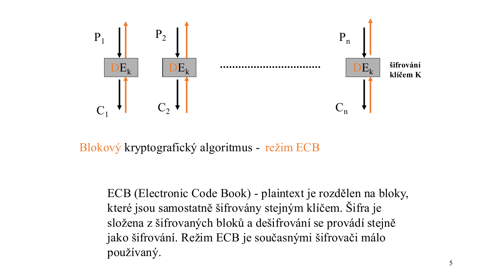

Princip:
- plaintext je rozdělen na bloky,
- každý blok je samostatně šifrován stejným klíčem,
- ciphertext je složen ze šifrovaných bloků,
- dešifrování probíhá analogicky po blocích.

```text
P1 -> E_K -> C1
P2 -> E_K -> C2
...
Pn -> E_K -> Cn
```

### 2.1 Bezpečnostní problém ECB

ECB má zásadní slabinu:

```text
stejný plaintext blok -> stejný ciphertext blok
```

Důsledky:
- opakující se vzory zůstávají viditelné,
- režim je snadno analyzovatelný,
- současnými šifrovači je používán málo.

### 2.2 Příklad z PDF - ECB s rotací

- Velikost bloku: `4 bity`
- Klíč: `K = B = 1011`
- Zpráva: `M = A23A9 = 1010 0010 0011 1010 1001`
- Operace: `M_i XOR K`, potom rotace o jednu pozici vlevo

Výsledek:

```text
C = 23124
```

Pointa: opakující se bloky původní zprávy se projeví opakujícími se bloky v kryptogramu.

---

## 3. Blokový režim CBC

**CBC = Cipher Block Chaining**

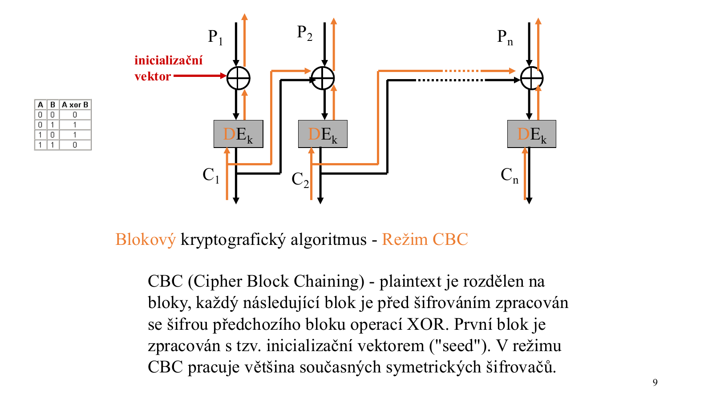

Princip:
- plaintext je rozdělen na bloky,
- každý blok se před šifrováním XORuje s předchozím ciphertext blokem,
- první blok se XORuje s inicializačním vektorem `IV`,
- výstup jednoho bloku ovlivňuje šifrování dalšího.

```text
C1 = E_K(P1 XOR IV)
C2 = E_K(P2 XOR C1)
C3 = E_K(P3 XOR C2)
...
```

Výhoda:

```text
stejný plaintext blok -> různý ciphertext blok
```

To výrazně omezuje viditelnost opakujících se vzorů.

### 3.1 Příklad z PDF - CBC s rotací

- Velikost bloku: `4 bity`
- Klíč: `K = B = 1011`
- Zpráva: `M = A23A9 = 1010 0010 0011 1010 1001`
- Inicializační vektor: `IV = 0000`

Výsledek v materiálu:

```text
C = 27FDF
```

Pointa: bloky původní zprávy už přímo nesouvisí s bloky kryptogramu.

---

## 4. Proudové režimy OFB a CFB

Proudové režimy používají blokovou šifru jako generátor pseudonáhodného proudu, který se následně XORuje s plaintextem.

### 4.1 OFB

**OFB = Output FeedBack**

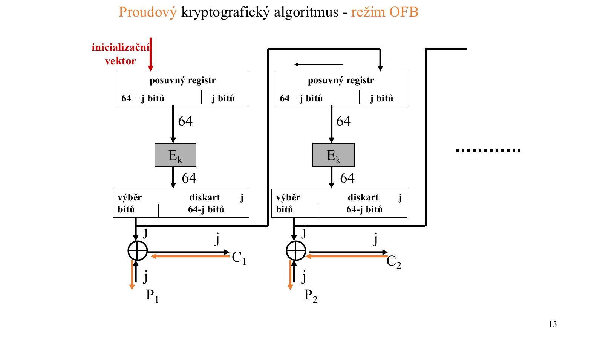

Vlastnosti:
- klíčový proud se opakovaně generuje z inicializačního vektoru a výstupu šifrovače,
- zpětná vazba není ovlivněna ciphertextem,
- vhodné pro HW implementace.

### 4.2 CFB

**CFB = Ciphertext FeedBack**

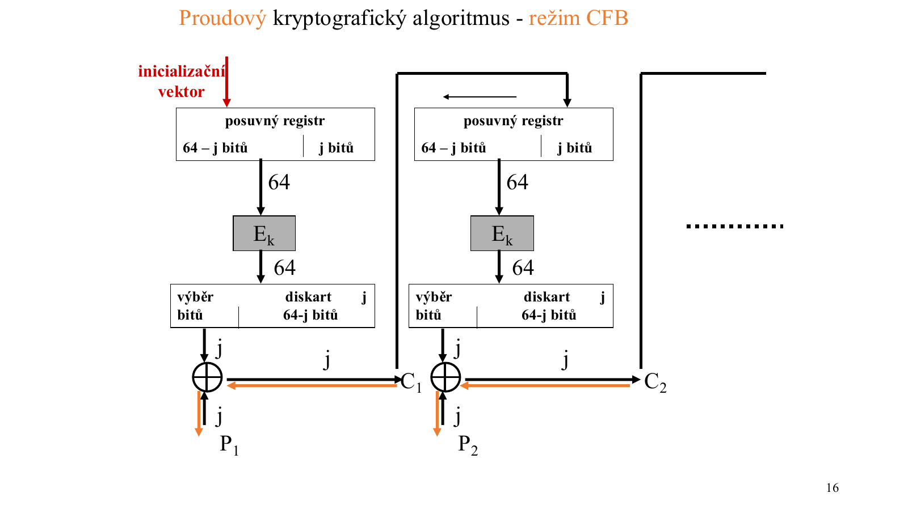

Vlastnosti:
- plaintext se nešifruje po celých blocích, ale po menších jednotkách, např. po 8bitových znacích,
- vstupem šifrovače je posuvný registr,
- registr se plní ciphertextem předchozího znaku,
- bloková šifra zde vytváří dynamický klíčový proud.

### 4.3 CFB vs OFB

| Vlastnost | CFB | OFB |
|-----------|-----|-----|
| Zpětná vazba | Z ciphertextu | Z výstupu šifrovače |
| Vliv ciphertextu na klíčový proud | Ano | Ne |
| Typická jednotka | Znaky/menší části | Proud bitů |
| Poznámka | Ciphertext se vrací do registru | Proud je generován nezávisle na ciphertextu |

---

## 5. MAC

**MAC = Message Authentication Code**

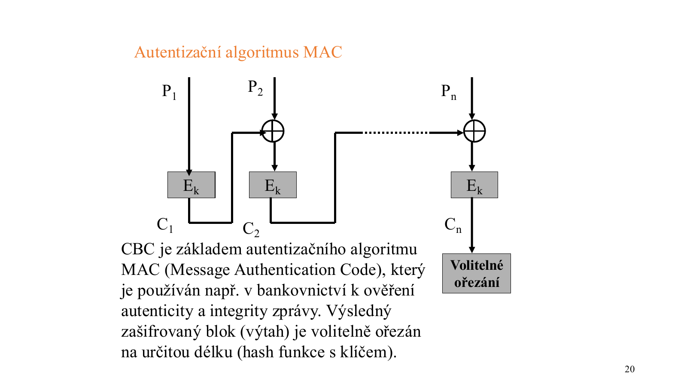

MAC je autentizační algoritmus používaný k ověření:
- **autenticity** zprávy,
- **integrity** zprávy.

V materiálu je MAC vysvětlen jako mechanismus založený na CBC:
- zpráva se zpracovává po blocích,
- bloky se řetězí podobně jako u CBC,
- výsledný zašifrovaný blok tvoří výtah,
- tento výtah může být volitelně ořezán na kratší délku.

MAC je prakticky **hash funkce s klíčem**. Bez znalosti tajného klíče nelze vytvořit správný autentizační kód.

Typické použití:
- bankovnictví,
- ověřování integrity zpráv,
- ověřování, že zprávu vytvořila strana znalá tajného klíče.

---

## 6. DES a 3DES

### 6.1 DES

**DES = Data Encryption Standard**

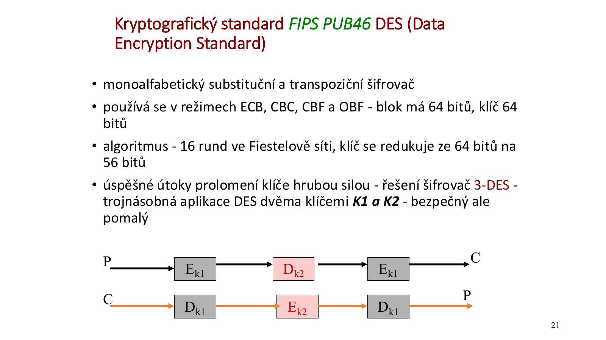

| Vlastnost | Hodnota |
|-----------|---------|
| Standard | FIPS PUB 46 |
| Typ | Monoalfabetický substituční a transpoziční šifrovač |
| Blok | 64 bitů |
| Klíč | 64 bitů, efektivně 56 bitů |
| Počet rund | 16 |
| Struktura | Feistelova síť |
| Režimy | ECB, CBC, CFB, OFB |

DES je dnes považován za zastaralý hlavně kvůli krátkému efektivnímu klíči `56 bitů`.

### 6.2 3DES

3DES vznikl jako reakce na prolomitelnost DES hrubou silou.

Princip:

```text
Šifrování:   E_K1 -> D_K2 -> E_K1
Dešifrování: D_K1 -> E_K2 -> D_K1
```

Vlastnosti:
- trojnásobná aplikace DES,
- typicky se dvěma klíči `K1` a `K2`,
- bezpečnější než DES,
- výrazně pomalejší.

### 6.3 Délka klíče a hrubá síla

Bezpečnost symetrické kryptografie závisí na:

```text
algoritmus + délka klíče
```

Silný algoritmus znamená, že nemá známou praktickou slabinu a zbývá jen útok hrubou silou.

Materiál uvádí orientační srovnání pro `10^6` testovaných klíčů za sekundu:

| Prostor klíčů | Orientační náročnost |
|---------------|----------------------|
| `2^56` | tisíce let |
| `2^64` | statisíce let |
| `2^128` | prakticky mimo realistické možnosti |

---

## 7. Feistelova síť

DES používá 16 rund Feistelovy sítě.

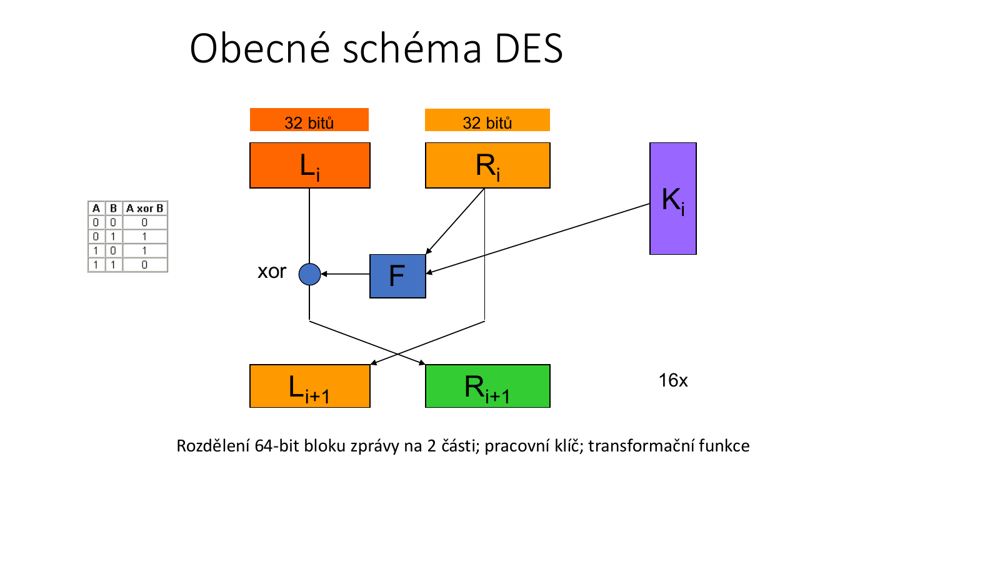

Princip jedné rundy:
- 64bitový blok se rozdělí na levou a pravou 32bitovou polovinu,
- pravá polovina vstupuje do transformační funkce `F` společně s pracovním klíčem `K_i`,
- výstup funkce `F` se XORuje s levou polovinou,
- poloviny se pro další rundu prohodí.

Zjednodušeně:

```text
L_{i+1} = R_i
R_{i+1} = L_i XOR F(R_i, K_i)
```

Výhoda Feistelovy konstrukce je, že stejná struktura může sloužit pro šifrování i dešifrování, jen se rundové klíče použijí v opačném pořadí.

---

## 8. Další symetrické algoritmy

| Algoritmus | Typ/blok | Klíč | Poznámka |
|------------|----------|------|----------|
| **Blowfish** | blok 64 b | až 448 b | Použití např. u čipových karet |
| **Twofish** | blok 128 b | 128 b | Autor Bruce Schneier |
| **IDEA** | blok 64 b | 128 b | Implementován v PGP |
| **SKIPJACK** | blok 64 b | 80 b | HW implementace, CLIPPER/CAPSTONE |
| **AES/Rijndael** | blok 128 b | 128/192/256 b | Moderní standard, autoři Rijmen a Daemen |
| **RC2/RC4/RC5/RC6** | různé | různé | Autor Ronald Rivest; RC4 je proudová verze používaná historicky v SSL |

---

## 9. Diffie-Hellmanův protokol

Diffie-Hellman zajišťuje ustanovení tajného klíče pro symetrickou kryptografii přes nezabezpečený kanál, který ale musí zajišťovat **autentizaci a integritu**.

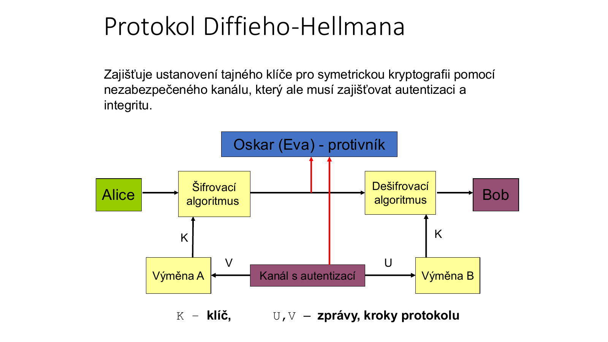

### 9.1 Princip

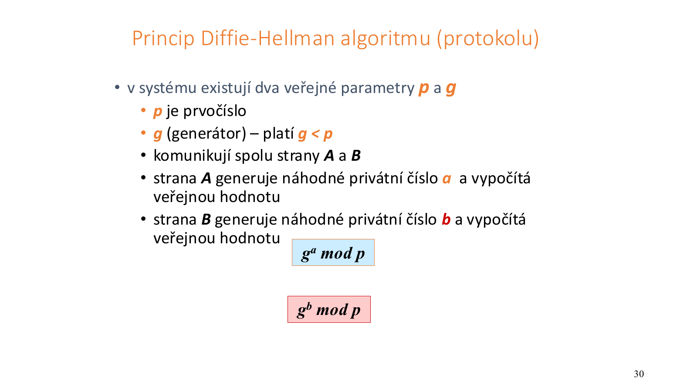

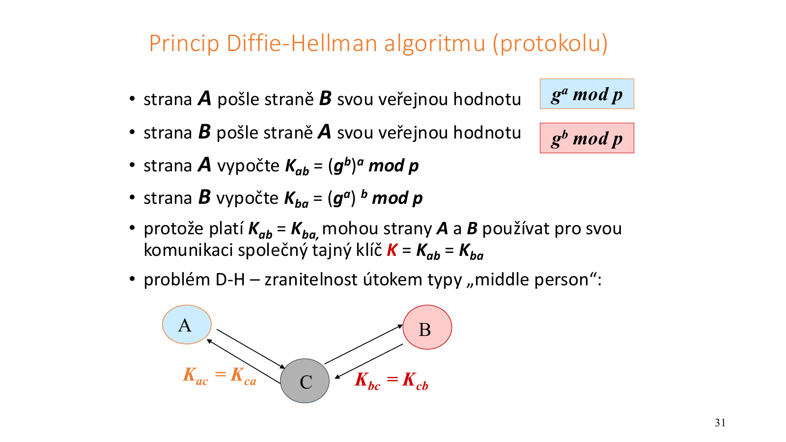

Veřejné parametry:
- `p` - velké prvočíslo,
- `g` - generátor, `g < p`.

Postup:

```text
Alice:                          Bob:
1. zvolí tajné x                1. zvolí tajné y
2. spočítá U = g^x mod p        2. spočítá V = g^y mod p
3. pošle U Bobovi               3. pošle V Alici
4. spočítá K = V^x mod p        4. spočítá K = U^y mod p
```

Obě strany dostanou stejný klíč:

```text
K = g^(xy) mod p
```

Bezpečnost stojí na problému **diskrétního logaritmu**: ze znalosti `g`, `p` a `g^x mod p` je výpočetně obtížné získat `x`.

### 9.2 Postup výpočtu

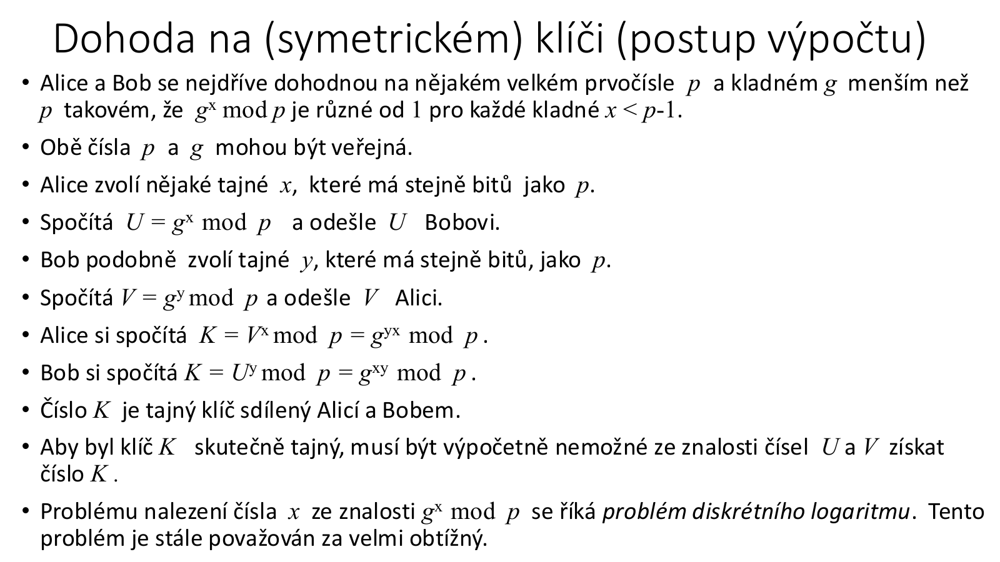

Příklad 1:

```text
p = 11, g = 7

Alice zvolí x = 3:
U = 7^3 mod 11 = 2

Bob zvolí y = 6:
V = 7^6 mod 11 = 4

Alice:
K = 4^3 mod 11 = 9

Bob:
K = 2^6 mod 11 = 9
```

Sdílený klíč je `K = 9`.

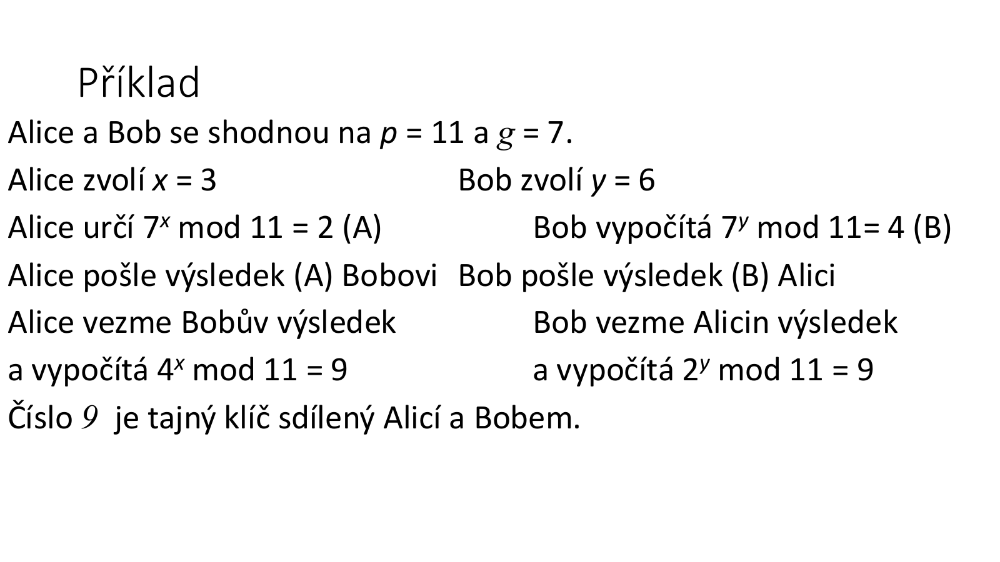

Příklad 2:

```text
p = 13, g = 11

Alice zvolí x = 5:
U = 11^5 mod 13 = 7

Bob zvolí y = 7:
V = 11^7 mod 13 = 2

Alice:
K = 2^5 mod 13 = 6

Bob:
K = 7^7 mod 13 = 6
```

Sdílený klíč je `K = 6`.

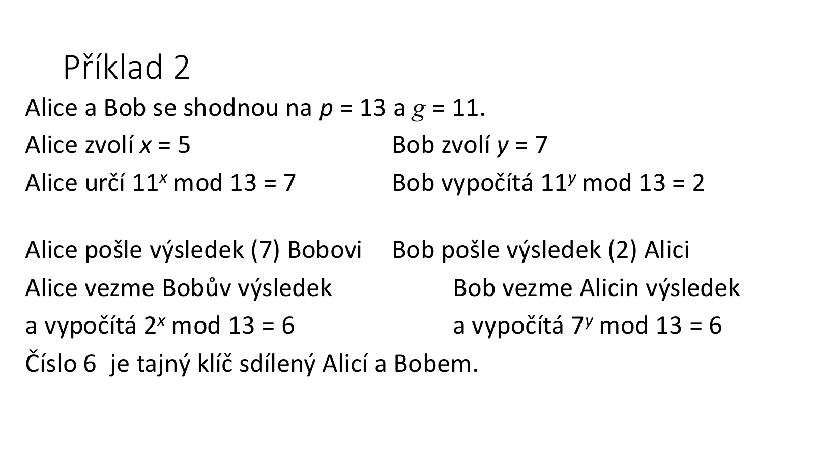

---

## 10. Man-in-the-Middle útok na Diffie-Hellman

Bez autentizace je Diffie-Hellman zranitelný vůči útoku typu **man-in-the-middle**.

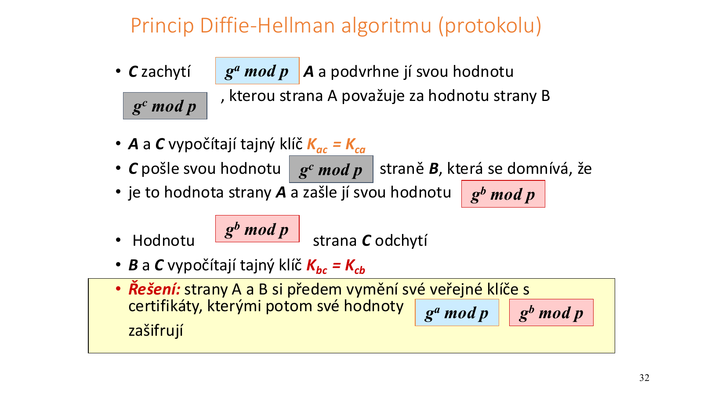

Scénář:
1. Útočník se postaví mezi Alici a Boba.
2. S Alicí provede vlastní DH výměnu a získá klíč `K_AC`.
3. S Bobem provede druhou DH výměnu a získá klíč `K_BC`.
4. Zprávy od Alice dešifruje klíčem `K_AC`.
5. Poté je znovu zašifruje klíčem `K_BC` a pošle Bobovi.
6. Alice i Bob mají dojem, že komunikují přímo spolu.

Obrana:
- autentizace kanálu,
- certifikáty,
- předem ověřené veřejné klíče,
- podpisy vyměňovaných DH hodnot.

---

## Otázky k opakování

1. Jaký je rozdíl mezi blokovou a proudovou symetrickou šifrou?
2. Jaký je rozdíl mezi ECB a CBC?
3. Proč je ECB málo bezpečný?
4. Co je inicializační vektor a proč je potřeba v CBC?
5. Jaký je rozdíl mezi CFB a OFB?
6. Co je MAC a proč se dá chápat jako hash funkce s klíčem?
7. Jaké jsou hlavní parametry DES?
8. Proč je DES dnes zastaralý?
9. Jak funguje 3DES?
10. Jak funguje Feistelova síť?
11. Jaké jsou příklady dalších symetrických algoritmů?
12. Co řeší Diffie-Hellmanův protokol?
13. Proč Diffie-Hellman potřebuje autentizaci?
14. Jak funguje man-in-the-middle útok na Diffie-Hellman?
