# 04b - Asymetrická kryptografie, hash algoritmus, elektronický podpis

**Zdroj:** `04b_Asymetricka_kryptografie,_Hash_algoritmus,_Elektronicky_podpis.pdf`  
**Autor:** Prof. Ing. Cyril Klimeš, CSc.  
**Poslední aktualizace:** 2026-05-15

---

## 1. Princip asymetrické kryptografie

Asymetrická kryptografie používá dvojici klíčů:

| Klíč | Význam |
|------|--------|
| **Veřejný klíč (`Kp`)** | Může být zveřejněn; ostatní jím šifrují zprávy pro vlastníka nebo ověřují jeho podpisy. |
| **Soukromý/tajný klíč (`Ks`)** | Musí zůstat pod kontrolou vlastníka; slouží k dešifrování nebo vytváření podpisů. |

### 1.1 Metafora bezpečné krabice

1. Bob navrhne zámek a kopie zámku distribuuje po světě.
2. Bob si ponechá jediný klíč.
3. Alice vloží tajnou zprávu do krabice a zaklapne Bobův zámek.
4. Pošle krabici Bobovi i nezabezpečenou poštou.
5. Bob ji odemkne svým klíčem.

Metafora odpovídá veřejnému a soukromému klíči: zámek je veřejný, odemykací klíč je soukromý.

### 1.2 Šifrovací systém s veřejným klíčem

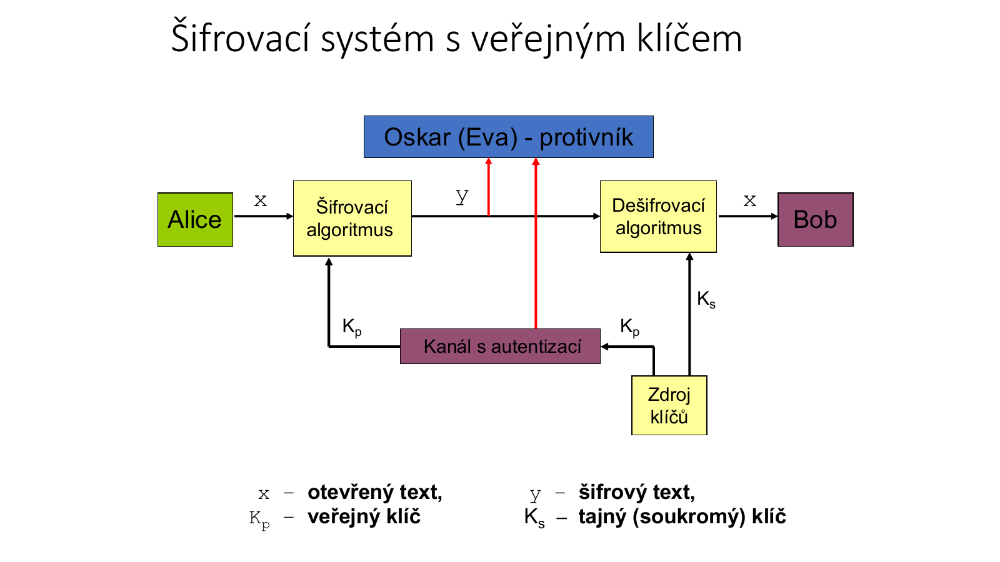

Požadavky:
- Pro dvojici klíčů `(Kp, Ks)` platí: `d_Ks(e_Kp(x)) = x`.
- Kanál pro přenos veřejného klíče nemusí zajišťovat důvěrnost, ale **musí zajišťovat autentizaci**.
- Příjemce musí mít jistotu, že veřejný klíč skutečně patří očekávané osobě.
- Generátor klíčů je obvykle na straně příjemce zprávy.
- Šifrování a dešifrování s klíči musí být prakticky rychlé, ale prolomení bez soukromého klíče musí být výpočetně nezvládnutelné.

### 1.3 Vlastnosti

Výhody:
- soukromý klíč je tajemstvím pouze příjemce,
- veřejný klíč umožňuje komukoliv zašifrovat zprávu pro příjemce,
- veřejný klíč lze relativně snadno distribuovat.

Nevýhody:
- matematicky složitější než symetrická kryptografie,
- výpočetně pomalejší,
- bezpečnost se posuzuje obtížněji,
- vyžaduje správné ověření vazby veřejného klíče na identitu.

---

## 2. RSA

RSA je nejznámější asymetrický algoritmus. Bezpečnost stojí na obtížnosti faktorizace velkého čísla `n`, které je součinem dvou velkých prvočísel.

### 2.1 Generování klíčů

1. Zvolí se dvě dostatečně velká prvočísla `p`, `q`.
2. Spočítá se:

```text
n = p · q
φ(n) = (p - 1)(q - 1)
```

3. Zvolí se exponent `e` nesoudělný s `φ(n)`.
4. Spočítá se soukromý exponent `d` jako multiplikativní inverze:

```text
d · e ≡ 1 (mod φ(n))
```

5. Klíče:

```text
veřejný klíč:   (e, n)
soukromý klíč:  (d, n)
```

### 2.2 Šifrování a dešifrování

```text
Šifrování:   y = x^e mod n
Dešifrování: x = y^d mod n
```

Korektnost stojí na tom, že `d · e ≡ 1 (mod φ(n))`.

### 2.3 Příklad klíčů z PDF

```text
p = 7, q = 13
n = 91
φ(n) = 6 · 12 = 72
```

Zvolí se `d = 7`, nesoudělné s `72`. Hledá se `e`, aby:

```text
e · 7 ≡ 1 (mod 72)
```

Rozšířeným Eukleidovým algoritmem:

```text
72 = 10 · 7 + 2
7 = 3 · 2 + 1
1 = 7 - 3(72 - 10 · 7)
1 = 31 · 7 - 3 · 72
```

Tedy:

```text
e = 31
```

Klíče:

```text
veřejný klíč:  (e = 31, n = 91)
soukromý klíč: (d = 7,  n = 91)
```

Příklad zprávy `x = 24`:

```text
y = 24^31 mod 91 = 80
x = 80^7 mod 91 = 24
```

### 2.4 Prolomení malého RSA

Pokud je veřejný klíč `(n, e) = (91, 31)`, útočník potřebuje rozložit:

```text
91 = 7 · 13
```

Pak získá:

```text
φ(n) = (7 - 1)(13 - 1) = 72
d = 31⁻¹ mod 72 = 7
```

U malých čísel je to jednoduché. U reálného RSA se používají velmi velká prvočísla, takže faktorizace `n` je prakticky neproveditelná.

### 2.5 Další příklad z PDF

```text
p = 17, q = 11
n = 187
φ(n) = 16 · 10 = 160
e = 7
```

Hledáme `d`, aby:

```text
d · 7 ≡ 1 (mod 160)
```

Z Eukleidova algoritmu vyjde:

```text
d = 23
```

Pro zprávu `M = 88`:

```text
C = 88^7 mod 187 = 11
M = 11^23 mod 187 = 88
```

---

## 3. Digitální podpis

Digitální podpis slouží k ověření autora a integrity podepsaných dat. Nezajišťuje důvěrnost obsahu.

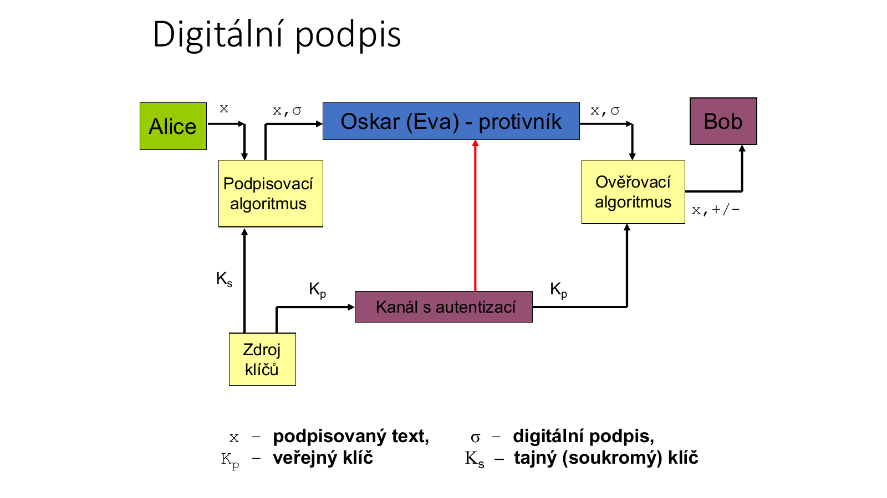

### 3.1 Bezpečnostní cíle

Digitální podpis zajišťuje:
- **autenticitu** - potvrzení původu dokumentu,
- **integritu** - dokument nebyl změněn,
- **nepopiratelnost** - autor nemůže později popřít podpis,
- **jednorázové použití** - konkrétní podpis nelze použít pro jiný dokument.

Digitální podpis nezajišťuje:
- **důvěrnost** - podepsaná zpráva nemusí být šifrovaná.

### 3.2 Podpisový systém

Podpisové schéma s veřejným klíčem tvoří:
- generátor pseudonáhodných čísel,
- podpisovací algoritmus,
- ověřovací algoritmus.

Podpisovací algoritmus ze zprávy `x` a soukromého klíče `Ks` vypočítá podpis `σ`. Ověřovací algoritmus pro zprávu `x`, podpis `σ` a veřejný klíč `Kp` ověří správnost podpisu.

### 3.3 Typy podvržení podpisu

| Typ útoku | Popis |
|-----------|-------|
| **Úplné prolomení** | Útočník získá soukromý klíč ze znalosti veřejného klíče. |
| **Univerzální podvržení** | Útočník umí vytvářet platné podpisy k libovolným zprávám. |
| **Selektivní podvržení** | Útočník umí vytvořit platný podpis ke zvolené zprávě. |
| **Existenční podvržení** | Útočník umí vytvořit nějakou dvojici `(x, σ)`, kde `σ` je platný podpis, ale nekontroluje podobu zprávy. |

### 3.4 Od šifrování k podpisu

Šifrovací systém s veřejným klíčem lze převést na podpisový systém:
- dešifrovací algoritmus se soukromým klíčem funguje jako podpisovací algoritmus,
- šifrovací algoritmus s veřejným klíčem funguje jako ověřovací algoritmus.

U jednoduchého RSA podpisu ale vznikají bezpečnostní problémy, např. existenční podvržení. Proto se v praxi nepodepisuje přímo celá zpráva, ale její hash.

---

## 4. Hash funkce

Hashovací funkce je jednosměrná funkce, která převádí vstup libovolné délky na výstup pevné délky.

```text
vstup libovolné délky -> HASH -> výstup pevné délky
```

Hash funguje jako otisk vstupních dat.

### 4.1 Požadavky na hash

1. Stejný vstup vždy vytvoří stejný hash.
2. Různě dlouhá data produkují hash stejné délky.
3. Z hashe nelze zpětně získat původní data.
4. Je výpočetně nezvládnutelné najít jiný vstup se stejným hashem.
5. Je výpočetně nezvládnutelné najít dvě různé zprávy se stejným hashem.

Formálně pro jednocestnou funkci `y = F(x)`:
- pro dané `x` lze snadno spočítat `y`,
- pro dané `y` je obtížné najít `x`,
- pro dané `x` je obtížné najít `x' != x`, aby `F(x) = F(x')`.

### 4.2 Známé hashovací funkce

| Algoritmus | Výstup | Poznámka |
|------------|--------|----------|
| **MD5** | 128 b | Od roku 1996 není považován za dostatečně bezpečný; od roku 2004 velmi nebezpečný kvůli kolizím. |
| **SHA-1** | 160 b | Nástupce MD5, slabiny nalezeny v roce 2005; nedoporučuje se pro hesla/podpisy. |
| **SHA-256** | 256 b | Bezpečnější varianta. |
| **SHA-512** | 512 b | Bezpečnější varianta. |
| **bcrypt** | proměnné | Vhodný pro ukládání hesel; používá sůl a nastavitelnou pomalost. |

### 4.3 MD5 v materiálu

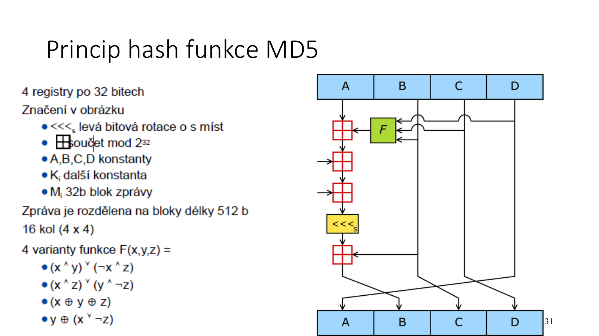

MD5:
- doplňuje zprávu na délku `448 mod 512`,
- připojuje 64bitovou délku původní zprávy,
- inicializuje čtyři 32bitové registry,
- zpracovává 512bitové bloky,
- používá 4 pomocné funkce a 64 rund,
- výsledkem je 128bitový hash.

### 4.4 Použití hash funkcí

- Uložení hesel
- Kontrolní součty bez šifrování
- Kontrola integrity
- HMAC - klíčované kontrolní součty
- Otisk zprávy pro digitální podpis
- Otisk klíčů

---

## 5. Elektronický digitální podpis s hashem

V praxi se používají podpisové systémy **bez obnovy zprávy**:

```text
nepodepisuje se zpráva M,
podepisuje se hash H(M)
```

Použitá hash funkce musí být odolná vůči kolizím. Pokud by dvě různé zprávy měly stejný hash, mohl by útočník nechat podepsat jednu zprávu a podpis připojit k jiné.

### 5.1 Princip RSA podpisu

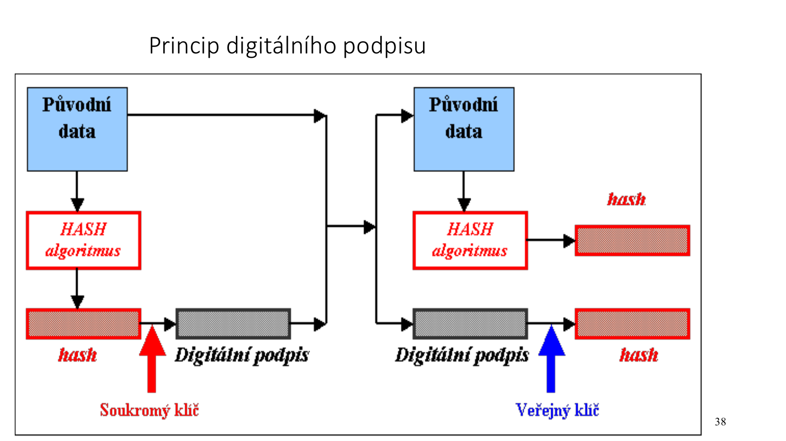

Odesílatel:

```text
M = zpráva
H = HASH(M)
S = H^d mod N
M + S = digitálně podepsaná zpráva
```

Příjemce:

```text
H1 = S^e mod N
H2 = HASH(M)
podpis platí, pokud H1 = H2
```

### 5.2 Podepsání a ověření zprávy

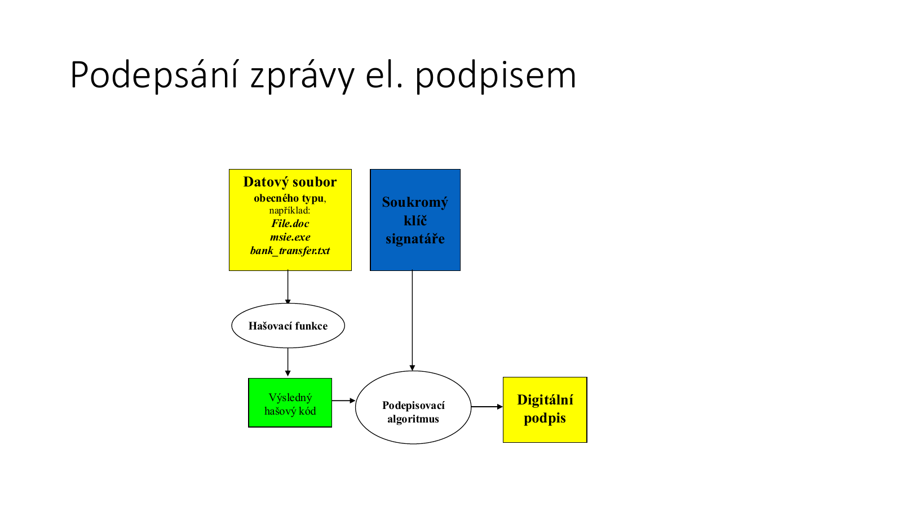

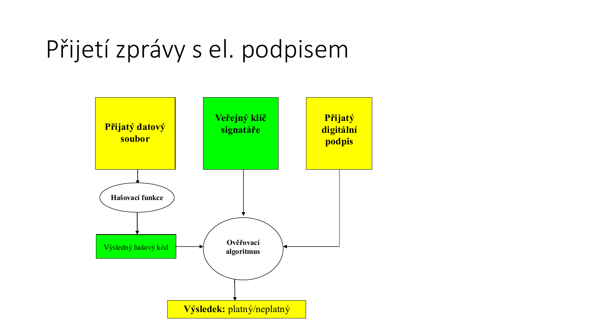

Mechanismus:
1. Zpráva se převede hash funkcí na digest.
2. Digest se podepíše soukromým klíčem.
3. Podpis se připojí ke zprávě.
4. Příjemce z podpisu získá digest pomocí veřejného klíče.
5. Příjemce sám spočítá hash přijaté zprávy.
6. Pokud se oba hashe shodují, podpis je platný a zpráva nebyla změněna.

### 5.3 Právní pojmy z materiálu

**Zaručený elektronický podpis:**
1. je jednoznačně spojen s podepisující osobou,
2. umožňuje identifikaci podepisující osoby,
3. je vytvořen prostředky pod výhradní kontrolou podepisující osoby,
4. je připojen tak, že lze zjistit následnou změnu dat.

**Uznávaný elektronický podpis:**

```text
zaručený elektronický podpis + kvalifikovaný certifikát
```

### 5.4 Bezpečnost elektronického podpisu

Bezpečnost závisí na tom, aby:
- nebyl prozrazen soukromý klíč,
- nebyl prolomen použitý kryptografický algoritmus,
- nebyla narušena bezpečnost hash funkce,
- byla zaručena autenticita veřejného klíče.

---

## 6. Certifikáty a certifikační autority

Problém elektronického podpisu: příjemce musí vědět, že veřejný klíč skutečně patří osobě, která je za jeho vlastníka označena.

Řešení: **certifikační autorita (CA)** jako důvěryhodná třetí strana.

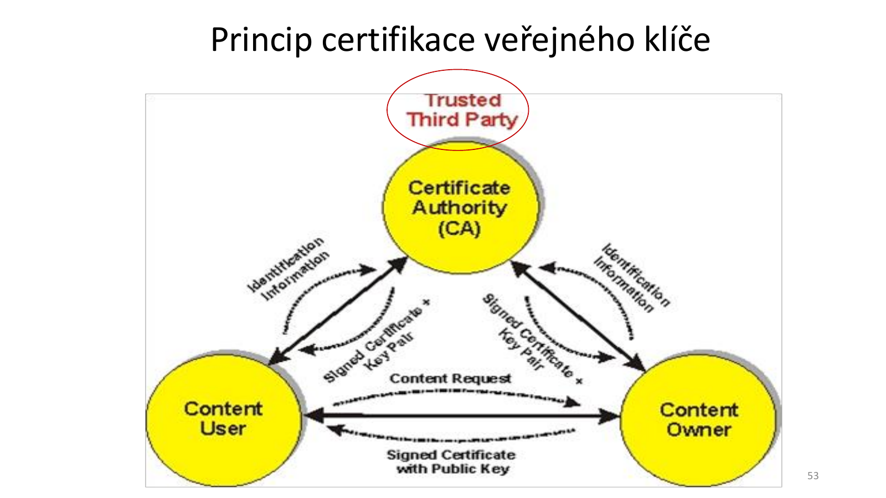

### 6.1 Certifikát

Certifikát je datová struktura, která svazuje veřejný klíč s identitou vlastníka.

Obsah certifikátu:
- jméno vlastníka,
- sériové číslo certifikátu,
- doba platnosti,
- algoritmus veřejného klíče,
- kopie veřejného klíče vlastníka,
- jméno certifikační autority,
- digitální podpis CA.

Formát je popsán doporučením **X.509**; materiál zmiňuje RFC2459, ASN.1 a DER.

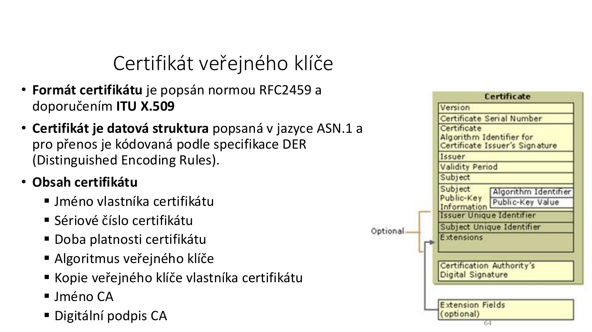

### 6.2 Zisk certifikátu

Certifikát se vydává na základě žádosti.

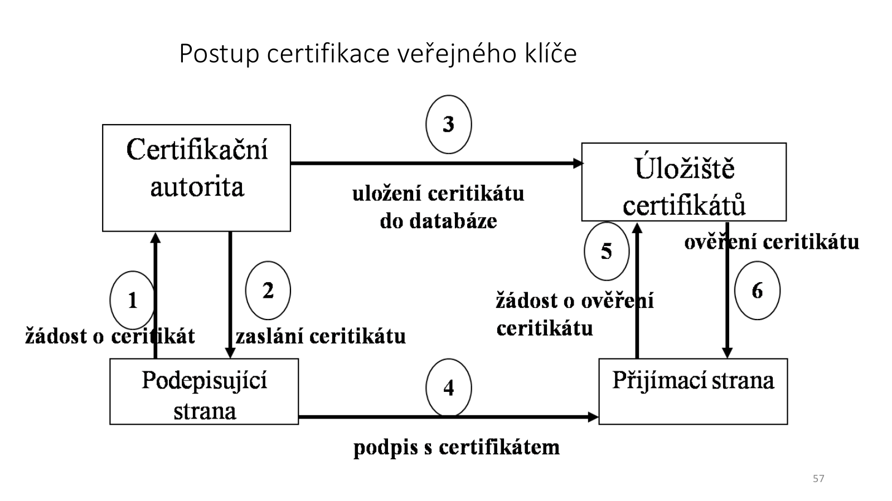

Postup:
1. Žadatel vygeneruje dvojici veřejný/soukromý klíč.
2. Vybere CA.
3. Zadá požadované informace.
4. Předá veřejný klíč a údaje CA.
5. CA ověří informace.
6. CA vytvoří certifikát a podepíše jej svým soukromým klíčem.
7. CA předá certifikát žadateli.

### 6.3 Funkce CA

Certifikační autorita:
- registruje uživatele certifikátů,
- vydává certifikáty k veřejným klíčům,
- odvolává platnost certifikátů,
- zveřejňuje seznamy certifikátů,
- zveřejňuje zneplatněné certifikáty v CRL,
- spravuje klíče po dobu jejich životního cyklu,
- může poskytovat časová razítka.

### 6.4 RA

**RA = Registration Authority**

RA je nepovinná složka PKI. Vytváří vazbu mezi klientem a CA:
- přijímá žádosti o certifikaci,
- ověřuje pravdivost údajů,
- předává certifikát CA k podpisu,
- předává podepsaný certifikát klientovi.

---

## 7. PKI a důvěryhodná třetí strana

**PKI = Public Key Infrastructure**

PKI zajišťuje automatizovanou správu veřejných klíčů a certifikátů.

Materiál zmiňuje související standardy:
- X.509 / ISO/IEC 9594-8 / ITU-T X.509,
- LDAP/X.500,
- PKCS #6,
- PKCS #10,
- ISO/IEC 11770-1 až 3.

### 7.1 Hierarchie CA

Problém: jak důvěryhodně zveřejnit veřejný klíč CA.

Řešení:
- kořenové CA,
- podřízené CA,
- tranzitivita důvěry,
- křížové ověření CA,
- mesh PKI architektura,
- ověření CA přes brány.

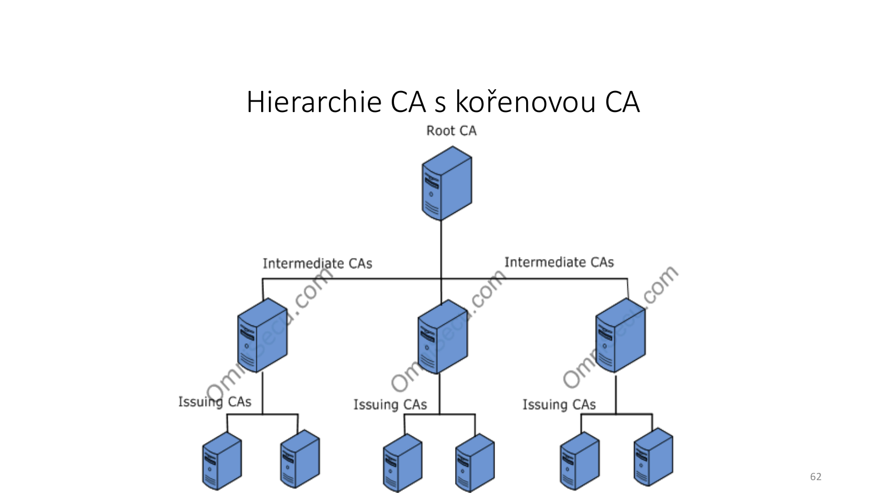

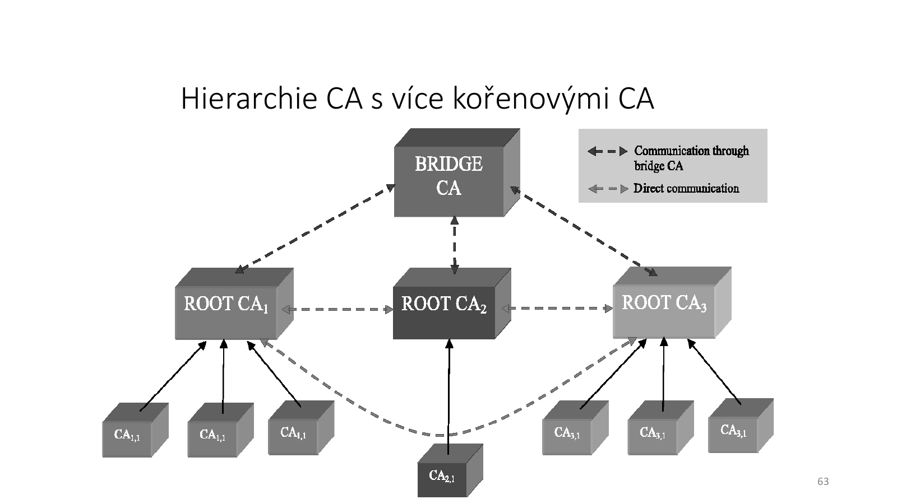

### 7.2 TTP

**TTP = Trusted Third Party**

TTP je bezpečnostní autorita důvěryhodná pro všechny entity zapojené do zabezpečené transakce.

Požadavky:
- činnost v právním rámci,
- dohled dozorového orgánu,
- vlastní bezpečnostní politika,
- akreditace kvality procesů a operací,
- záruky dostupnosti a kvality služeb.

Režimy TTP:

| Režim | Popis |
|-------|------|
| **In-line TTP** | Působí přímo uprostřed transakčního kanálu jako proxy agent. |
| **On-line TTP** | Je dostupná během transakce pro real-time interakci. |
| **Off-line TTP** | Není nutně dostupná během transakce; požadavky se plní v pozdějších cyklech. |

### 7.3 TSA

**TSA = Time Stamping Authority**

Časové razítko potvrzuje, že daná informace existovala před uvedeným časem.

---

## 8. Praktické závěry z materiálu

### 8.1 Důvěrnost + neodmítnutelnost

Pro zajištění důvěrnosti a neodmítnutelnosti zprávy:
1. Obsah zprávy se zašifruje náhodně vygenerovaným symetrickým klíčem.
2. Symetrický klíč se zašifruje veřejným klíčem příjemce.
3. Hash zprávy se zašifruje soukromým klíčem odesílatele.
4. Příjemce ověří podpis veřejným klíčem odesílatele.

Tím se kombinuje:
- symetrická kryptografie pro rychlé šifrování dat,
- asymetrická kryptografie pro ochranu klíče a podpis,
- hash funkce pro integritu.

### 8.2 Nejdůležitější podmínka podpisu

Podepisující subjekt musí mít zařízení, na kterém probíhá podepisování, pod plnou kontrolou. U podpisu a neodmítnutelnosti by mělo být pod jeho **výhradní kontrolou**.

### 8.3 Zámeček u webu

Web s certifikátem a ikonou zámku znamená:
- komunikace s webem je šifrovaná.

Neznamená automaticky:
- že je web legitimní,
- že neobsahuje malware,
- že nejde o podvodný web,
- že je použita silná konfigurace šifer.

### 8.4 Steganografie

Steganografie nezajišťuje primárně šifrování obsahu, ale skrývá samotnou skutečnost, že je přenášena tajná zpráva. Zpráva může být ukryta v textu, obrázku, hudbě nebo videu.

---

## Otázky k opakování

1. Jaký je rozdíl mezi veřejným a soukromým klíčem?
2. Proč musí být kanál pro veřejný klíč autentizovaný, i když nemusí být důvěrný?
3. Jak se generují klíče RSA?
4. Jak funguje RSA šifrování a dešifrování?
5. Proč je RSA bezpečné jen při použití velkých prvočísel?
6. Jak rozšířený Eukleidův algoritmus pomáhá určit soukromý exponent?
7. Co zajišťuje digitální podpis?
8. Proč digitální podpis sám o sobě nezajišťuje důvěrnost?
9. Proč se v praxi podepisuje hash zprávy a ne celá zpráva?
10. Jaké vlastnosti musí mít bezpečná hash funkce?
11. Proč jsou MD5 a SHA-1 problematické?
12. Jaký je rozdíl mezi CA a RA?
13. Co obsahuje certifikát veřejného klíče?
14. Co je PKI a proč je potřeba?
15. Co je TTP a jaké má režimy?
16. Co skutečně znamená ikona zámku u webové stránky?
