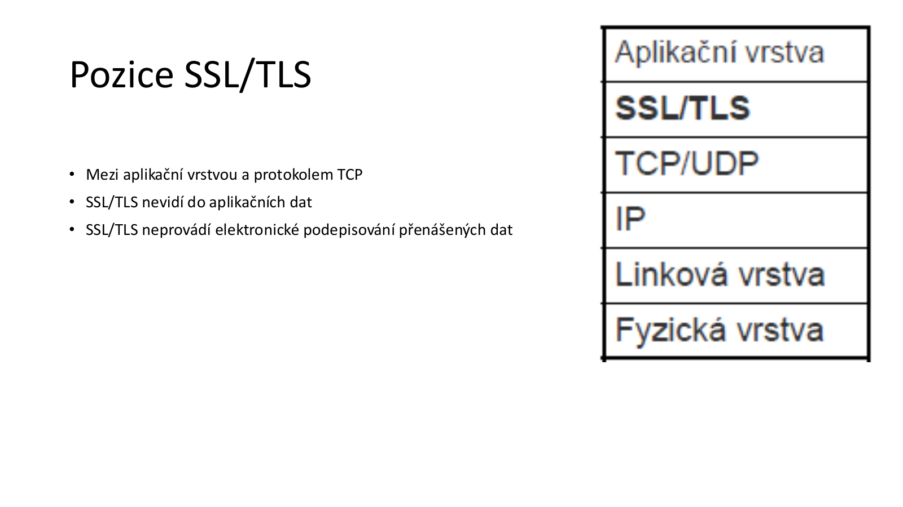
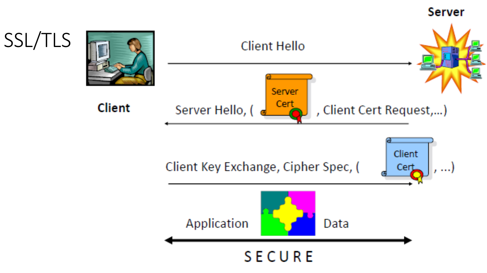
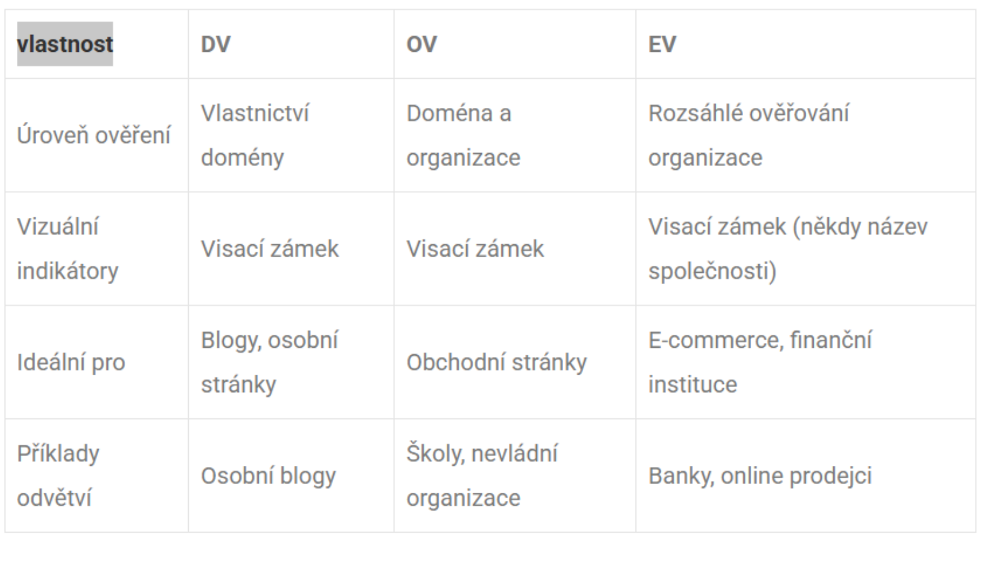

# 04c - Protokoly vyšší úrovně: SSL/TLS

**Zdroj:** `04c_Protokoly_vyssi_urovne.pdf`  
**Autor:** Prof. Ing. Cyril Klimeš, CSc.  
**Poslední aktualizace:** 2026-05-15

---

## 1. SSL/TLS

**SSL = Secure Sockets Layer**  
**TLS = Transport Layer Security**

SSL/TLS jsou protokoly pro bezpečnou komunikaci přes počítačovou síť, typicky internet.

SSL/TLS certifikát:
- ověřuje identitu webové stránky,
- obsahuje veřejný klíč serveru,
- umožňuje šifrovat data mezi klientem a serverem,
- používá se např. pro bezpečný přenos hesel nebo údajů o platební kartě.

---

## 2. Co SSL/TLS poskytuje

| Vlastnost | Jak je zajištěna |
|-----------|------------------|
| **Autentizace stran** | Certifikáty a mechanismus výzva-odpověď. |
| **Integrita** | Autentizační kódy MAC zajišťují, že data nebyla změněna. |
| **Důvěrnost** | Po handshaku je ustaven symetrický klíč, kterým se šifruje další komunikace. |

SSL/TLS kombinuje:
- **asymetrickou kryptografii** pro ověření identity a ustavení tajemství,
- **symetrickou kryptografii** pro rychlé šifrování následné komunikace,
- **MAC/hash mechanismy** pro integritu a autenticitu dat.

---

## 3. Jak SSL/TLS certifikát pracuje

1. **Ověření identity:** prohlížeč požádá server o identifikaci.
2. **Certifikát:** server pošle SSL/TLS certifikát s veřejným klíčem a informacemi o identitě.
3. **Ověření certifikátu:** prohlížeč ověří platnost certifikátu přes certifikační autoritu.
4. **Vytvoření šifrovaného kanálu:** pokud je certifikát platný, klient a server vytvoří zabezpečený kanál.
5. **Bezpečný přenos dat:** další data jsou šifrována a chráněna před odposlechem a MITM útokem.

---

## 4. Pozice SSL/TLS



SSL/TLS leží:

```text
aplikační vrstva
SSL/TLS
TCP
IP
```

Důležité poznámky z materiálu:
- SSL/TLS je mezi aplikační vrstvou a TCP.
- SSL/TLS nevidí do aplikačních dat.
- SSL/TLS neprovádí elektronické podepisování přenášených dat.

---

## 5. Klíče v SSL/TLS

Materiál popisuje klasický princip ustavení klíčů:

1. Klient generuje `PreMasterSecret`.
2. Klient jej zašifruje veřejným klíčem serveru.
3. Server jej dešifruje soukromým klíčem.
4. Obě strany vytvoří blok klíčů z:
   - `PreMasterSecret`,
   - náhodného čísla z `ClientHello`,
   - náhodného čísla ze `ServerHello`.

Blok klíčů obsahuje:
- MAC klíč klient -> server,
- MAC klíč server -> klient,
- šifrovací klíč klient -> server,
- šifrovací klíč server -> klient,
- inicializační vektory.

---

## 6. SSL/TLS handshake



Zjednodušený průběh:

1. Klient se připojí k zabezpečenému webu přes HTTPS.
2. Server předloží SSL/TLS certifikát.
3. Prohlížeč certifikát ověří přes důvěryhodnou CA.
4. Prohlížeč zkontroluje:
   - platnost certifikátu,
   - podpis certifikátu,
   - zda certifikát nebyl odvolán.
5. Pokud je certifikát v pořádku, vznikne symetrický klíč relace.
6. Server i klient používají tento symetrický klíč pro další komunikaci.
7. Všechna následná data jsou šifrována symetricky.

Tento proces probíhá velmi rychle, typicky v milisekundách.

---

## 7. Vizuální indikátory SSL/TLS

| Indikátor | Význam |
|-----------|--------|
| `https://` v URL | Stránka používá zabezpečené připojení přes SSL/TLS. |
| Ikona zámku v prohlížeči | Prohlížeč vyhodnotil certifikát jako platný. |
| Název organizace | U EV certifikátů mohl být zobrazován vedle URL; v některých prohlížečích se tato funkce omezuje nebo vyřazuje. |

Pozor: zámek neznamená automaticky, že web je poctivý nebo bezpečný po obsahové stránce. Znamená hlavně, že komunikace je šifrovaná a certifikát prošel kontrolou prohlížeče.

---

## 8. Typy SSL/TLS certifikátů



### 8.1 DV certifikát

**DV = Domain Validation**

- Ověřuje vlastnictví domény.
- Ověření probíhá typicky přes e-mail nebo DNS záznamy.
- Vydává se rychle, často během minut až hodin.
- Je nejlevnější.
- Vhodný pro blogy, osobní stránky, informační weby nebo malé projekty.

### 8.2 OV certifikát

**OV = Organization Validation**

- Ověřuje doménu i základní informace o organizaci.
- Vydání typicky trvá jeden až tři dny.
- Vhodný pro veřejné weby, které sbírají uživatelská data.
- Dává návštěvníkům vyšší jistotu legitimity organizace než DV.

### 8.3 EV certifikát

**EV = Extended Validation**

- Poskytuje rozsáhlé ověření právní, fyzické a provozní existence organizace.
- Vydání trvá typicky jeden až pět dní.
- Je nejdražší.
- Vhodný pro e-commerce, finanční instituce, banky, významné značky a zdravotnické služby.

### 8.4 Srovnání

| Vlastnost | DV | OV | EV |
|-----------|----|----|----|
| Úroveň ověření | Vlastnictví domény | Doména + organizace | Rozsáhlé ověřování organizace |
| Vizuální indikátor | Zámek | Zámek | Zámek, někdy název společnosti |
| Ideální pro | Blogy, osobní stránky | Obchodní stránky, školy, neziskové organizace | Banky, online prodejci, finanční služby |

---

## Otázky k opakování

1. Co znamenají zkratky SSL a TLS?
2. Jaké tři hlavní bezpečnostní vlastnosti SSL/TLS poskytuje?
3. K čemu slouží SSL/TLS certifikát?
4. Kde je SSL/TLS umístěn vzhledem k aplikační vrstvě a TCP?
5. Co je `PreMasterSecret` a jak se používá při ustavení klíčů?
6. Jaké klíče vznikají v SSL/TLS key bloku?
7. Jak zjednodušeně probíhá SSL/TLS handshake?
8. Co skutečně znamená zámek v prohlížeči?
9. Jaký je rozdíl mezi DV, OV a EV certifikátem?
10. Proč SSL/TLS používá kombinaci asymetrické a symetrické kryptografie?
