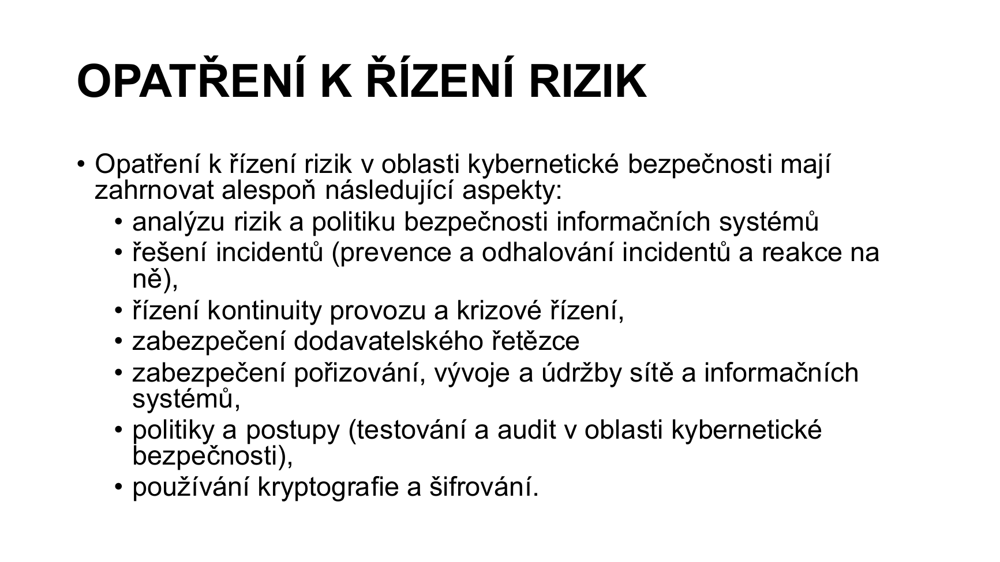
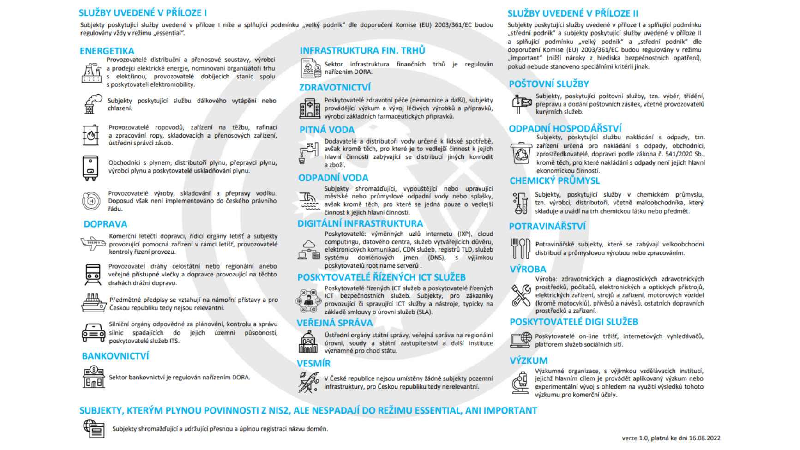
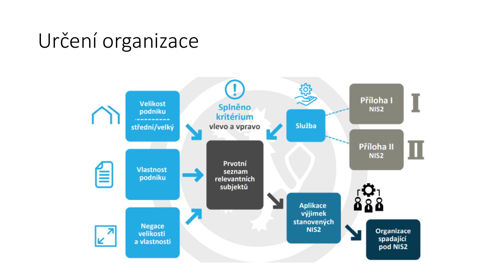
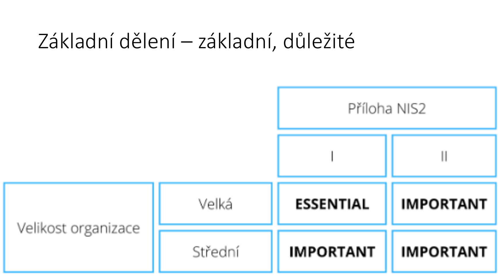
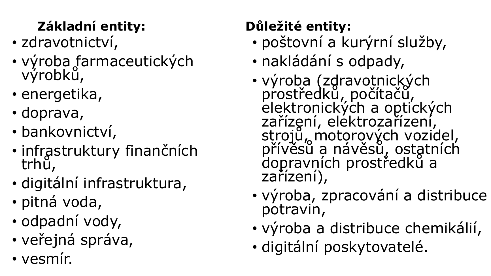
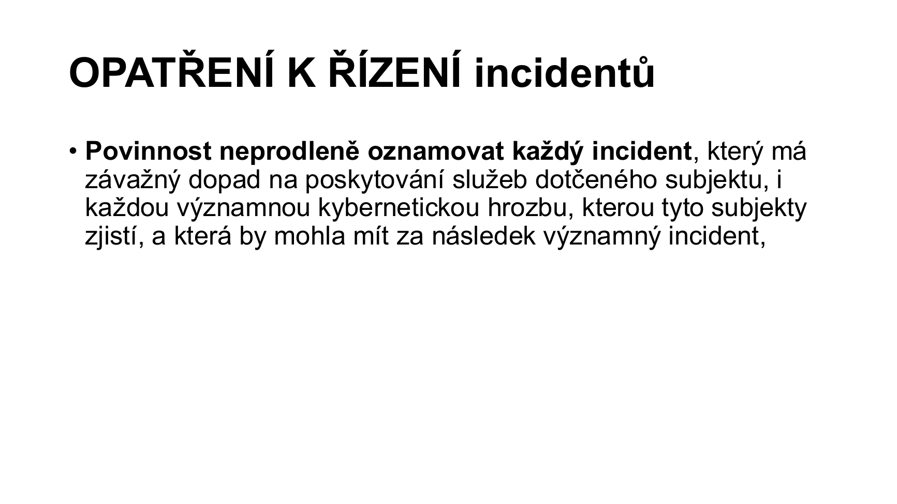

# 05 - Legislativní ukotvení KB, NIS2, nový zákon o KB

**Zdroj:** `05_Legislativni_ukotveni_KB,_NIS2,_Novy_zakon_o_KB.pdf`  
**Stav poznámek:** zpracováno podle přednáškového PDF; u právních tvrzení je potřeba počítat s tím, že reálný stav legislativy se může měnit.

---

## 1. Základní kontext

Přednáška navazuje na evropskou regulaci kybernetické bezpečnosti:

- **NIS** byla přijata Evropskou unií v roce 2016.
- Jejím cílem bylo zajistit vysokou společnou úroveň bezpečnosti sítí a informačních systémů v EU.
- **NIS2** je nová směrnice EU o kybernetické bezpečnosti, jejíž oficiální znění bylo publikováno v Úředním věstníku EU 16. 1. 2023.
- Podle materiálu byl nový český zákon o kybernetické bezpečnosti schválen a má být účinný od roku 2025.

Hlavní myšlenka: kybernetická bezpečnost už nemá být jen interním IT problémem vybraných velkých organizací. Regulace se rozšiřuje na tisíce subjektů, jejichž služby jsou důležité pro fungování státu, ekonomiky a společnosti.

---

## 2. Proč NIS2 vznikla

Původní regulace dopadala jen na úzkou skupinu nejvýznamnějších organizací. NIS2 rozsah výrazně zvětšuje:

- zahrnuje více odvětví,
- sjednocuje dohled a spolupráci mezi státy EU,
- posiluje roli dozorových orgánů,
- zavádí vyšší sankce,
- klade větší odpovědnost na vedení organizací,
- zdůrazňuje rizika dodavatelského řetězce, zranitelnosti, kontinuitu provozu a incident response.

### Nejvýznamnější povinnosti podle materiálu

- Stát určí jeden ze svých týmů CSIRT/CERT jako koordinátora pro koordinované zveřejňování zranitelností.
- Dozorové orgány si mají poskytovat vzájemnou pomoc a kontrolu.
- Evropská komise má mít větší zapojení do sjednocování regulace.
- Pokuty se výrazně zvyšují; u **essential entities** materiál uvádí horní hranici nejméně 10 milionů EUR nebo alespoň 2 % celkového celosvětového ročního obratu.

---

## 3. Stěžejní změna v české regulaci

Návrh nové české regulace podle materiálu sdružuje dříve roztříštěnou úpravu několika typů povinných osob do jedné kategorie:

> **poskytovatel regulované služby**

Takový poskytovatel musí naplňovat kritéria stanovená vyhláškou o regulovaných službách.

### Co z toho prakticky plyne

Organizace se nemá ptát jen "jsme kritická infrastruktura?", ale hlavně:

1. Poskytujeme službu uvedenou v příloze/ve vyhlášce?
2. Splňujeme velikostní nebo speciální kritéria?
3. Spadáme do nižšího, nebo vyššího režimu?
4. Jaké povinnosti z toho pro nás konkrétně vyplývají?

---

## 4. Koho se nové povinnosti týkají

Dosavadní regulace se týkala jen několika stovek nejvýznamnějších organizací. NIS2 a navazující česká úprava mířila na mnohem širší okruh poskytovatelů služeb důležitých pro fungování společnosti.

### Obecné podmínky

Aby soukromá nebo veřejná organizace spadala pod regulaci, materiál uvádí dvě základní podmínky:

1. Organizace poskytuje alespoň jednu službu uvedenou v příloze směrnice nebo ve vyhlášce.
2. Je středním nebo velkým podnikem:
   - alespoň 50 zaměstnanců,
   - nebo roční obrat či bilanční suma roční rozvahy alespoň 10 milionů EUR.

Pozor na partnerské a propojené podniky, protože velikost se nemusí posuzovat izolovaně jen podle jedné právní osoby.

### Subjekty bez ohledu na velikost

Některé organizace spadají pod regulaci bez ohledu na velikost, např.:

- poskytovatelé služeb elektronických komunikací,
- poskytovatelé služeb vytvářejících důvěru,
- poskytovatelé DNS služeb.

---

## 5. Základní a důležité subjekty

NIS2 mění členění subjektů. Dříve se mluvilo o provozovatelích základních služeb a poskytovatelích digitálních služeb. Nově se subjekty dělí na:

- **základní subjekty**,
- **důležité subjekty**.

Rozdíl je v kritičnosti odvětví/služby a v závislosti ostatních odvětví na dané službě.

| Typ subjektu | Praktický význam |
|---|---|
| **Základní subjekt** | Přísnější kybernetická opatření, ex-ante kontrola ze strany NÚKIB. |
| **Důležitý subjekt** | Méně přísné povinnosti, typicky ex-post kontrola. |

---

## 6. Odvětví a typy subjektů

### Základní entity

Materiál mezi základní entity řadí zejména:

- zdravotnictví,
- výrobu farmaceutických výrobků,
- energetiku,
- dopravu,
- bankovnictví,
- infrastruktury finančních trhů,
- digitální infrastrukturu,
- pitnou vodu,
- odpadní vody,
- veřejnou správu,
- vesmír.

### Důležité entity

Mezi důležité entity materiál uvádí zejména:

- poštovní a kurýrní služby,
- nakládání s odpady,
- výrobu zdravotnických prostředků,
- výrobu počítačů, elektronických a optických zařízení,
- výrobu elektrozařízení, strojů, motorových vozidel a dopravních prostředků,
- výrobu, zpracování a distribuci potravin,
- výrobu a distribuci chemikálií,
- digitální poskytovatele.

---

## 7. Povinnosti poskytovatele regulované služby

Přednáška shrnuje povinnosti prakticky: poskytovatel regulované služby musí mít bezpečnost řízené, dokumentované, kontrolovatelné a provozně vymahatelné.

### Hlavní povinnosti

- Nastavit systém řízení rizik ve vlastních sítích a informačních systémech.
- Zavést minimální standard kyberbezpečnostních opatření.
- Řešit bezpečnost dodavatelského řetězce.
- Řídit zranitelnosti.
- Hodnotit rizika kybernetické bezpečnosti.
- Vytvořit tým, který schvaluje opatření a dohlíží na jejich dodržování.
- Klasifikovat používané aplikace a systémy.
- Mít plán obnovy.
- Provádět penetrační testy.
- Používat silná hesla, dvoufaktorové ověřování nebo certifikáty pro přihlašování do kriticky důležitých systémů.
- Aplikovat bezpečnostní aktualizace vydávané výrobci softwaru.
- Řešit lokalizaci dat podle požadavků materiálu.
- Hlásit kyberbezpečnostní incidenty NÚKIB.
- Pravidelně aktualizovat a revidovat procesy kybernetické bezpečnosti.

---

## 8. Opatření k řízení rizik

Opatření k řízení rizik mají podle materiálu zahrnovat alespoň:

- analýzu rizik,
- politiku bezpečnosti informačních systémů,
- řešení incidentů:
  - prevence,
  - odhalování,
  - reakce,
- řízení kontinuity provozu,
- krizové řízení,
- zabezpečení dodavatelského řetězce,
- zabezpečení pořizování, vývoje a údržby sítí a informačních systémů,
- testování a audit v oblasti kybernetické bezpečnosti,
- používání kryptografie a šifrování.

### Důležitý princip

Regulace není jen o technickém zabezpečení. Je to kombinace:

- řízení,
- dokumentace,
- technických opatření,
- odpovědnosti vedení,
- kontinuální kontroly,
- schopnosti reagovat na incidenty.

---

## 9. Incidenty a hrozby

Materiál uvádí povinnost neprodleně oznamovat:

- každý incident, který má závažný dopad na poskytování služeb dotčeného subjektu,
- každou významnou kybernetickou hrozbu, kterou subjekt zjistí a která by mohla vést k významnému incidentu.

V praxi je důležité mít předem připravené:

- kdo incident vyhodnocuje,
- kdo komunikuje s NÚKIB,
- jaké informace se sbírají,
- jak se dokládá časová osa incidentu,
- jak se po incidentu aktualizují procesy a opatření.

---

## 10. Přímá odpovědnost vedení

Jedna z nejdůležitějších změn je odpovědnost statutárních orgánů.

Podle materiálu se problematika kybernetické bezpečnosti nedá jednoduše delegovat na IT oddělení. Vedení organizace musí:

- zajímat se o kybernetickou bezpečnost,
- schvalovat nebo vynucovat opatření,
- zajistit jejich dodržování,
- nést odpovědnost za nedostatečné řízení.

To je zásadní praktický posun: kybernetická bezpečnost se stává součástí corporate governance.

---

## 11. Nižší a vyšší režim povinností

Materiál rozlišuje dvě sady pravidel:

- **nižší povinnosti** pro méně kritické regulované služby,
- **vyšší povinnosti** pro kritičtější regulované služby.

### Nižší povinnosti

Nižší režim zahrnuje zejména:

- zajišťování minimální úrovně kybernetické bezpečnosti,
- povinnosti vrcholného vedení,
- řízení rizik,
- bezpečnost lidských zdrojů,
- řízení kontinuity činností,
- řízení přístupu,
- řízení identit a oprávnění,
- detekci a zaznamenávání kybernetických bezpečnostních událostí,
- řešení kybernetických bezpečnostních incidentů,
- bezpečnost komunikačních sítí,
- aplikační bezpečnost,
- kryptografické algoritmy.

### Vyšší povinnosti

Vyšší režim jde víc do hloubky a materiál ho dělí na organizační a technická opatření.

| Organizační opatření | Technická opatření |
|---|---|
| Systém řízení bezpečnosti informací | Fyzická bezpečnost |
| Povinnosti vrcholného vedení | Bezpečnost komunikačních sítí |
| Bezpečnostní role | Správa a ověřování identit |
| Řízení bezpečnostní politiky a dokumentace | Řízení přístupových oprávnění |
| Řízení aktiv | Detekce bezpečnostních událostí |
| Řízení rizik | Zaznamenávání bezpečnostních a provozních událostí |
| Řízení dodavatelů | Vyhodnocování událostí |
| Bezpečnost lidských zdrojů | Aplikační bezpečnost |
| Řízení změn | Kryptografické algoritmy |
| Akvizice, vývoj a údržba | Zajišťování dostupnosti regulované služby |
| Zvládání událostí a incidentů | Zabezpečení průmyslových a řídicích systémů |
| Řízení kontinuity činností |  |
| Audit kybernetické bezpečnosti |  |

---

## 12. Regulované služby s vyšším režimem

Materiál mezi služby s vyšším režimem řadí:

- veřejnou správu,
- energetiku:
  - elektřina,
  - dálkové vytápění a chlazení,
  - ropa,
  - plyn,
  - vodík,
- dopravu:
  - letecká,
  - železniční,
  - vodní,
  - silniční,
- bankovnictví a infrastruktury finančních trhů,
- zdravotnictví,
- výrobu farmaceutických a zdravotnických prostředků,
- pitnou vodu a odpadní vody,
- digitální infrastrukturu,
- výměnné uzly internetu,
- poskytovatele DNS,
- registry TLD,
- poskytovatele cloud computingu,
- poskytovatele datových center,
- sítě pro doručování obsahu,
- poskytovatele služeb vytvářejících důvěru,
- veřejné sítě a služby elektronických komunikací,
- vesmír.

---

## 13. Organizace s nižším režimem

Do nižšího režimu materiál řadí např.:

- výrobu strojního zařízení,
- výrobu počítačů a elektroniky,
- výrobu motorových vozidel,
- výrobu jiných zdravotnických prostředků,
- výrobu potravin,
- digitální poskytovatele:
  - internetová tržiště,
  - internetové vyhledávače,
  - platformy sociálních sítí,
- poštovní a kurýrní služby,
- nakládání s odpady,
- chemické látky.

---

## 14. Jak organizace zjistí, zda spadá pod regulaci

Materiál doporučuje test zařazení organizace a připomíná velikostní kategorie podniků:

| Kategorie | Orientační kritéria podle materiálu |
|---|---|
| **Mikropodnik** | Méně než 10 osob a obrat/bilanční suma do 2 milionů EUR. |
| **Malý podnik** | Méně než 50 osob a obrat/bilanční suma do 10 milionů EUR. |
| **Střední podnik** | Více než 50 a méně než 250 osob, obrat do 50 milionů EUR nebo bilanční suma do 43 milionů EUR. |

Pokud organizace neví, do jakého oddílu CZ-NACE patří, lze využít Registr ekonomických subjektů. Oddíl určuje první dvojčíslí klasifikace.

---

## 15. Co znamená zavést směrnice informační bezpečnosti

Organizace má mít základní bezpečnostní dokumentaci, např.:

- bezpečnostní politiku,
- politiku hesel,
- pravidla přidělování oprávnění,
- dokumentaci pro prokázání shody s NIS2,
- navazující procesy a odpovědnosti.

Dokumentace nemá být formalita. Má doložit, že organizace ví:

- co chrání,
- proč to chrání,
- kdo za ochranu odpovídá,
- jaká opatření platí,
- jak se opatření kontrolují.

---

## 16. Co znamená řízení bezpečnosti v praxi

Řízení bezpečnosti podle materiálu znamená mít pod kontrolou:

- komu a proč dáváme oprávnění k aplikaci,
- kdo zná jaká hesla,
- kdo má kam fyzický přístup:
  - klíče,
  - vstupní karty,
- kdo kam ukládá jaké informace,
- odebírání přístupů při odchodu zaměstnance,
- přidělování přístupů při nástupu zaměstnance.

Tohle je velmi praktická část: NIS2 není jen o firewallech a šifrování, ale i o tom, jestli organizace umí řídit identity, přístupy, odpovědnosti a změny v životním cyklu zaměstnance.

---

## 17. Zkouškové shrnutí

- NIS2 rozšiřuje regulaci kybernetické bezpečnosti na mnohem více subjektů.
- Základní pojem české úpravy je **poskytovatel regulované služby**.
- Organizace se zařadí podle poskytované služby, velikosti a případně speciálních kritérií.
- Subjekty se dělí na **základní** a **důležité**.
- Základní subjekty mají přísnější povinnosti a ex-ante kontrolu.
- Důležité subjekty mají mírnější režim a typicky ex-post kontrolu.
- Klíčové oblasti jsou řízení rizik, incidenty, kontinuita, dodavatelský řetězec, přístupy, kryptografie, audit a dokumentace.
- Statutární orgány nesou přímou odpovědnost; kyberbezpečnost nelze jen "hodit na IT".

---

## Otázky k opakování

1. Proč byla přijata směrnice NIS2 a co mění oproti původní NIS?
2. Co znamená pojem poskytovatel regulované služby?
3. Jaké dvě základní podmínky musí organizace typicky splnit, aby spadala pod regulaci?
4. Které subjekty mohou spadat pod regulaci bez ohledu na velikost?
5. Jak se liší základní a důležité subjekty?
6. Co je ex-ante a ex-post kontrola v kontextu NIS2?
7. Jaké oblasti musí pokrývat opatření k řízení rizik?
8. Proč je důležitá přímá odpovědnost statutárních orgánů?
9. Co patří mezi nižší povinnosti?
10. Co patří mezi vyšší organizační a technická opatření?
