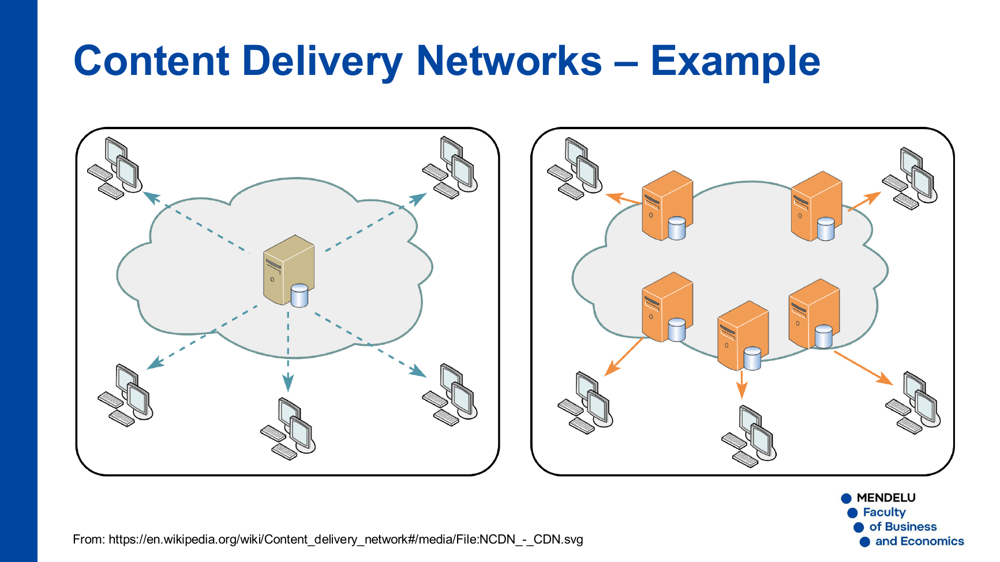

# P7 – ENA-KB: Komunikace služeb a PKI

**Zdroj:** `07_ENA-KB_komunikace-sluzeb_PKI.pdf`  
**Autor materiálu:** Tomáš Sochor, březen 2026

---

## 1. Certifikáty a kryptografie s veřejným klíčem

### 1.1 Co je certifikát

- **Certifikát** je nástroj pro bezpečnou publikaci veřejného klíče.
  - Obsahuje veřejný klíč vlastníka (osoby nebo serveru).
  - Je bezpečně podepsán vydavatelem — **certifikační autoritou (CA)**.
- Proč jsou certifikáty potřeba?
  - Bez certifikátu nelze veřejnému klíči důvěřovat (chybí autentizace vlastníka).
  - Alternativy existují (PGP — síť sdílené důvěry, osobní předání klíče), ale nejsou dostatečně flexibilní pro rozsáhlé nasazení.

### 1.2 Symetrická kryptografie (sdílený klíč)

- Odesílatel (Alice) i příjemce (Bob) sdílejí **jeden stejný klíč**.
- Postup:
  1. Alice zašifruje zprávu sdíleným klíčem.
  2. Šifrovaná data jsou přenesena sítí.
  3. Bob dešifruje sdíleným klíčem.
- Výhoda: rychlost.
- Nevýhoda: nutnost bezpečně doručit sdílený klíč oběma stranám předem.

### 1.3 Asymetrická kryptografie (kryptografie veřejného klíče)

- Každá strana má **dvojici klíčů**: soukromý (privátní) a veřejný.
- **Šifrování zprávy pro příjemce:**
  1. Alice požádá o Bobův certifikát (obsahuje Bobův veřejný klíč).
  2. Alice zašifruje zprávu **Bobovým veřejným klíčem**.
  3. Pouze Bob může dešifrovat svým **soukromým klíčem**.
- CA vydává certifikáty pro Alice i Boba a ručí za jejich pravost.

### 1.4 Algoritmy asymetrické kryptografie

| Algoritmus | Základ bezpečnosti | Poznámky |
|---|---|---|
| **RSA** | Faktorizace celých čísel na prvočísla | První algoritmus (1977); v praxi čísla se ~100 desetinnými ciframi |
| **ECC** (Elliptic Curve Cryptography) | Diskrétní logaritmus na eliptické křivce | Kratší klíče = stejná bezpečnost jako delší RSA klíče; ECDSA (podpisy), ECDH (výměna klíčů) |
| **elGamal** | Diskrétní logaritmus v konečném tělese | Méně rozšířen |

---

## 2. PKI – Infrastruktura veřejného klíče

### 2.1 Definice a funkce PKI

**PKI (Public Key Infrastructure)** je softwarový systém, který zajišťuje:

1. **Vydávání certifikátů** (tvorba a distribuce):
   - Pro koncové uživatele.
   - Pro servery.

2. **Uložení a ověřování certifikátů** (včetně vyhledávání):
   - Důvěryhodné úložiště certifikátů.
   - Při každém použití certifikátu musí proběhnout jeho ověření platnosti.

3. **Odvolání certifikátů** (na žádost):
   - Typicky při ztrátě soukromého klíče.
   - Pravidelně publikován **CRL (Certificate Revocation List)** — seznam odvolaných certifikátů.

> Všechny operace PKI jsou podmíněny autentizací uživatele.

### 2.2 Způsoby zabezpečené komunikace pomocí certifikátů

- **TLS** (používán v HTTPS)
- **Digitální podpisy**
- **SSH** (místo certifikátů se používají páry klíčů)

---

## 3. TLS – Transport Layer Security

### 3.1 Charakteristika TLS

- Nástupce protokolu **SSL** pro zabezpečení komunikace nad TCP (vrstva pod HTTP).
- Používán pro HTTPS (port 443).

### 3.2 TLS handshake — postup navázání spojení

| Krok | Popis |
|---|---|
| 1 | Klient naváže TCP spojení se serverem; odešle žádost o šifrované spojení spolu se seznamem podporovaných metod (symetrické i asymetrické šifrování, hašování). |
| 2 | Server vybere vhodnou sadu metod ze svého seznamu a odešle klientovi svůj **certifikát**. |
| 3 | Klient ověří platnost a důvěryhodnost certifikátu. |
| 4 | Klient sestaví **relační klíč** pro symetrické šifrování zbytku komunikace. |

**Výměna klíče v kroku 4:**
- **TLS 1.3:** Diffie–Hellman výměna klíčů.
- **Starší verze TLS:** Klient vygeneruje náhodné číslo odpovídající délky a zašifruje ho veřejným klíčem serveru (z certifikátu).

### 3.3 Verze TLS

| Verze | RFC | Rok | Poznámky |
|---|---|---|---|
| TLS 1.0 | RFC 2246 | 1999 | Téměř totožný s SSL 3.0; drobné záměrné odlišnosti |
| TLS 1.1 | RFC 4346 | 2006 | — |
| TLS 1.2 | RFC 5246 | 2008 | Přidán AES |
| TLS 1.3 | RFC 8446 | 2018 | Diffie–Hellman výměna klíčů; modernější a bezpečnější |

---

## 4. SSH – Secure SHell

- Protokol pro **šifrované vzdálené připojení** k serveru.
- Využívá různé (volitelné) kryptografické techniky.
- Open-source implementace: **OpenSSH**.
- Místo certifikátů se používají **páry veřejný/soukromý klíč**.
- Základní využití: náhrada za Telnet (příkazový řádek na vzdáleném serveru).
- Další využití:
  - **SSH tunneling** — šifrovaný přenos libovolných dat z lokálního socketu na vzdálený (např. pro vzdálenou plochu).

---

## 5. Digitální podpis

### 5.1 Obecně o digitálním podpisu

- Elektronický ekvivalent klasického vlastnoručního podpisu.
- Hlavní vlastnosti:
  - **Autentizace** podepisující osoby
  - **Integrita** podepsaného dokumentu (dokument nelze změnit)
  - **Nepopiratelnost** (non-repudiation) — podepisující nemůže popřít, že dokument podepsal

### 5.2 Elektronický podpis (legislativní pohled)

- Zvláštní typ digitálního podpisu definovaný zákonem (v EU).
- V EU je základem **osobní certifikát**.
- Aspekty:
  - **Technický**: závisí na použitém osobním certifikátu.
  - **Legislativní**: jak lze podpis ověřit ve vztahu k podepisující osobě.
- Hlavní aplikace: podepisování dokumentů, zpráv (e-mailů), kódu (aplikací).

### 5.3 Jak funguje elektronický podpis

V praxi se nepodepisuje celý dokument jako "zašifrovaná data". Typický postup je:

1. Z dokumentu se vypočítá hash.
2. Alice vytvoří podpis pomocí svého **soukromého klíče**.
3. Bob získá Alicin certifikát obsahující její **veřejný klíč**.
4. Bob ověří podpis veřejným klíčem a porovná jej s hashem dokumentu.
5. Pokud dokument někdo změnil, hash nebude sedět a podpis nebude platný.

> Klíčový rozdíl od šifrování: při podpisu se šifruje **soukromým** klíčem (kdokoli může ověřit veřejným klíčem), při šifrování zprávy pro příjemce se šifruje **veřejným** klíčem příjemce.

Zjednodušené schéma v přednášce ukazuje princip, že ověření podpisu závisí na Alicině certifikátu a veřejném klíči.

---

## 6. High Availability (Vysoká dostupnost)

### 6.1 Základní pojmy a metriky

- **Uptime ratio** (koeficient dostupnosti):
  ```
  uptime ratio = uptime / celkový čas
  ```
- **99,999 %** (tzv. "five nines") = hranice High Availability.
  - Povolený výpadek max. **52 minut a 30 sekund za rok**.

### 6.2 Proč nelze dosáhnout 100 %?

- Vždy je nutná určitá doba nedostupnosti: údržba, aktualizace, výměna hardware apod.

### 6.3 Standardní přístup k HA — eliminace SPoF

**SPoF (Single Point of Failure)** = jediný bod selhání — komponenta, jejíž výpadek způsobí výpadek celé služby.

Zaměřujeme se na SPoF s **vysokým dopadem**:
- Na mnoho uživatelů, nebo
- Na velký objem komunikace.

Typy SPoF:

| Typ | Příklady |
|---|---|
| Infrastruktura | Centrální switch, router, firewall, napájení, chlazení |
| Sdílené prostředky | Disky, tiskárny |
| Napájení kritických komponent | UPS, zdroje |
| Jednotlivé servery služeb | DNS server, DHCP server, webový server |

**Metody eliminace SPoF:**
- Anycast adresování
- Serverová redundance (hot-swap apod.)
- Load balancing (vyvažování zátěže)

---

## 7. Anycast

### 7.1 Princip Anycastu

- **Anycast** je mechanismus umožňující komunikaci s jedním ze skupiny cílových uzlů (zpravidla serverů).
- Paket odeslaný na anycastovou adresu je doručen **nejbližšímu členovi** anycastové skupiny.
- Anycastová adresa musí být přiřazena **síťovému zařízení** (routeru), ne hostiteli.
- Anycastová adresa **nesmí** být použita jako zdrojová adresa.

### 7.2 Technická implementace

| Protokol | Podpora |
|---|---|
| **IPv4** | Vyžaduje podporu BGP |
| **IPv6** | Anycast adresy jsou nativně podporovány |

**IPv6 Anycast:**
- V každé podsíti `/64` jsou poslední 7 bitů interface ID rezervovány pro anycast ID.
- Pro rozpoznání anycastové adresy musí být **7. bit 1. bajtu** v části interface nastaven na `0`.

### 7.3 Využití Anycastu

- Efektivní doručení dotazů jednomu z více DNS serverů
- Základ pro CDN a cloudové služby

---

## 8. DNS — redundance a bezpečnost

### 8.1 Proč je DNS kritická infrastruktura

- DNS překládá **FQDN** (plně kvalifikované doménové jméno) na IP adresy.
- Tato funkce je kritická pro všechny uživatele i služby.
- Jediný DNS server = **SPoF**.

### 8.2 Způsoby zdvojení DNS serverů

- Záložní DNS server ve **stejné síti**
- DNS server v **jiné síti** (geografická redundance)
- Více DNS serverů jako sdílená služba pro více sítí
- **Cloudová řešení** (např. Cisco Umbrella)

### 8.3 Bezpečnostní problémy standardního DNS

- Přenáší se přes **UDP** (bez zaručeného doručení)
- Žádná autentizace
- Žádné šifrování
- Riziko: **DNS spoofing** — falešná IP adresa v DNS odpovědi → útok Man-in-the-Middle (MITM)

### 8.4 Bezpečnostní protokoly pro DNS

| Protokol | Účel |
|---|---|
| **DNSSEC** | Zabezpečená komunikace mezi DNS servery; primárně autentizace kořenových DNS serverů |
| **DNS over TLS** | Šifrování DNS dotazů pomocí TLS; bezpečnostní řešení pro koncové body |
| **DNS over HTTPS** | Šifrování DNS dotazů přes HTTPS; bezpečnostní řešení pro koncové body |

---

## 9. CDN — Content Delivery Networks (Sítě pro doručování obsahu)

### 9.1 Co je CDN

- **CDN** je nástroj pro poskytování služby prostřednictvím více izolovaných serverů.
- CDN = geograficky distribuovaná síť **proxy serverů a datových center**.
- Příklady použití: webová stránka s vysokou návštěvností, IS s tisíci uživateli po celém světě.



### 9.2 Cíle CDN

| Cíl | Popis |
|---|---|
| **Eliminace SPoF** | Výpadek jednoho uzlu neovlivní celou službu |
| **Zlepšení doby odezvy** | Uživatel je obsloužen nejbližším serverem |
| **Lepší škálovatelnost** | Snazší rozšíření kapacity než u jednoho serveru |

### 9.3 Srovnání modelů

- **Centralizovaný model:** Jeden server obsluhuje všechny klienty — vysoká latence pro vzdálené uživatele.
- **CDN model:** Více serverů rozmístěných geograficky — kratší cesta, nižší latence, redundance.

---

## Otázky k opakování

1. Co je certifikát a jaký je jeho hlavní účel? Proč nestačí pouze sdílet veřejný klíč bez certifikátu?
2. Popište rozdíl mezi symetrickou a asymetrickou kryptografií. Kdy je výhodné použít každou z nich?
3. Na jakém matematickém principu je založen RSA a ECC? Jakou výhodu má ECC oproti RSA z hlediska délky klíče?
4. Vyjmenujte tři hlavní funkce PKI a vysvětlete, co je CRL a kdy se používá.
5. Popište průběh TLS handshake (4 kroky). Jak se liší výměna klíče v TLS 1.3 oproti starším verzím?
6. Jaké jsou tři hlavní vlastnosti digitálního podpisu? Jak funguje ověření podpisu pomocí asymetrické kryptografie?
7. Co znamená uptime ratio 99,999 %? Kolik minut za rok smí služba spadnout, aby splnila tuto hranici?
8. Co je SPoF a jaké jsou metody jeho eliminace? Uveďte alespoň tři typy kritických SPoF v síťové infrastruktuře.
9. Jak funguje Anycast? Jaký je rozdíl v podpoře Anycastu mezi IPv4 a IPv6?
10. Jaké jsou bezpečnostní problémy standardního DNS protokolu a jaká řešení existují? Vysvětlete rozdíl mezi DNSSEC a DNS over HTTPS.
