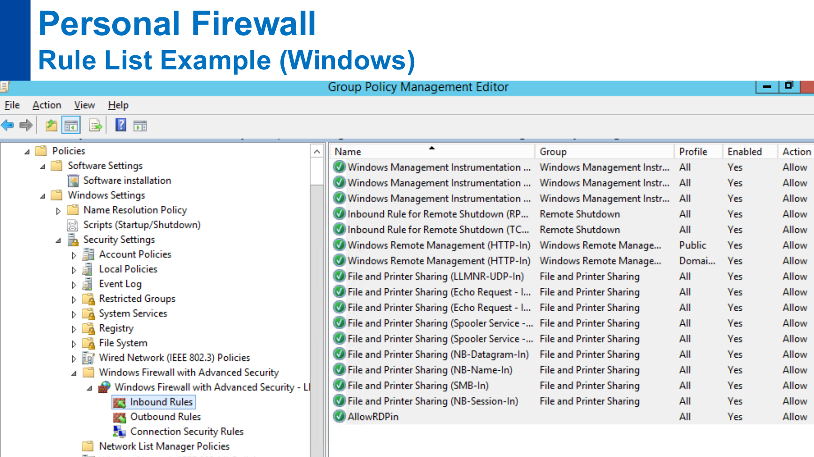
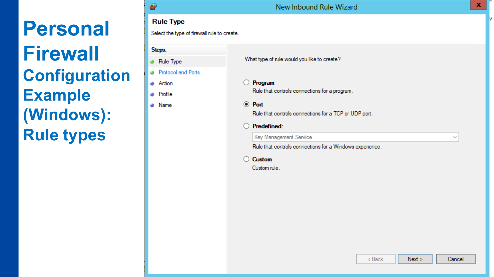

# P10 – ENA-KB: Endpoint Protection

**Zdroj:** `10_ENA-KB_endpoint-protection.pdf`  
**Autor materiálu:** Tomáš Sochor, duben 2026

---

## 1. Úvod – Co je endpoint?

**Endpoint (koncový bod)** = klientské zařízení, např.:
- PC nebo laptop (OS: Windows, macOS, Linux, …)
- Mobilní zařízení (OS: Android, iOS)
- Pozn.: servery, IoT zařízení apod. se v tomto kontextu za endpointy nepovažují

### 1.1 Hlavní rizika endpointů

- **Infekce škodlivým softwarem** (virus, malware, trojan)
- **Vzdálené (tiché) připojení útočníka** (např. prostřednictvím červa/wormu)
- **Oklamání uživatele** – podvodné stažení škodlivé aplikace, vyzrazení citlivých informací (přihlašovací údaje), …

### 1.2 Princip ochrany endpointů

Kontrola všech vstupů:
- **Síťová připojení:**
  - Drátová – Ethernet
  - Bezdrátová – WiFi, 4/5G, Bluetooth
- **Lokální soubory** – USB disky, interní úložiště

---

## 2. Metody detekce škodlivého kódu

| Metoda | Popis |
|--------|-------|
| **Signaturová detekce** | Hledání známých řetězců v spustitelném kódu; nespolehlivá pro „stealth" viry |
| **Heuristická analýza** | Vychází ze signaturové detekce, ale nevyžaduje přesnou shodu – zachytí i varianty |
| **Detekce v reálném čase** | Sledování podezřelé aktivity kódu v OS (zápis do systémových souborů, změny Registry/etc) |
| **Detekce manipulace s oprávněními** | Ochrana proti rootkitům |

---

## 3. Antivirus a antimalware

### 3.1 Ochrana před viry a malwarem

- Každá spouštěná aplikace může být potenciálně škodlivá.
- Aplikace je **před spuštěním zkontrolována** na přítomnost virových signatur a volitelně na škodlivé chování v reálném čase.
- Podrobnější kontrola probíhá v době nečinnosti počítače.
- Kontrolována musí být i jiná data převoditelná na spustitelné aplikace (přílohy zpráv).

### 3.2 Funkce antiviru/antimalwaru

**Vyhledávání známých vzorů** v příchozích datech (e-maily, webové stránky, uložené soubory):
- Virová databáze **musí být aktualizována v krátkých intervalech** (např. denně)

**Vyhledávání podezřelého chování:**
- Modifikace systémových dat
- Vzdálená modifikace lokálně uložených souborů/databází

### 3.3 Nasazení antiviru

- Součástí běžných OS (Windows Defender)
- Doporučeno na každém zařízení: PC, laptopy, mobilní zařízení
- Doplňkové funkce: karanténa virů, analýza podezřelých souborů, sandbox testování

### 3.4 Další ochranný software na straně klienta

- Ochrana registru (Windows Registry)
- Správci hesel a cookies
- AdBlocker
- Často integrován do bezpečnostního balíčku nebo webového prohlížeče

---

## 4. Osobní firewall (Personal Firewall)

### 4.1 Základní principy

- Lokální ochranný software – chrání pouze jedno zařízení (na rozdíl od síťového firewallu)
- Firewall = **sada pravidel (RULES)**
- Výchozí chování: **blokovat VEŠKERÝ příchozí provoz** – implicitní pravidlo **DENY ANY**
- Výjimky jsou jen explicitně povoleny pravidlem PASS
- Chrání před: červy (worms), APT, …

### 4.2 Typy pravidel (Windows Firewall)

| Typ pravidla | Popis |
|-------------|-------|
| **Program** | Řídí připojení pro konkrétní aplikaci |
| **Port** | Řídí připojení pro TCP nebo UDP port |
| **Předdefinované** | Standardní funkce Windows |
| **Vlastní (Custom)** | Uživatelsky definované |

Správa přes Group Policy Management Editor – kategorie: Inbound Rules, Outbound Rules, Connection Security Rules.

### 4.3 Praktická poznámka

Osobní firewall chrání právě jeden endpoint. Není náhradou síťového firewallu, protože nechrání celý segment sítě, ale je důležitý proti situacím, kdy se zařízení připojí do rizikové sítě nebo kdy se škodlivý kód pokusí navazovat či přijímat spojení lokálně.

---

## 5. Unified Endpoint Management (UEM)

### 5.1 Co je UEM?

UEM = evoluční fáze správy zařízení v organizaci:
- Předchůdce: **MDM (Mobile Device Management)** – vzdálená správa mobilních zařízení
- UEM rozšiřuje MDM na libovolná zařízení (PC, tablety, mobilní telefony)

### 5.2 Funkce UEM

| Funkce | Popis |
|--------|-------|
| **Provisioning** | Uvedení zařízení do provozu |
| **Nasazení softwaru** | Vzdálená instalace a správa aplikací |
| **Monitorování** | Sledování činnosti zařízení a aplikací |
| **Aktualizace** | Zajištění aktuálního stavu OS a aplikací |
| **Bezpečnostní konfigurace** | Nastavení bezpečnostních politik |

### 5.3 BYOD a MDM

**BYOD (Bring Your Own Device):**
- Organizace povoluje uživatelům připojovat vlastní zařízení k interní síti
- Výměnou organizace získává kontrolu nad zařízením nebo alespoň nad firemními daty

**MDM (Mobile Device Management):**
- Nezbytný nástroj pro BYOD
- Funkce: sledování + vzdálená správa (vč. vzdáleného vymazání dat), správa aplikací, oddělení soukromých a firemních dat (kontejnerizace), IAM, bezpečnost zařízení

---

## 6. Kontrola přístupu endpointů k síti

### 6.1 Network Admission/Access Control (NAC)

NAC = software ověřující, zda klient splňuje bezpečnostní požadavky před/po připojení k síti.

**Typický scénář:** laptop po odpojení (mohl být připojen jinde = potenciálně rizikový) se znovu připojuje k firemní síti.

**Bezpečnostní požadavky mohou zahrnovat:**
- Aktuální záplaty OS
- Aktuální antivirus/antimalware
- Antivirová kontrola provedená max. 24 hod. před připojením

### 6.2 Pre-admission vs. Post-admission

| Přístup | Popis | Poznámka |
|---------|-------|----------|
| **Pre-admission** | Přihlášení podmíněno úspěšnou bezpečnostní kontrolou | Zpoždění obtěžuje uživatele |
| **Post-admission** | Kontrola po přihlášení; oprávnění jsou omezena do dokončení kontroly | Rychlejší přihlášení, dočasně limitovaný přístup |

### 6.3 Architektura NAC (klient/server)

**Klientský software:**
- Kontroluje proces spouštění OS a přihlašování do sítě
- Chráněn proti obejití – musí se spustit při každém připojení k firemní síti

**Serverový software:**
- Jediná síťová služba dostupná klientům před přihlášením
- Poskytuje záplaty a antivirus ke stažení
- Může fungovat jako **RADIUS server**:
  - Po úspěšné kontrole provede **změnu VLAN** (dle IEEE 802.1x)

---

## 7. Zkouškové shrnutí

- Endpoint je v tomto kurzu klientské zařízení: PC, laptop nebo mobilní zařízení.
- Ochrana endpointu znamená kontrolu všech vstupů: síť, bezdrátové technologie, USB a lokální soubory.
- Malware se detekuje signaturami, heuristikou, real-time sledováním chování a kontrolou manipulace s oprávněními.
- Antivirová databáze musí být pravidelně aktualizovaná, jinak signaturová detekce rychle ztrácí smysl.
- Osobní firewall je lokální sada pravidel; implicitní bezpečný přístup je **DENY ANY** pro příchozí provoz.
- UEM rozšiřuje původní MDM přístup na širší správu různých zařízení v organizaci.
- BYOD dává organizaci problém: uživatel vlastní zařízení, ale organizace potřebuje chránit firemní data.
- NAC kontroluje, zda endpoint splňuje minimální bezpečnostní stav před připojením nebo krátce po něm.
- RADIUS a IEEE 802.1x umožňují po úspěšné kontrole změnit VLAN a pustit klienta do správné části sítě.

---

## Otázky k opakování

1. Co je to endpoint a jaká jsou jeho hlavní bezpečnostní rizika?
2. Jaké metody se používají pro detekci škodlivého kódu? Porovnej signaturovou detekci a heuristickou analýzu.
3. Jaký je rozdíl mezi osobním firewallen a síťovým firewallen? Jak funguje pravidlo DENY ANY?
4. Co je UEM a jaké jsou jeho hlavní funkce? Jak se liší od MDM?
5. Co znamená BYOD a jaká bezpečnostní opatření jsou s ním spojena?
6. Vysvětli rozdíl mezi pre-admission a post-admission přístupem v NAC.
7. Jak funguje NAC architektura klient/server? Jakou roli hraje RADIUS a IEEE 802.1x?
8. Proč je nezbytné pravidelně aktualizovat virovou databázi antiviru?
9. Jaké typy pravidel lze definovat v osobním firewallu Windows a co každý z nich řídí?
10. Jaké funkce MDM jsou klíčové při řešení ztráty firemního mobilního zařízení?
