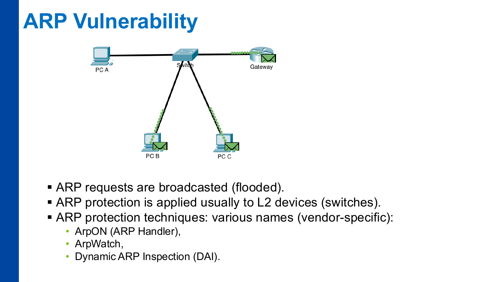
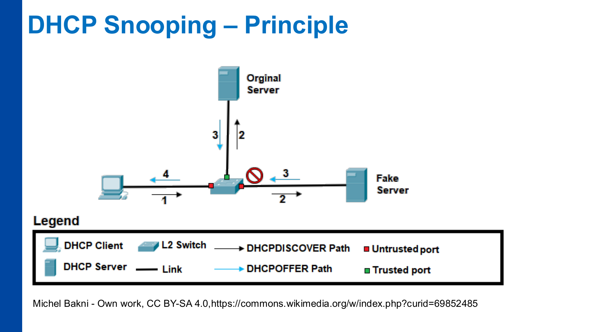
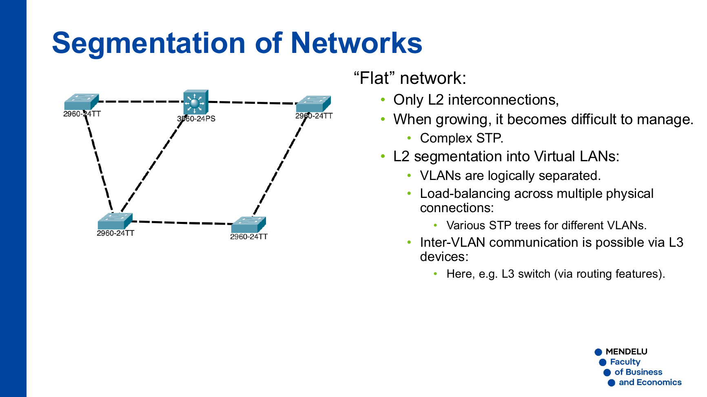
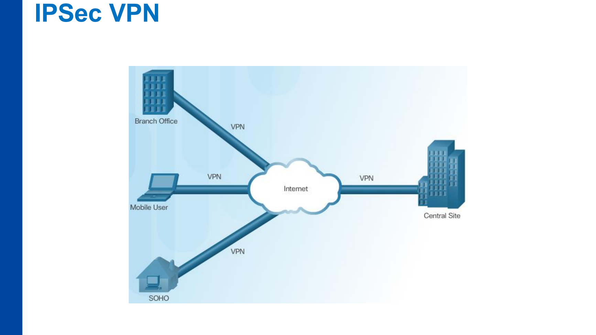
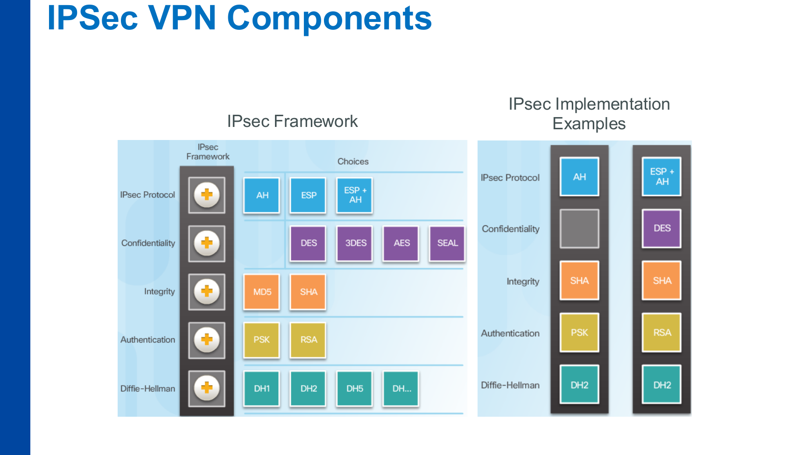
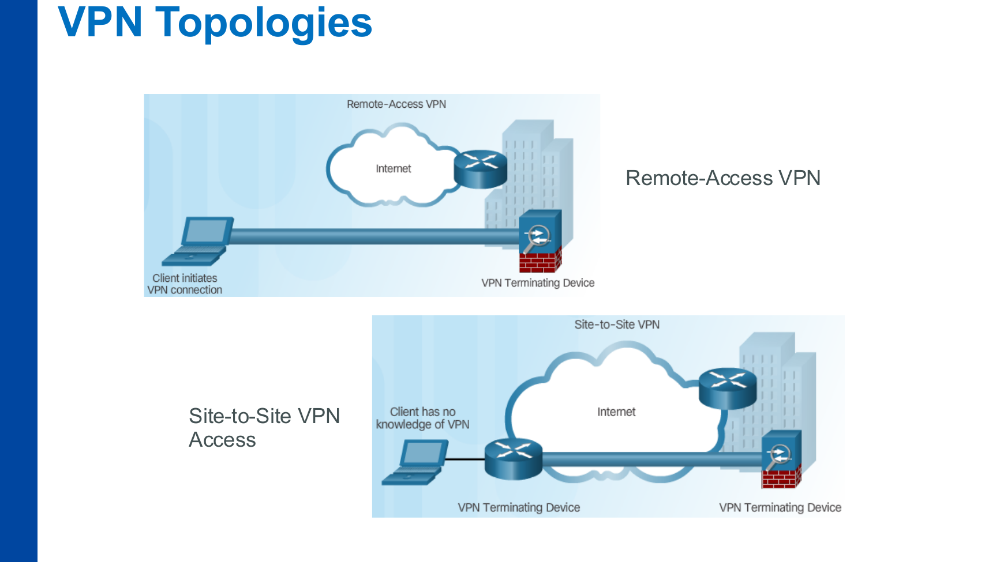

# P11 – ENA-KB: Infrastructure Protection

**Zdroj:** `11_ENA-KB_infrastructure-protection.pdf`  
**Autor materiálu:** Tomáš Sochor, květen 2026

---

## 1. Zabezpečení IP protokolu

### 1.1 Rizika IP protokolů (IPv4 i IPv6)

Ani IPv4, ani IPv6 nejsou samy o sobě bezpečné. Hlavní kategorie rizik:

#### IP Spoofing
- Útočník odesílá pakety s **podvrženou zdrojovou IP adresou**
- Důsledky: matení koncových zařízení, MITM útok
- Autentizace paketů existuje (IPSec), ale je málokdy nasazena — vysoká konfigurační režie

#### DHCP rizika
- **Podvodný (rogue) DHCP server** může klientům přiřadit falešné IP adresy → MITM, odposlech
- Nasazení falešného DHCP serveru je triviální, detekce obtížná

#### MAC adresa — rizika
- **IPv4 / ARP:** žádné zabezpečení
- **IPv6 / Neighbor Discovery:** autentizace možná, ale v praxi se nepoužívá

### 1.2 Preventivní opatření na vrstvě L3

| Mechanismus | Vrstva | Popis |
|---|---|---|
| IP Source Guard | L3 (router/L3 switch) | Ověřuje zdrojovou IP vůči DHCP databázi |
| ARP Inspection (DAI) | L2 (switch) | Ověřuje ARP vazby IP↔MAC |
| DHCP Snooping | L2 (switch) | Blokuje odpovědi falešných DHCP serverů |
| RA Guard | L2 (switch, IPv6) | Blokuje RA zprávy z neoprávněných portů |

---

## 2. Ochrana ARP

### 2.1 Zranitelnost ARP

- ARP je **extrémně zranitelný** — žádná autentizace
- Útočník zašle falešnou ARP vazbu (IP→MAC): jako odpověď na dotaz nebo nevyžádaně (**Gratuitous ARP**)
- ARP požadavky jsou broadcastové → šíří se celou L2 sítí / VLAN
- Ochrana se implementuje na **L2 přepínačích**



### 2.2 Techniky ochrany ARP

| Nástroj | Popis |
|---|---|
| **ArpON** (ARP Handler) | Softwarová ochrana na hostu |
| **ArpWatch** | Monitorování ARP tabulky, detekce změn |
| **DAI** (Dynamic ARP Inspection) | Cisco — filtrování ARP na přepínači |

### 2.3 Dynamic ARP Inspection (DAI)

- Přepínač ukládá ARP tabulku (kde ji normálně neudržuje)
- Funguje **společně s DHCP Snoopingem**: DHCP databáze slouží jako zdroj důvěryhodných vazeb IP↔MAC
- ARP pakety s neodpovídající vazbou jsou zahozeny

---

## 3. DHCP Snooping

### 3.1 Princip

- DHCP neobsahuje žádné zabezpečení
- **DHCP Snooping** definuje na přepínači **důvěryhodné (Trusted) porty** — pouze z nich mohou procházet DHCP nabídky (DHCPOFFER)
- Z **nedůvěryhodných (Untrusted) portů** (přístupové porty ke klientům) jsou DHCP odpovědi blokovány

### 3.2 Tok paketů

```
Klient → [DHCPDISCOVER] → Switch → Fake Server (BLOKOVÁNO — Untrusted port)
                                  → Original Server (prochází — Trusted port)
Original Server → [DHCPOFFER] → Switch → Klient
```



### 3.3 DHCP Snooping databáze

- Switch uchovává záznamy: `MAC adresa ↔ IP adresa ↔ port ↔ VLAN`
- Základ pro **DAI** a **IP Source Guard**

---

## 4. SLAAC a RA Guard (IPv6)

### 4.1 SLAAC

- V IPv6 existuje alternativa k DHCP: **SLAAC (Stateless Address Autoconfiguration)**
- Router rozesílá **Router Advertisement (RA)** zprávy s IPv6 prefixem přes ICMPv6 (RS/RA zprávy)

### 4.2 RA Guard

- Analogie DHCP Snoopingu pro IPv6
- Filtruje RA zprávy na přepínači: **RA z portů, které nejsou označeny jako routerové, jsou zahazovány**
- Zabraňuje útočníkovi vydávat se za router a distribuovat falešné IPv6 prefixy

---

## 5. IP Source Guard

### 5.1 Popis

- Dostupný na zařízeních Cisco, Juniper a dalších
- Funguje ve spolupráci s DHCP Snoopingem
- Každý paket z **nedůvěryhodného rozhraní** se ověřuje vůči DHCP databázi

### 5.2 Co se ověřuje

| Atribut | Podmínka |
|---|---|
| Zdrojová IP adresa | Musí odpovídat záznamu v DHCP databázi |
| MAC adresa | Musí odpovídat záznamu |
| VLAN ID | Musí odpovídat záznamu |
| Rozhraní (port) | Musí odpovídat záznamu |

- Neshoda → **paket zahozen**

---

## 6. Segmentace sítě — VLAN

### 6.1 Problém „ploché" sítě

- Síť pouze s L2 propoji je při růstu těžko spravovatelná (složitý STP)
- Řešení: **segmentace do virtuálních LAN (VLAN)**



### 6.2 Výhody VLAN

- Logické oddělení broadcast domén
- Load-balancing: různé STP stromy pro různé VLANy
- Komunikace mezi VLANy pouze přes **L3 zařízení** (router, L3 switch)
- VLANy se používají v **každé podnikové síti**

### 6.3 Typické typy VLAN

| VLAN | Účel |
|---|---|
| Uživatelská | Běžný provoz uživatelů |
| Hostovská (Guest) | Pro návštěvníky, izolována |
| Management | Správa síťových prvků, nepřístupná uživatelům |
| Serverová | Servery odděleny od uživatelů |

### 6.4 Úskalí VLAN

- Nutnost konfigurace (bez VLANů je přepínač téměř plug-and-play)
- **DTP (Dynamic Trunk Protocol)**: automatická konfigurace trunk portů — **bezpečnostní riziko** (VLAN hopping)
- **Double tagging**: někdy nutné, přináší složitost správy

---

## 7. Síťové firewally

### 7.1 Packet Filtering (bez stavů)

- Pravidla aplikována na **každý paket stejně**, bez ohledu na kontext
- Neumí rozlišit pakety patřící k již navázanému TCP spojení
- **Výhody:** nízká spotřeba zdrojů, hardwarová akcelerace
- **Nevýhody:** pouze jednoduché útoky, nelze implementovat složitější politiky

### 7.2 Stateful Packet Filtering (stavový)

- **Sledování stavu spojení** (connection state tracking)
- Filtrování se liší podle předchozí komunikace
- Volitelně obsahuje **NAT**

### 7.3 Srovnání typů firewallů

| Typ | Vrstva | Stav | Hlavní výhoda |
|---|---|---|---|
| Packet filter | L3/L4 | Stateless | Rychlost, nízká zátěž |
| Stateful firewall | L3/L4 | Stavový | Sledování spojení |
| NGFW | L3–L7 | Stavový + DPI | Plná viditelnost obsahu |

---

## 8. Next-Generation Firewall (NGFW)

### 8.1 Přidané funkce oproti tradičnímu firewallu

- **Hluboká inspekce L7 (DPI)**:
  - HTTP/HTTPS — nutná **SSL/TLS inspekce** (dešifrování HTTPS)
  - SSH, FTP, SMB inspekce
- **Antivirus / Antimalware** integrovaný v zařízení
- **Správa identit uživatelů** (user-aware policies):
  - Integrace s AD, LDAP
  - Politiky vázané na konkrétního uživatele, ne jen IP adresu

### 8.2 Typické funkce NGFW

- URL filtrování a kategorizace obsahu
- Aplikační kontrola (detekce aplikace bez ohledu na port)
- Integrovaný IPS modul
- Sandboxing podezřelých souborů
- SSL/TLS inspekce

---

## 9. IDS a IPS

### 9.1 IDS — Intrusion Detection System

- Síťové zařízení/služba pro **detekci potenciálně rizikového provozu**
- Detekuje pokročilé útoky (APT) pomocí dynamické (adaptivní) sady pravidel
- **Provoz NEBLOKUJE** — pracuje pasivně mimo cestu dat (TAP / SPAN port)
- Generuje výstrahy pro bezpečnostní tým

### 9.2 IPS — Intrusion Prevention System

- Evoluce IDS — přidává **aktivní blokování** detekovaného provozu
- Umístěn **inline, přímo za centrální firewall** (v cestě dat)
- Detekce + prevence v reálném čase

### 9.3 Srovnání IDS vs. IPS

| Vlastnost | IDS | IPS |
|---|---|---|
| Umístění | Pasivní (TAP/SPAN) | Inline (za FW) |
| Reakce | Detekce + alert | Detekce + blokování |
| Vliv na provoz | Žádný | Může zvýšit latenci |
| False positive dopad | Nízký | Může blokovat legitimní provoz |

---

## 10. Řízení webového provozu

### 10.1 Web Proxy

- **Centralizovaná ochranná komponenta** pro webové klienty
- Sbírá HTTP(S) požadavky klientů a přeposílá je cílovým serverům jejich jménem
- Pro HTTPS nutné **re-šifrování** (SSL inspection): správa certifikátů (interní CA) + autentizace uživatelů
- Umožňuje: filtrování obsahu, logování, kategorizaci URL, antivirovou kontrolu

### 10.2 Web Application Firewall (WAF)

- Specializované zařízení/software nasazené u **webových/aplikačních serverů**
- Chrání servery před webovými útoky: SQL injection, XSS, CSRF, path traversal aj.
- Na rozdíl od Web Proxy (chrání klienty) — WAF chrání **servery**

### 10.3 Srovnání Web Proxy vs. WAF

| Vlastnost | Web Proxy | WAF |
|---|---|---|
| Chrání | Klienty (odchozí provoz) | Servery (příchozí provoz) |
| Umístění | Před klienty | Před webovými servery |
| Hlavní funkce | Filtrování odchozího webu | Ochrana webových aplikací |

---

## 11. Virtuální privátní sítě (VPN)

### 11.1 Přínosy VPN

- **Úspora nákladů** — veřejný internet místo pronajatých linek
- **Bezpečnost** — šifrování a autentizace
- **Škálovatelnost** — snadné přidávání lokalit/uživatelů
- **Kompatibilita** — funguje přes stávající infrastrukturu

### 11.2 Topologie VPN

#### Remote-Access VPN
- Klient **sám iniciuje** VPN připojení k VPN termination zařízení
- Typické použití: vzdálení pracovníci, home office
- Vyžaduje VPN klienta na zařízení

#### Site-to-Site VPN
- Tunel mezi **dvěma VPN zařízeními** (routery/firewally)
- Klient o VPN neví — provoz transparentně šifrován/dešifrován
- Typické použití: propojení poboček s ústředím



---

## 12. VPN protokoly

### 12.1 Přehled

| Protokol | Vrstva | Použití | Poznámka |
|---|---|---|---|
| **IPSec VPN** | L3 | Site-to-site VPN | Silná bezpečnost, složitější konfigurace |
| **SSL/TLS VPN** | L4/L7 | Remote-access VPN | Snadnější nasazení |
| **L2TP/IPSec** | L2+L3 | Remote-access VPN | RFC 3193; L2TP tunel + IPSec šifrování |
| **PPTP** | L2 | — | **Zastaralý, nepoužívat** |

### 12.2 IPSec VPN

- Šifrování na vrstvě **L3** pomocí IPSec
- Nejčastěji pro **site-to-site VPN** (pobočky → centrála)



#### IPSec Framework — modulární výběr algoritmů

| Kategorie | Možnosti |
|---|---|
| **IPSec protokol** | AH, ESP, ESP+AH |
| **Důvěrnost (šifrování)** | DES, 3DES, AES, SEAL |
| **Integrita** | MD5, SHA |
| **Autentizace** | PSK (Pre-Shared Key), RSA |
| **Diffie-Hellman** | DH1, DH2, DH5, … |



#### AH vs. ESP

| Protokol | Autentizace | Šifrování | Popis |
|---|---|---|---|
| **AH** (Authentication Header) | Ano | Ne | Pouze integrita a autentizace |
| **ESP** (Encapsulating Security Payload) | Ano | Ano | Integrita + šifrování |
| **ESP + AH** | Ano | Ano | Kombinace — maximální ochrana |

#### IKE (Internet Key Exchange)
- Automatické vyjednání bezpečnostních parametrů a výměna klíčů
- Vytváří **Security Association (SA)** mezi VPN partnery
- IKEv2 je modernější a bezpečnější než IKEv1

### 12.3 SSL-based VPN

- Šifrování L4/L7 pomocí **TLS**
- Výhody: snadnější nasazení pro vzdálený přístup
- Nevýhody: někdy méně bezpečné než IPSec

---

## 13. Shrnutí — přehled technologií

| Technologie | Vrstva | Kde | Co chrání |
|---|---|---|---|
| DHCP Snooping | L2 | Přepínač | Falešné DHCP servery |
| DAI | L2 | Přepínač | ARP spoofing |
| RA Guard | L2 | Přepínač (IPv6) | Falešné Router Advertisement |
| IP Source Guard | L3 | L3 switch/router | IP spoofing |
| VLAN | L2 | Přepínač | Segmentace sítě |
| Packet filter FW | L3/L4 | Router/FW | Základní filtrování |
| Stateful FW | L3/L4 | Firewall | Sledování spojení |
| NGFW | L3–L7 | Firewall | DPI, antivirus, identity |
| IDS | L3–L7 | Pasivní (TAP/SPAN) | Detekce průniků |
| IPS | L3–L7 | Inline (za FW) | Blokování průniků |
| Web Proxy | L7 | Proxy server | Ochrana klientů |
| WAF | L7 | Před web serverem | Ochrana web aplikací |
| IPSec VPN | L3 | Router/firewall | Šifrovaný tunel |
| SSL VPN | L4/L7 | VPN gateway | Vzdálený přístup |

### Jak si technologie zařadit

- **DHCP Snooping, DAI a RA Guard** jsou hlavně ochrany na L2 přepínačích proti útokům uvnitř lokální sítě.
- **IP Source Guard** využívá informace z DHCP Snoopingu a brání spoofingu zdrojové IP.
- **VLAN** není sama o sobě bezpečnostní zázrak, ale vytváří hranice, na kterých lze vynucovat ACL, routing a firewallová pravidla.
- **Firewall/NGFW/IDS/IPS** řeší kontrolu provozu mezi segmenty nebo na hranici sítě.
- **Proxy a WAF** jsou aplikačnější ochrany webového provozu, ale každá chrání jinou stranu komunikace.
- **VPN** chrání přenos přes nedůvěryhodnou síť; remote-access řeší uživatele, site-to-site řeší propojení lokalit.

---

## Otázky k opakování

1. Proč je ARP zranitelný a jak funguje útok pomocí Gratuitous ARP? Jak může útočník pomocí falešné ARP vazby provést MITM útok?
2. Co je Dynamic ARP Inspection (DAI) a jak spolupracuje s DHCP Snoopingem? Jaký zdroj dat využívá pro ověřování ARP vazeb?
3. Vysvětlete princip DHCP Snoopingu. Jak rozlišuje přepínač mezi důvěryhodným a nedůvěryhodným portem a co se stane s DHCP odpovědí z nedůvěryhodného portu?
4. Co je RA Guard a k čemu slouží v kontextu IPv6? Čím se liší od DHCP Snoopingu?
5. Popište rozdíl mezi stateless (packet filter) a stateful firewallem. V čem spočívá hlavní omezení packet filteru?
6. Jaké funkce přidává NGFW oproti tradičnímu stavovému firewallu? Proč je pro NGFW nutná SSL/TLS inspekce?
7. Jaký je rozdíl mezi IDS a IPS z hlediska umístění v síti a reakce na hrozbu? Uveďte výhody a nevýhody každého přístupu.
8. Čím se liší Web Proxy od WAF? Uveďte příklad situace, kdy je vhodné nasadit každý z těchto nástrojů.
9. Porovnejte IPSec VPN a SSL VPN. Kdy je výhodnější použít site-to-site IPSec VPN a kdy remote-access SSL VPN?
10. Jaké komponenty tvoří IPSec framework? Vysvětlete rozdíl mezi protokoly AH a ESP a uveďte, kdy použít ESP místo AH.
