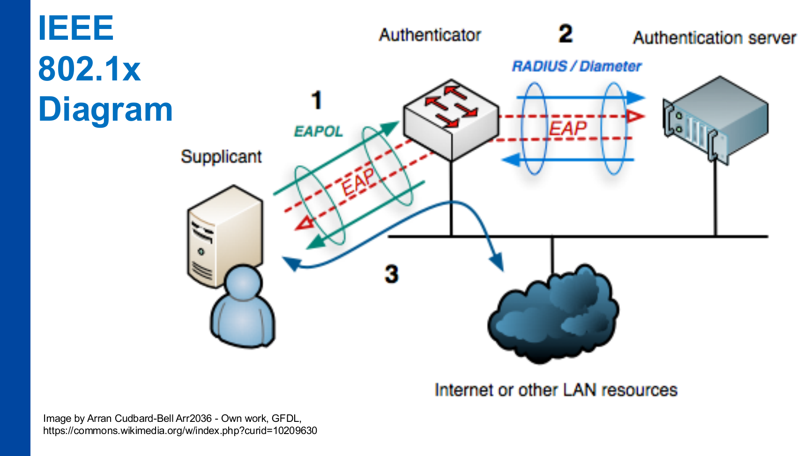
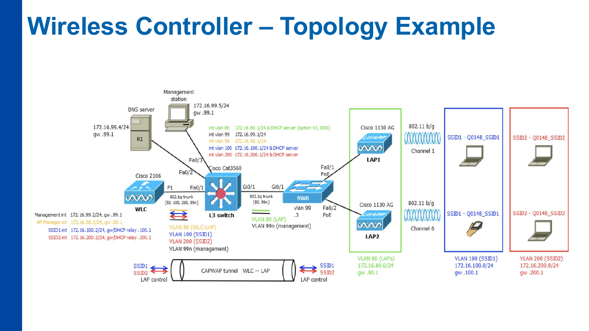

# P12 – ENA-KB: Bezpečnost bezdrátové komunikace

**Zdroj:** `12_ENA-KB_Wireless.pdf`  
**Autor materiálu:** Tomáš Sochor, květen 2026

---

## Obsah přednášky

- IEEE 802.1x
- WPA: PSK vs Enterprise
- Wireless controllers
- Radio spectrum monitoring
- IoT networks

---

## 1. IEEE 802.1x

- Standard pro **autentizaci a autorizaci** zařízení při přístupu k síti
  - **Drátové sítě:** autentizace switch portů
  - **Bezdrátové sítě:** autentizace na access pointu
- Definuje **zapouzdření EAP do L2 rámců** (EAPOL – EAP over LAN)
- Vyžaduje **autentizační server** (např. RADIUS)

### 1.1 Architektura IEEE 802.1x

Tři role:
1. **Supplicant** – klient (zařízení/uživatel žádající o přístup)
2. **Authenticator** – přepínač nebo AP (prostředník)
3. **Authentication server** – RADIUS nebo Diameter server

Tok komunikace:
- Supplicant ↔ Authenticator: protokol **EAPOL**
- Authenticator ↔ Authentication server: protokol **EAP** (přes RADIUS/Diameter)
- Po úspěšné autentizaci → přístup do sítě/internetu

---

## 2. Wi-Fi Protected Access (WPA)

### 2.1 Historie verzí

| Verze | Rok | Klíčové vlastnosti |
|-------|-----|-------------------|
| **WPA** | 2003 | Šifrování TKIP – dočasné řešení pro rychlé nahrazení WEP na zařízeních |
| **WPA2** | 2004 | Implementuje IEEE 802.11i; přidána podpora AES |
| **WPA3** | 2018 | PSK nahrazen mechanismem SAE (Simultaneous Authentication of Equals) dle IEEE 802.11s |

### 2.2 Módy WPA

#### Malá WiFi síť – PSK (Pre-Shared Key)

- Nevyžaduje autentizační server v LAN
- Sdílená přístupová fráze (min. 8 znaků) se transformuje do **256bitového PSK** (SSID jako salt)
- Šifrovací klíč pro zařízení: **128bitový klíč odvozený z PSK**
- V WPA3 je PSK nahrazen **SAE (Simultaneous Authentication of Equals)**

#### Větší WiFi síť (korporace/organizace) – Enterprise

- K dispozici je **centrální autentizační server** (např. RADIUS)
- Používá se kombinace s **IEEE 802.1x** → „enterprise WPA" nebo „WPA-802.1X mode"
- Pro autentizaci se používá **protokol EAP**

---

## 3. Centrální správa bezdrátových AP

### 3.1 Malá WiFi síť (2–10 AP)

- Každý AP spravován **samostatně**:
  - Každé SSID, bezpečnostní nastavení, MAC filtry, admin hesla, atd.
- Pro časté změny **není dostatečně flexibilní**

### 3.2 Větší WiFi síť

- Nutná **centrální správa** pomocí **WLC (WireLess Controller)**:
  - Softwarový proces (běžící na jednom z AP), nebo
  - Hardwarový appliance (jako server v LAN)

- WLC umožňuje centrální konfiguraci:
  - SSID včetně bezpečnostního nastavení
  - Volitelné MAC filtrování, atd.

- **Měření parametrů rádiového signálu:**
  - S/N, útlum, interference, přeslechy pro každý kanál
  - Detekce **Rogue AP**

- **Dynamická změna kanálu** (koordinovaná napříč všemi AP v síti)

### 3.3 Příklad topologie s WLC

- WLC ↔ LAP komunikace přes **CAPWAP tunel**
- Různá SSID mapována na různá VLAN
- AP označené jako **LAP (Lightweight AP)** – logika přenesena na WLC

---

## 4. Rádiové spektrum pro WiFi sítě

### 4.1 Frekvenční pásma

| Pásmo | Vlastnosti |
|-------|-----------|
| **ISM (2,4 GHz)** | Největší dosah; horší podmínky přenosu (překryv kanálů, interference) |
| **5 GHz** | Přišlo později; **žádný překryv kanálů**; více kanálů |
| **6 GHz a ostatní** | Nově přidáno; v některých zemích ještě nejsou dokončeny koncese |

### 4.2 Potenciální problémy rádiového spektra

- **Vysoký útlum:**
  - Příliš mnoho překážek (zdi, …)
  - Příliš velká vzdálenost
- **Špatný S/N** (signal-to-noise ratio)
- **Interference s jinými zdroji rádiového signálu:**
  - Mikrovlnné trouby, dálkové ovladače, mobilní telefony, …
- **Neautorizované (rogue) AP:**
  - Zaměstnanec přinesl AP bez povolení
  - Útočník nainstaloval AP v blízkosti (SSID může být identické, např. eduroam)

---

## 5. Detekce Rogue AP

### 5.1 Co je Rogue AP?

- WiFi AP **mimo kontrolu** (firemního) správce sítě
- Může:
  - Kompromitovat bezpečnostní opatření přístupu k síti (např. DHCP)
  - Odposlouchávat soukromý síťový provoz (lákáním klientů místo legitimních AP)
  - Zaplavit síť provozem (DoS)
  - Interferovat s rádiovým signálem legitimních AP (útlum signálu)
  - Narušit kanál a způsobit vynucenou změnu čísla kanálu

### 5.2 Detekce pomocí pokročilého WLC

- Přesná lokalizace Rogue AP
- Někdy i eliminace jejich dopadu ještě před fyzickým odstraněním

---

## 6. IoT sítě (Internet of Things)

### 6.1 Charakteristika IoT

- Síťová zařízení s **omezenými schopnostmi**, např.:
  - Počítačové senzory (zemědělství, zdravotní péče, řízení dopravy, …)
  - Domácí kontroléry (automatizace domácnosti)
- Komunikace IoT je **primárně bezdrátová**

### 6.2 Technologie krátkého dosahu

- WiFi
- BlueTooth
- **ZigBee** (IEEE 802.15.4)
- NFC, RFID
- Z-Wave
- …

### 6.3 Technologie středního a dlouhého dosahu

| Kategorie | Protokoly |
|-----------|-----------|
| **Střední dosah** | 5G, varianty LTE |
| **Dlouhý dosah** | LoRaWAN, SigFox, NB-IoT, VSAT (satelitní technologie) |

---

## 7. IoT bezpečnost

### 7.1 Omezení IoT zařízení

- Omezené napájení
- Omezená výpočetní kapacita a úložiště → **možné bezpečnostní nedostatky**

### 7.2 Bezpečnostní opatření

- **Cloud-based řešení převládají** → nutná internetová komunikace
  - Uzavření do oddělené VLAN příliš nepomáhá (zařízení stejně musí na internet)
  - Určitá úroveň separace (od privátních LAN) je však nutná
- **Autentizace:**
  - Slabá hesla jsou časté – výchozí hesla je třeba **okamžitě změnit**

### 7.3 Praktické důsledky

- IoT zařízení často nelze spravovat stejně pohodlně jako běžné endpointy.
- Oddělená VLAN je nutná kvůli omezení dopadu kompromitace, ale sama nestačí, protože zařízení obvykle stále komunikuje do cloudu.
- Největší minimum je změna výchozích hesel, omezení přístupů, průběžné aktualizace a sledování komunikace.

---

## 8. Zkouškové shrnutí

- IEEE 802.1x řeší autentizaci a autorizaci zařízení při vstupu do sítě.
- Tři role jsou supplicant, authenticator a authentication server.
- WPA-PSK je vhodnější pro malé sítě; WPA-Enterprise používá centrální autentizaci přes 802.1x/RADIUS.
- WPA3 nahrazuje PSK mechanismem SAE.
- WLC centralizuje správu AP, SSID, bezpečnosti, kanálů a detekci rogue AP.
- Pásmo 2,4 GHz má větší dosah, ale horší rušení a překryv kanálů; 5 GHz má více kanálů a bez překryvu; 6 GHz přidává další prostor, ale závisí na regulaci.
- Rogue AP je AP mimo kontrolu správce, může lákat klienty, odposlouchávat, rušit nebo obcházet bezpečnostní pravidla.
- IoT bezpečnost je obtížná kvůli omezenému výkonu, slabé správě, výchozím heslům a závislosti na cloudu.

---

## Otázky k opakování

1. Co je IEEE 802.1x a jaké jsou tři role v jeho architektuře (supplicant, authenticator, authentication server)?
2. Jaký je rozdíl mezi WPA, WPA2 a WPA3 – co přinesl každý standard?
3. Vysvětlete rozdíl mezi WPA-PSK a WPA-Enterprise – kdy se který používá a proč?
4. Jak funguje PSK v WPA2 – jak se z přístupové fráze získá šifrovací klíč (role SSID jako salt)?
5. Co je WLC (WireLess Controller) a jaké funkce poskytuje pro správu větší WiFi sítě?
6. Jaké jsou rozdíly mezi frekvenčními pásmy 2,4 GHz, 5 GHz a 6 GHz z hlediska dosahu a interference?
7. Co je Rogue AP, jaké hrozby představuje a jak ho pokročilý WLC dokáže detekovat?
8. Vyjmenujte alespoň 4 technologie krátkého dosahu pro IoT a 3 technologie dlouhého dosahu.
9. Proč je uzavření IoT zařízení do separátní VLAN nedostatečné bezpečnostní opatření a jaká opatření jsou doporučována?
