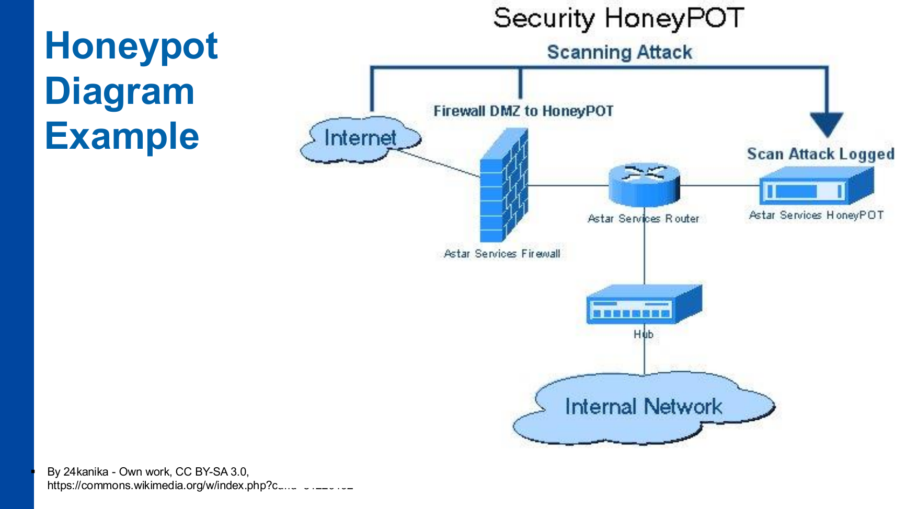

# P13 – ENA-KB: Speciální nástroje pro zabezpečení sítí

**Zdroj:** `13_ENA-KB_special-tools.pdf`  
**Autor materiálu:** Tomáš Sochor, květen 2026

---

## Obsah přednášky

- Honeypots
- Sandboxing
- Server virtualization

---

## 1. Honeypoty

### 1.1 Co je honeypot?

- Honeypot je **„návnada" pro útočníky**
- Napodobuje reálný IT asset:
  - Application Server (nejčastěji)
  - Router nebo switch
  - Firewall
  - Infrastrukturní server (např. DNS)
  - Klientské zařízení (workstation, laptop, mobil, …)

### 1.2 Účel honeypotu

- **Sběr informací o hrozbách:**
  - Z internetu
  - Z privátní sítě (závisí na umístění honeypotu)
- Data o hrozbách (útocích) z honeypotu jsou **relevantnější a detailnější** než zobecněné informace z databází poskytovatelů bezpečnostních produktů
  - Příklady externích zdrojů: Talos by Cisco, OWASP

### 1.3 Typy honeypotů

#### Podle podobnosti s reálným počítačovým systémem

| Typ | Popis |
|-----|-------|
| **Low-interaction** | Emuluje pouze jednu službu (např. SSH pro Linux servery) |
| **Medium-interaction** | Emulace více služeb; detailnější emulace |
| **High-interaction** | Komplexní server dostupný útočníkům (např. celý VM s plným OS – s omezením navenek) |

#### Podle aktivity honeypotu

| Typ | Popis |
|-----|-------|
| **Server honeypot** | Pasivní; čeká na příchozí útočníky (běžný) |
| **Client honeypot** | Aktivně vyhledává rizikové služby (vzácný) |

### 1.4 Komponenty komplexního honeypotu

- **Specializovaný firewall (honeywall)** – odděluje honeypot od reálné sítě
- **Síťové zařízení (router/switch)** – rozhoduje:
  - Jaký provoz jde do reálné (produkční) sítě
  - Jaký provoz směřuje do honeypotu
- **Honeypot pro zachycení aktivit útočníka:**
  - Schopen poskytovat vybrané služby: SSH (Unix), SMB (Windows)
  - Schopen uzavřít aktivitu útočníka uvnitř honeypotu
    - Síťová interakce s ostatními uzly sítě jen pro high-interaction honeypoty

### 1.5 Honeynety

- Více honeypotů může **spolupracovat** → tvoří **HONEYpot NETworks**
- Výhody honeynetu:
  - Sdílení informací o aktuálních útocích
  - Přesvědčivější pro útočníky (vypadá jako reálná produkční infrastruktura)
  - Nejčastěji používané pro **high-interaction honeypoty** (více služeb/celý OS dostupný útočníkům)

### 1.6 Problémy honeypotů

- **Přilákání provozu** (včetně škodlivého)
- **Oklamání útočníků** – přesvědčit je, že honeypot je reálný server hodný prozkoumání/útoku
  - Např. schopnost interakce s ostatními LAN komponentami (jako při šíření malwaru)
- **Správný návrh high-interaction honeypotů**
- **Analýza zachycených útoků:**
  - Časově náročná činnost
  - Vyžaduje odborné znalosti principů útoku

---

## 2. Sandboxing

### 2.1 Co je sandboxing?

- Technika pro **spuštění programu/aplikace v izolovaném prostředí OS** tak, aby:
  - Software nemohl interagovat s jiným běžícím softwarem
  - Software mohl používat pouze standardní sadu OS API
  - Software nebyl schopen inspekovat OS

- **Hlavní účel:** poskytnout izolované prostředí pro spuštění jakékoli aplikace/softwaru

### 2.2 Použití sandboxingu

| Použití | Popis |
|---------|-------|
| **Testování chování škodlivé aplikace** | Antiviry: zero-day infekce |
| **Testování nových aplikací** | Od neznámého vývojáře; před nasazením v síti mezi uživatele |

---

## 3. Serverová virtualizace

### 3.1 Co je VM?

- **Virtual Machine (VM)** je softwarový kontejner pro spuštění operačního systému:
  - Se serverovými aplikacemi/službami/daemony
  - V prostředí hypervizoru

### 3.2 Rozdíl oproti desktopové virtualizaci

- Hlavní cíl: **dodatečná flexibilita**
  - App na fyzickém serveru: jakákoliv údržba (OS nebo HW update) vyžadovala výpadek serveru
  - App na virtuálním serveru:
    - Údržba se provádí na podkladovém hardware
    - Před plánovaným výpadkem lze běžící servery **migrovat** na jiný fyzický server

### 3.3 Použití serverové virtualizace

| Oblast | Popis |
|--------|-------|
| **On-premise servery** | Všudypřítomné; snazší správa; sdílení zdrojů → snížení nákladů na HW |
| **Cloud služby** | Orientované na aplikace nebo služby |

### 3.4 Problémy serverové virtualizace

- **Správný odhad potřebných (virtualizovaných HW) zdrojů:**
  - CPU, RAM, místo na disku, …
  - Zdroje jsou přiřazovány **staticky** i v softwarovém hypervizoru
    - Lze je přerozdělit pouze když VM neběží
  - Server musí zvládat nárůsty provozu

- **Správné plánování výpadků:**
  - Pro High Availability jsou nutné **2 fyzické servery**
    - Migrace na záložní (hot-standby) server před výpadkem

### 3.5 Alternativy k serverové virtualizaci

#### Kontejnerizace (např. Docker)

- Lehké kontejnery běží uvnitř **stejného OS**
- Přístup **PaaS (Platform as a Service)**
- Kontejner sdílí OS komponenty (služby) jednou – na rozdíl od VM
- Omezeno na **jeden OS a jeho verzi**

#### Server/cloud hosting

- **HaaS/PaaS** (Hardware as a Service / Platform as a Service)
- Amazon cloud, Azure, Google cloud, atd.

---

## Závěry přednášky

| Nástroj | Role |
|---------|------|
| **Honeypot** | Ochranné opatření pro zvýšení bezpečnosti |
| **Sandboxing** | Ochrana infrastruktury |
| **Serverová virtualizace** | Úspora zdrojů pro provoz služeb; úspora nákladů na správu |

### Jak si nástroje neplést

- **Honeypot** není primárně produkční ochrana typu firewall. Slouží jako návnada a zdroj informací o útocích.
- **Honeynet** je více honeypotů propojených tak, aby prostředí působilo věrohodněji.
- **Sandbox** izoluje spuštěný program, aby bylo možné bezpečně sledovat jeho chování nebo testovat neznámý software.
- **Virtualizace serverů** řeší hlavně flexibilitu provozu, migrace, údržbu a sdílení zdrojů.
- **Kontejnerizace** je lehčí než VM, ale sdílí stejný OS, takže má jiné limity a jiný bezpečnostní model.

---

## Otázky k opakování

1. Co je honeypot a jaké typy IT assetů může napodobovat?
2. Jaký je rozdíl mezi low-interaction, medium-interaction a high-interaction honeypoty?
3. Vysvětlete rozdíl mezi server honeypot a client honeypot.
4. Co je honeywall a jakou roli hraje v komplexní honeypot infrastruktuře?
5. Co je honeynet a jaké výhody přináší oproti samostatnému honeypotu?
6. Jaké jsou hlavní výzvy (problémy) při provozování honeypotu?
7. Co je sandboxing, jaké má vlastnosti a k čemu se používá v bezpečnosti?
8. Vysvětlete hlavní výhodu serverové virtualizace oproti spuštění aplikace přímo na fyzickém serveru.
9. Jaké jsou problémy serverové virtualizace z hlediska plánování zdrojů a výpadků?
10. Jaký je rozdíl mezi VM a kontejnerem (Docker) – sdílení OS, flexibilita, omezení?
